# Урок 11. Циклы в JavaScript: Повторение без мучений 🔄

## Концепция циклов: Почему лень — двигатель прогресса? 🥔

Представьте, что перед вами стоит огромная корзина картошки, которую нужно почистить к ужину. Процедура всегда одна и та же: берем картофелину, счищаем кожуру, кладем в кастрюлю. Если в корзине 5 штук — это легкая разминка. А если 50? А если 500? Ваша инструкция для мозга не меняется, меняется только количество повторений.

В программировании **цикл** — это именно такая «инструкция по чистке картошки». Вместо того чтобы прописывать в коде однотипное действие десять раз подряд, мы создаем правило: «Пока в корзине есть овощи — продолжай выполнять алгоритм».

>[!tip]
>
>#### Главная цель циклов 🎯
>
>Циклы позволяют автоматизировать **рутинные, повторяющиеся задачи**. Они избавляют нас от «копипаста» и делают код компактным. Если вам кажется, что вы пишете одну и ту же строку в третий раз — скорее всего, вам нужен цикл.

---

## Итерируемость: Что можно «перебрать»? 🧺

Прежде чем запускать цикл, нам нужно понять, над чем мы будем работать. В реальном мире нельзя «перебрать» одну картофелину (ее можно только почистить). Но можно перебрать **корзину** с картошкой.

В JavaScript объекты, которые позволяют «пройтись» по своим элементам один за другим, называются **итерируемыми** (от лат. *iteratio* — повторение). Самые популярные коллекции данных, с которыми вы столкнетесь на старте — это **строки** и **массивы**.

Представьте коллекцию как длинный стеллаж с пронумерованными ячейками:

1. Вы знаете, где начало и где конец.
2. Вы можете подойти к любой ячейке по её номеру (**индексу**).
3. Вы можете последовательно вынимать содержимое каждой ячейки.

---

## Строки и Массивы: Что внутри? 📦

Когда мы запускаем цикл для перебора коллекции, JavaScript «заглядывает» внутрь и выдает нам содержимое по кусочкам. Важно понимать, что именно мы получим в каждом случае.

### 1. Перебор строк 🔡

Строка для JavaScript — это цепочка символов. Если мы решим «проитерировать» (перебрать) слово `**"Привет"**`, цикл на каждом шаге будет давать нам ровно одну букву:

- Шаг 1: `П`
- Шаг 2: `р`
- Шаг 3: `и`
... и так далее до конца. Мы не можем получить сразу два символа за раз, цикл видит строку как набор атомарных знаков, включая пробелы и знаки препинания.

### 2. Перебор массивов 🗂️

Массив — это более универсальный «контейнер». В нем могут лежать не просто буквы, а целые сущности: числа, другие строки или даже сложные объекты.

- Если у нас есть список имен `**["Анна", "Иван", "Мария"]**`, то цикл выдаст нам на первом шаге имя `Анна` целиком, на втором — `Иван`.
- В массиве один элемент — это одна «единица хранения», какой бы большой она ни была.

>[!info]
>
>#### В чем разница? 🔍
>
>При переборе **строки** мы всегда работаем с **текстовыми символами**.
>При переборе **массива** мы работаем с **элементами**, тип которых зависит от того, что вы туда положили (хоть числа, хоть целые корзины с картошкой).

---

## Что мы получаем в итоге? 🏗️

Цикл — это не просто способ «пробежаться» по списку. Это инструмент для трансформации. Перебирая коллекцию, мы можем:

- **Фильтровать:** «Чистим только крупную картошку, мелочь выбрасываем».
- **Находить:** «Ищем в списке сотрудников человека с фамилией Иванцов».
- **Изменять:** «Приводим все имена в списке к заглавным буквам».

В следующих разделах мы разберем «двигатели», которые заставляют эти процессы работать — конкретные конструкции циклов в коде.

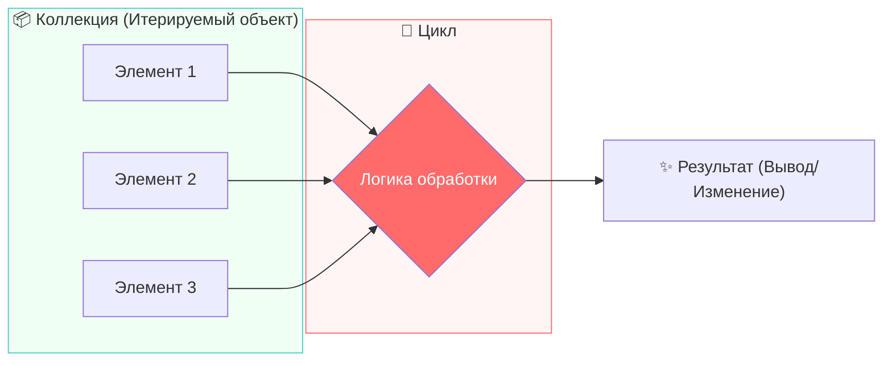

## Виды циклов 🧩

В JavaScript существует несколько способов запустить процесс повторения. Каждый из них подходит для своей задачи: один удобен, когда мы точно знаем количество «картофелин в корзине», другой — когда мы готовы работать «до победного конца», пока не наступит определенное событие.

### 1. Цикл `for...of`: Простой перебор 🧺

Представьте, что вы идете вдоль конвейера, на котором лежат коробки. Вы берете первую, проверяете её, затем вторую, третью — и так пока коробки не закончатся. Вам не важно, сколько их точно, и вам не нужно считать их по номерам. Вы просто говорите: **«Для каждой (for) коробки из (of) этой партии — сделай действие»**.

Это самый современный и человекочитаемый способ перебора коллекций (массивов или строк).

- **Главная особенность:** Он автоматически берет следующий элемент. Вам не нужно следить за тем, где вы сейчас находитесь — JavaScript сам «переставит ноги» к следующему объекту.
- **Когда использовать:** Когда вам нужно просто обработать **все** элементы списка один за другим, не пропуская ни одного.

>[!info]
>
>#### Принцип «Для каждого» 📦
>
>В цикле `for...of` вы фокусируетесь на **содержимом**. Если у вас есть массив фруктов, на каждом шаге цикла в ваших руках окажется конкретный фрукт (`яблоко`, затем `банан`), а не его порядковый номер в списке.

---

### 2. Цикл `while`: Работа до условия 🛑

Этот цикл работает иначе. Он не привязан к конкретной коллекции. Он ориентируется на **условие**. Это похоже на инструкцию: «Пока (while) на улице идет дождь — держи зонт открытым». Вы не знаете, сколько минут или часов это продлится, вы просто постоянно проверяете условие «Дождь идет?». Как только ответ станет «Нет», вы закрываете зонт.

- **Главная особенность:** Скорость или количество повторений заранее неизвестны. Цикл может выполниться 1000 раз, а может не выполниться ни разу, если условие изначально было ложным.
- **Риск:** Если условие всегда будет оставаться правдивым (например, «Пока солнце светит»), цикл станет **бесконечным** и программа «зависнет».

>[!warning]
>
>#### Опасность бесконечности ♾️
>
>В отличие от перебора коллекции, который всегда заканчивается вместе с элементами, `while` требует от вас четкого понимания, в какой момент условие изменится. Если вы забудете «выключить» условие, компьютер будет выполнять цикл вечно, потребляя все ресурсы памяти.

---

### Сравнение подходов 🔄

| Тип цикла | На что похож | Когда выбираем |
| :--- | :--- | :--- |
| **`for...of`** | Прогулка по списку дел | Когда есть четкая коллекция (массив/строка) и нужно обработать её элементы. |
| **`while`** | Ожидание закипания чайника | Когда мы не знаем, сколько шагов потребуется, но знаем, какого события ждем. |

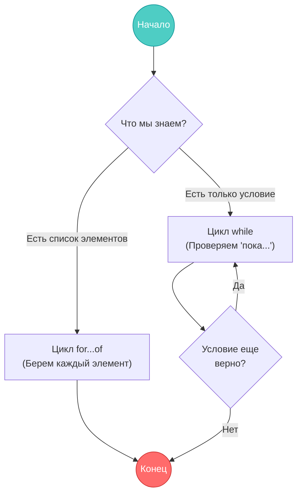

## Цикл `for...of`: Идеальный перебор 🧺

Когда у нас есть коллекция данных — будь то массив имен, список задач или корзина с картофелем — нам нужен простой и надежный способ обработать каждый элемент. В современном JavaScript для этого идеально подходит цикл `for...of`.

### Как это работает? ⚙️

Представьте, что вы стоите перед конвейером. Вы не считаете коробки, вы просто берете **каждую следующую**, пока они не закончатся.

Цикл `for...of` делает три вещи автоматически:

1. **Заглядывает** в коллекцию и проверяет, есть ли там еще элементы.
2. **Извлекает** текущий элемент и помещает его в временную переменную.
3. **Запускает** блок кода, который вы написали, используя эту переменную.

>[!tip]
>
>#### Прозрачность и чистота ✨
>
>Главное преимущество `for...of` в том, что нам не нужно следить за индексами (номерами элементов `0, 1, 2...`). Мы работаем напрямую с **данными**, что делает код чистым и защищает от ошибок «выхода за границы массива».

---

### Визуализация процесса ⏱️

Рассмотрим, как JavaScript пошагово обрабатывает нашу корзину с картофелем. На каждом шаге цикла управление передается внутрь блока, где мы можем сделать с «картофелиной» что угодно.

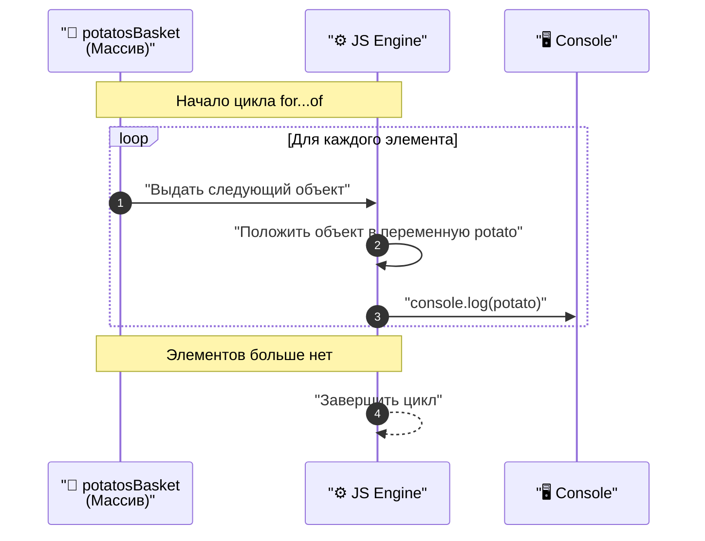

---

### Цитирование кода 📝

Посмотрим, как это выглядит на практике. Мы создадим «корзину» из массива строк и попросим JavaScript по очереди показать нам содержимое каждой ячейки.

```javascript
# sample_011_01.js

let potatosBasket = [
  "картошка 1",
  "картошка 2 гнилая",
  "картошка 3",
  "картошка 4 гнилая",
  "картошка 5",
  "картошка 6",
  "картошка 7 гнилая",
];

// Выводим весь массив целиком для сравнения
console.log(potatosBasket);

// Запускаем перебор коллекции
for (let potato of potatosBasket) {
  // На каждом круге в переменной potato лежит НОВАЯ строка из массива
  console.log(potato);
}
```

### Разбор кода 🔍

1. **Создание коллекции:** Мы объявили массив `potatosBasket`. Это наша «итерируемая сущность».
2. **Объявление цикла:** В строке `for (let potato of potatosBasket)` мы говорим интерпретатору: «Создай переменную `potato` и на каждом шаге клади в неё следующий элемент из `potatosBasket`».
3. **Тело цикла:** Код внутри фигурных скобок `{ ... }` выполняется столько раз, сколько элементов в массиве.
4. **Автоматизация:** Обратите внимание — мы не говорим циклу, когда остановиться. Он самостоятельно «поймет», что `картошка 7` была последней, и аккуратно завершит работу.

>[!info]
>
>#### Переменная цикла 🔄
>
>Ключевое слово `let` внутри `for` создает новую переменную `potato` для каждой итерации. Это безопасно: она существует только внутри этого цикла и не мешает остальному коду.

## Счетчик в циклах: Где прячется результат? 🧮

При работе с циклами нам часто нужно не только перечислить объекты, но и посчитать их. Казалось бы, простая задача — завести переменную-счетчик. Однако то, **где** вы объявите эту переменную, кардинально меняет логику работы программы.

Рассмотрим две ситуации на примере нашей корзины с картофелем.

---

### Вариант 1: Правильный счетчик (Снаружи цикла) ✅

Чтобы посчитать общее количество итераций (шагов), переменная должна быть объявлена **до начала** цикла. В этом случае она «живет» дольше цикла, сохраняет свое значение между шагами и продолжает существовать после его завершения.

```javascript
# sample_011_02.js

let potatosBasket = ["картошка 1", "картошка 2", "картошка 3"];
let counter = 0; // 💡 Объявляем СНАРУЖИ

for (let potato of potatosBasket) {
  counter++; // На каждом шаге прибавляем 1
  console.log(`Проверяем ${potato}. По счету она: ${counter}`);
}

console.log(`Итого проверено: ${counter}`); // Выведет: 3
```

**Как это работает:**
Цикл берет значение из внешней области памяти, меняет его и кладет обратно. На следующем круге он берет уже обновленное значение. Это называется **накоплением**.

---

### Вариант 2: Логическая ошибка (Счетчик внутри цикла) ❌

Новички часто совершают ошибку, объявляя счетчик прямо внутри тела цикла (между фигурными скобками `{ ... }`).

```javascript
# sample_011_03.js

for (let potato of potatosBasket) {
  let counter = 0; // ❌ ОШИБКА: Объявляем ВНУТРИ
  counter++;
  console.log(`Проверяем ${potato}. По счету она: ${counter}`);
}
```

**В чем проблема:**
На каждом шаге цикла JavaScript заново заходит в блок кода и видит команду: `let counter = 0`.

1. **Шаг 1:** Создали `counter = 0`, прибавили 1, вывели «1». В конце шага переменная **удаляется** из памяти.
2. **Шаг 2:** Снова создали `counter = 0`, прибавили 1, вывели «1». Переменная снова удалилась.
3. **Результат:** Ваша программа всегда будет утверждать, что любая картофелина — первая по счету.

>[!warning]
>
>#### Ловушка области видимости 🪤
>
>Переменные, созданные внутри фигурных скобок цикла, «умирают» сразу после завершения текущего круга (итерации). Если вам нужно **сохранить** данные между кругами или использовать их после цикла — объявляйте переменную **снаружи**.

---

### Визуализация разницы 🧠

Различие между «накоплением» и «обнулением» наглядно видно на схеме:

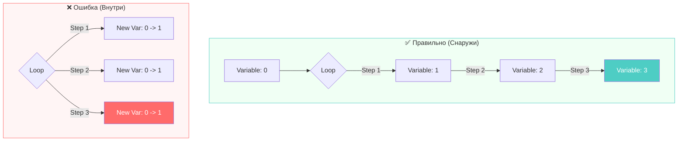

>[!info]
>
>#### Когда использовать «внутренние» переменные? 💡
>
>Объявлять переменные внутри цикла стоит только тогда, когда данные нужны вам **только здесь и сейчас** (например, для временных расчетов внутри одного шага), и вы не планируете использовать их на следующем круге.

### Синтаксический сахар: Инкремент и Декремент 🍬

В программировании настолько часто приходится прибавлять или отнимать единицу (например, считая ту самую картошку), что для этих операций придумали специальные сокращенные записи. Эти инструменты называются **инкремент** и **декремент**.

Рассмотрим три способа сделать одно и то же действие, от самого длинного до самого короткого.

---

#### 1. Полная запись (Математическая) 📝

Это классический способ, который вы могли видеть в школьных учебниках. Мы говорим компьютеру: «Возьми текущее значение переменной, прибавь к нему единицу и результат положи обратно в ту же переменную».

```javascript
# sample_011_04.js

let counter = 0;
counter = counter + 1; // 0 + 1 = 1
console.log(counter); // Выведет: 1
```

#### 2. Оператор сложения с присваиванием ➕

Чуть более короткий вариант. Он читается как: «Прибавь к текущему значению единицу».

```javascript
counter += 1; // Результат тот же: 2
```

#### 3. Инкремент и Декремент (Кратчайший путь) ⚡

Это «золотой стандарт» внутри циклов. Два знака плюс или два знака минус.

- `++` (**Инкремент**): Увеличивает значение строго на **1**.
- `--` (**Декремент**): Уменьшает значение строго на **1**.

```javascript
# sample_011_05.js

let apples = 10;

apples++; // Теперь 11 (Инкремент)
console.log(apples);

apples--; // Снова 10 (Декремент)
console.log(apples);
```

---

### Сравнение синтаксиса 📊

| Операция | Полная запись | Сокращенная запись | Кратчайшая (Sugar) |
| :--- | :--- | :--- | :--- |
| **Прибавить 1** | `x = x + 1` | `x += 1` | `x++` |
| **Отнять 1** | `x = x - 1` | `x -= 1` | `x--` |

>[!tip]
>
>#### Почему это важно? 💡
>
>Использование `counter++` внутри цикла — это не просто экономия времени. Это делает ваш код **профессиональным** и легко читаемым для других разработчиков. Когда коллега видит `++`, он мгновенно понимает: «Ага, здесь просто увеличивают счетчик на шаг».

---

### Визуальная аналогия 🪜

Представьте переменную как ступеньку лестницы. Операторы `++` и `--` — это команды вашему коду «сделать один шаг вверх» или «один шаг вниз».

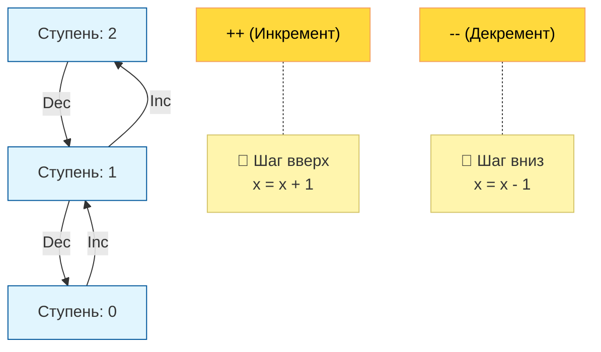

>[!warning]
>
>#### Только для переменных! 🛑
>
>Вы можете использовать `++` только с переменными (`let`). Если вы попытаетесь написать `5++`, JavaScript выдаст ошибку, потому что число **5** — это константа, его нельзя «увеличить», оно всегда равно пяти. Только «коробку» (переменную) можно наполнить новым значением.

## Практический пример: Фильтрация данных в цикле 🧺

Теперь, когда мы освоили перебор коллекции и работу со счетчиками, объединим всё вместе. Наша задача — не просто перечислить картофель, а «отфильтровать» его: посчитать только качественные экземпляры и вывести отчет.

### Как это работает логически? 🧠

Представьте, что вы сидите перед двумя емкостями: одна полная (исходная корзина), вторая пустая (ведро для хорошей картошки).

1. Вы берете картофелину из корзины (**цикл `for...of`**).
2. Вы внимательно её осматриваете (**условие `if`**).
3. Если она гнилая — вы откладываете её в сторону.
4. Если она хорошая — вы кладете её в ведро и загибаете палец (**инкремент `++`**).

---

### Реализация в коде 📝

Мы будем использовать метод строки `.includes()`, чтобы проверить, содержит ли название картофелины слово "гнилая".

```javascript
# sample_011_06.js

let potatosBasket = [
  "картошка 1",
  "картошка 2 гнилая",
  "картошка 3",
  "картошка 4 гнилая",
  "картошка 5",
  "картошка 6",
  "картошка 7 гнилая",
];

// 1. Создаем счетчик СНАРУЖИ цикла
let goodPotatos = 0;

console.log("--- Начинаем проверку корзины ---");

// 2. Цикл перебирает каждый элемент массива
for (let potato of potatosBasket) {
  console.log(`🔎 Осматриваем: ${potato}`);

  // 3. Проверяем условие «Гнилая ли она?»
  if (potato.includes("гнилая")) {
    console.log(`❌ Ошибка: ${potato} отправляется в мусор.`);
  } else {
    // 4. Если условие выше НЕ выполнилось (картошка хорошая)
    console.log(`✅ Успех: ${potato} добавлена в ведро.`);
    goodPotatos++; // Увеличиваем наш счетчик
  }
}

// 5. Выводим итоговый результат
console.log("--- Проверка окончена ---");
console.log(`📊 Итого в ведре хорошей картошки: ${goodPotatos}`);
```

---

### Разбор механики 🔍

1. **Инициализация:** Переменная `goodPotatos` (наш «палец для счета») стоит до цикла. Если бы мы поставили её внутрь, на каждой итерации она бы «забывала», сколько картофелин уже в ведре.
2. **Инспекция:** Метод `includes("гнилая")` возвращает `true` или `false`. Это идеальный «детектор», который помогает циклу принять решение.
3. **Ветвление:** Блок `if...else` разделяет судьбу каждого элемента. Только те строки, которые **не** содержат слово "гнилая", добираются до команды `goodPotatos++`.
4. **Завершение:** Когда корзина пустеет, цикл закрывается, и мы видим итоговое значение счетчика в консоли.

>[!info]
>
>#### Чистота кода 🧹
>
>Обратите внимание, как грамотно расставлены `console.log`. Они выступают в роли «бортового журнала», сообщая нам о каждом действии программы. В реальных проектах это помогает быстро найти ошибку, если что-то пошло не так.

---

### Визуализация процесса обработки ⚙️

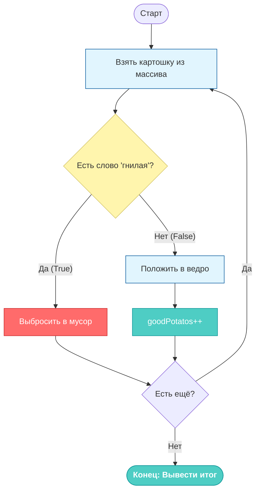

>[!tip]
>
>#### Задание для самопроверки 🧠
>
>Попробуйте мысленно предугадать: что будет, если в массиве вообще не будет «гнилых» картофелин? А если все будут «гнилые»? Правильно работающий цикл должен корректно обрабатывать оба этих случая, выводя либо общее количество, либо ноль.

## Debugger: Как увидеть «магию» кода в замедленной съемке 🔍

Писать код — это только половина дела. Вторая половина — понимать, как он работает на самом деле (особенно когда что-то идет не так). Для этого в каждом современном браузере есть мощнейший инструмент — **Отладчик (Debugger)**. Он позволяет буквально остановить время и заглянуть в «голову» вашему коду.

### 1. Как открыть Отладчик 🛠️

Чтобы попасть в святая святых разработчика, откройте вашу страницу в браузере и воспользуйтесь одним из способов:

- Нажмите `F12`.
- Или `Ctrl + Shift + I` (для Windows) / `Cmd + Opt + I` (для Mac).
- В открывшемся окне выберите вкладку **Отладчик** (Debugger в Chrome/Firefox).

### 2. Поиск вашего кода 📂

Слева вы увидите список всех файлов, которые загрузила страница. Найдите ваш проектный файл (например, `lesson_11.js`) и кликните по нему. Его содержимое отобразится в центральном окне.

---

### 3. Точки останова (Breakpoints): Магия паузы 🛑

Представьте, что вы смотрите фильм и хотите детально рассмотреть спецэффект. Вы нажимаете на паузу. **Breakpoint** — это такая кнопка «пауза» для кода.

- **Как поставить:** Кликните на номер строки (например, на строку с началом цикла). Она подсветится синим цветом.
- **Что произойдет:** Когда JavaScript дойдет до этой строки, выполнение программы **замрет**. Страница «повиснет», а вы станете хозяином положения.

### 4. Панель управления (Пульт) 🎮

Когда код стоит на паузе, в верхнем правом углу (или сверху) появляется пульт управления. Разберем две главные кнопки:

1. **Play / Резюме (Светящаяся стрелка):** «Иди до следующей точки останова». Код пролетит все строки до тех пор, пока снова не наткнется на вашу синюю отметку (например, на следующем шаге цикла).
2. **Шаг через (Изогнутая стрелка / Step Over):** «Сделай ровно один шаг». Это позволяет двигаться по коду построчно, наблюдая за тем, как меняются переменные.

---

### 5. Инструментарий анализа 🛰️

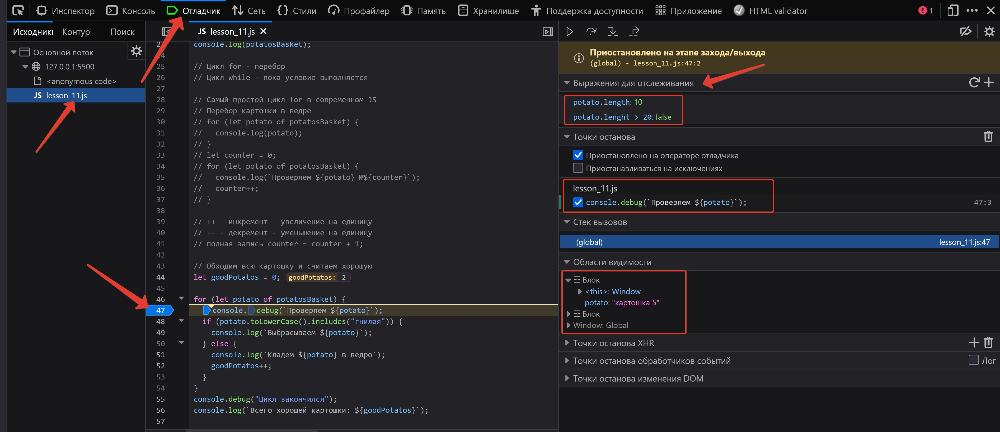

Посмотрите на правую панель отладчика. Там находятся ваши главные союзники:

- **Выражения для отслеживания (Watch):** Вы можете «заказать» просмотр любого значения. Например, напишите там `potato.length`, и отладчик будет на каждом шагу показывать вам длину текущей строки, даже если в основном коде этой команды нет.
- **Области видимости (Scopes):** Это самое важное место. Здесь перечислены все переменные, которые сейчас «видит» программа. На скриншоте видно, что мы находимся внутри **Блока**, и в переменной `potato` сейчас лежит значение `"картошка 5"`.
- **Точки останова:** Список всех мест, где вы поставили «паузы», чтобы вы могли их быстро включать или выключать.

>[!info]
>
>#### Почему это круче, чем console.log? 💡
>
>`console.log` показывает вам прошлое — то, что уже случилось. **Debugger** показывает вам настоящее и позволяет предсказывать будущее. Вы можете в реальном времени видеть, как `goodPotatos` превращается из `1` в `2`, и понимать, почему сработало (или не сработало) условие `if`.

---

### Резюме по работе с отладчиком 📋

>[!success]
>
>#### Алгоритм отладки ⚙️
>
>1. **Установите Breakpoint** на строке, с которой начинаются подозрения.
>2. **Обновите страницу**, чтобы код запустился заново.
>3. Когда код замрет, **изучите Scopes** (Области видимости) — какие там сейчас значения?
>4. Используйте **Step Over** (Следующий шаг), чтобы проследить путь выполнения.
>5. Если всё понятно — нажмите **Play**, чтобы отпустить код до следующей проверки.

Работа с циклами без отладчика — это как попытка починить часы с закрытыми глазами. Отладчик открывает вам механизм и делает вас настоящим повелителем логики.

### Опциональные точки останова: Пауза только «по делу» 🎯

Иногда обычная точка останова (Breakpoint) превращается в рутину. Если в вашей корзине 1000 картофелин, а вы хотите поймать момент, когда попадется именно «картошка 42», вам придется нажать кнопку «Play» сорок один раз. Это скучно и неэффективно.

Для таких случаев в инструментах разработчика существуют **условные точки останова (Conditional Breakpoints)**.

#### Что это такое? 🤔

Это «умная» пауза. Вы говорите браузеру: «Не останавливайся на этой строке просто так. Замирай только в том случае, если выполняется моё условие».

---

#### Как это настроить? ⚙️

1. **Правый клик** по номеру строки (там, где вы обычно ставите обычную точку).
2. Выберите пункт **«Добавить условную точку останова...»** (Add conditional breakpoint).
3. В появившемся поле введите логическое выражение. Например:
   `potato.includes("гнилая")` или `counter === 42`.
4. Нажмите `Enter`. Точка окрасится в **оранжевый** (или другой отличный от синего) цвет.

Теперь цикл будет «пролетать» на полной скорости через все хорошие картофелины и встанет на паузу **только тогда**, когда в переменную `potato` попадет гнилая.

---

#### Преимущества опциональных точек 🚀

- **Экономия времени:** Вы игнорируете сотни итераций, которые работают правильно, и фокусируетесь на проблемном месте.
- **Поиск иголки в стоге сена:** Идеально подходит для отладки огромных массивов данных.
- **Чистота анализа:** Ваши «Выражения для отслеживания» (Watch) не будут мелькать перед глазами — вы увидите их значения только в момент критической ситуации.

>[!tip]
>
>#### Совет от наставника 💡
>
>Условные точки останова особенно полезны, когда ошибка (баг) плавающая. Если программа «падает» только на определенных данных, просто поставьте условие на проверку этих данных, и отладчик сам «поймает» нарушителя за руку.

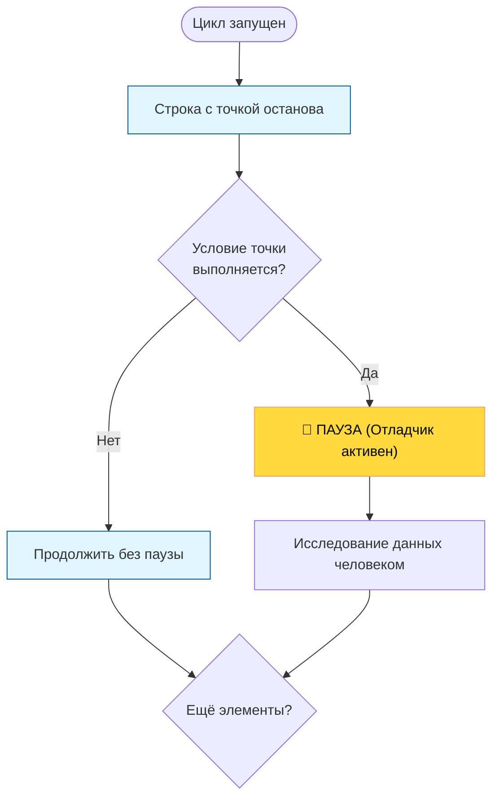

>[!info]
>
>#### Использование Expressions (Выражений) 🔬
>
>Вы можете использовать любые валидные JavaScript-выражения внутри условия. Например, `goodPotatos > 5` заставит отладчик сработать только тогда, когда в вашем ведре уже накопится приличное количество урожая.

## Арсенал разработчика: Методы массивов 🛠️

Массивы в JavaScript — это не просто списки данных, это «умныерованные» объекты, которые уже из коробки умеют выполнять множество операций: добавлять, удалять, искать и проверять элементы. Чтобы не изобретать велосипед (и не писать лишние циклы), нужно знать основные встроенные **методы**.

### Таблица основных методов массива

В технической документации методы часто описываются через их **аргументы** (что мы передаем внутрь) и **результат** (что метод возвращает).

| Категория | Метод | Что делает | Аргументы | Результат |
| :--- | :--- | :--- | :--- | :--- |
| **Добавление / Удаление** | `.push()` | Добавляет элемент в **конец** | Любое значение | Новая длина массива |
| | `.pop()` | Удаляет **последний** элемент | Нет | Тот самый удаленный элемент |
| | `.unshift()` | Добавляет элемент в **начало** | Любое значение | Новая длина массива |
| | `.shift()` | Удаляет **первый** элемент | Нет | Тот самый удаленный элемент |
| **Поиск** | `.indexOf()` | Ищет индекс (номер) элемента | Точное значение | Индекс элемента (или `-1`, если не найден) |
| | `.includes()` | Проверяет, есть ли элемент | Точное значение | `true` или `false` |
| **Трансформация** | `.join()` | Собирает массив в **строку** | Разделитель (например, `", "`) | Одна длинная строка |
| | `.reverse()` | Разворачивает массив задом наперед | Нет | Ссылка на тот же массив (измененный) |
| **Копия / Часть** | `.slice()` | Копирует «кусок» массива | `start, end` (индексы) | Новый массив с копиями элементов |

---

### Детальный разбор популярных методов 🔬

#### 1. Модификация концов: `push` / `pop`

Это самые быстрые операции. Представьте стопку тарелок: `push` кладет тарелку сверху, `pop` её забирает.

- **Пример:** Если у вас есть корзина заказов, новый товар всегда будет «пушиться» (`.push()`) в конец списка.

#### 2. Работа с началом: `unshift` / `shift`

Эти операции медленнее, потому что JavaScript приходится «передвигать» все остальные элементы в памяти, чтобы освободить (или заполнить) нулевой индекс.

- **Пример:** Используется для очередей, где кто первым пришел, тот первым и обрабатывается.

#### 3. Универсальный поиск: `includes`

Раньше для проверки наличия элемента использовали `.indexOf() > -1`, но теперь есть лаконичный `.includes()`.

- **Важно:** Он ищет **точное совпадение**. Если вы ищете в массиве строк `"Сыр"`, а там лежит `"Сырный"`, метод вернет `false`.

#### 4. Объединение: `join`

Незаменим, когда нужно красиво вывести список пользователю.

- **Инсайт:** Вы можете передать пустую строку `""`, чтобы склеить буквы в слово, или `"\n"` (перенос строки), чтобы каждый элемент был с новой строчки.

---

### Поведение методов: Мутация vs Иммутабельность ⚠️

Методы массивов делятся на две группы по способу воздействия на оригинал:

1. **Мутирующие (Разрушающие):** Они меняют сам исходный массив.
    - *Примеры:* `push`, `pop`, `reverse`, `shift`, `unshift`.
    - *Аналогия:* Вы покрасили забор. Забор остался тот же, но его цвет изменился.
2. **Немутирующие (Возвращающие):** Они не трогают оригинал, а создают **новый** массив или значение.
    - *Примеры:* `join`, `slice`, `includes`.
    - *Аналогия:* Вы сфотографировали забор и на фото подкрасили его в Фотошопе. Настоящий забор всё еще старого цвета.

>[!warning]
>
>#### Будьте внимательны с мутацией 💣
>
>Используя такие методы, как `reverse()`, помните, что вы меняете массив навсегда. Если вам нужны данные и в старом, и в новом виде — сначала сделайте копию (например, через `.slice()`).

---

### Визуализация работы со стеком (Push/Pop) 🧱

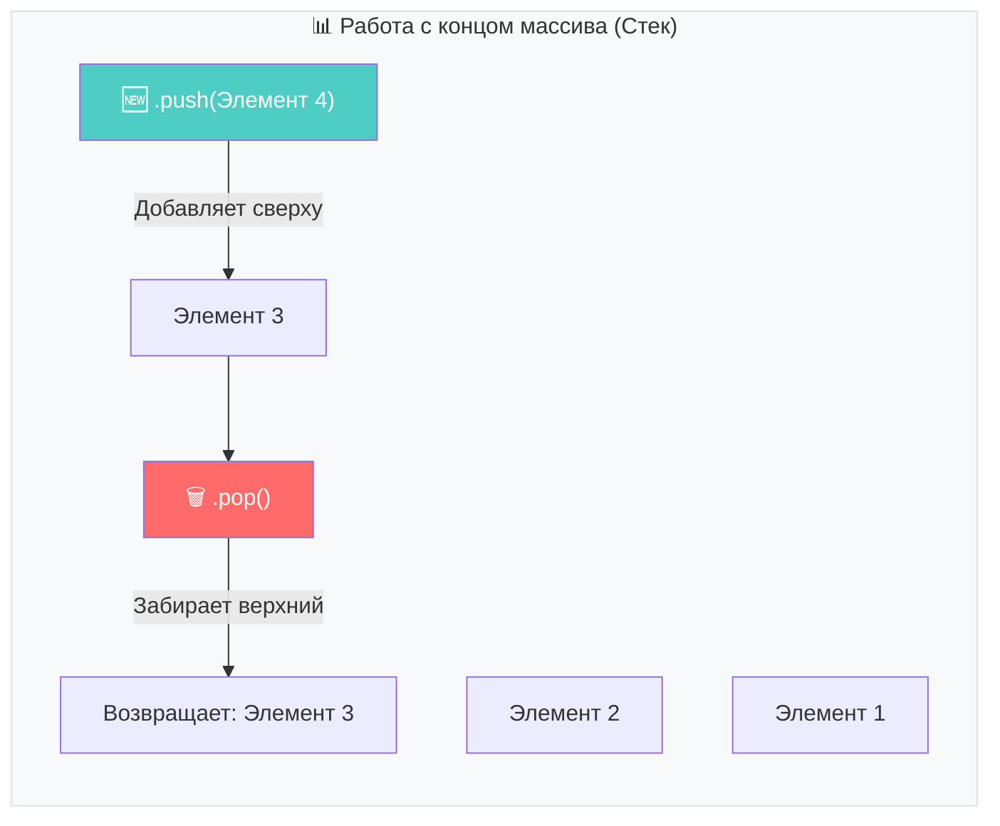

>[!tip]
>
>#### Как запомнить? 💡
>
>- `push` (толкать) — заталкиваем в конец.
>- `pop` (хлопать/вылетать) — последний вылетает.
>- `shift` (сдвигать) — всё сдвигается, первый выпадает.

## Практика: Управление корзиной покупок 🛒

Теория методов массива лучше всего усваивается на живых примерах. Представьте, что мы разрабатываем интерфейс для корзины интернет-магазина. Нам нужно динамически добавлять товары, удалять их и преобразовывать списки для отображения пользователю.

### 1. Добавление и удаление элементов

Основные инструменты управления составом массива — это методы `push`, `unshift` и `pop`. Они позволяют гибко манипулировать данными в зависимости от того, куда именно мы хотим поместить новый объект.

```javascript
# sample_011_07.js

let productsCart = [];

// .push() — добавляет элементы в Конец массива
// Это самый частый способ: новые покупки встают в очередь последними
productsCart.push("хлеб");
productsCart.push("молоко");
productsCart.push("масло");
console.log(productsCart); // ["хлеб", "молоко", "масло"]

// .unshift() — добавляет элемент в Начало массива
// Представьте, что это «приоритетный» товар, который должен быть сверху списка
productsCart.unshift("яйца");
console.log(productsCart); // ["яйца", "хлеб", "молоко", "масло"]

// .pop() — удаляет Последний элемент и ВЕРНЁТ его нам
// Это полезно, если пользователь нажал «Отменить последнее действие»
let lastItem = productsCart.pop(); 
console.log(productsCart); // ["яйца", "хлеб", "молоко"]
console.log(`Удаленный элемент: ${lastItem}`); // "масло"
```

---

### 2. Превращение в строку и обратно

Массив удобен для программы, но пользователю лучше показывать обычный текст. Для этого используются «зеркальные» методы `join` и `split`.

```javascript
# sample_011_08.js

// .join() — склеивает массив в одну строку через разделитель
let productsString = productsCart.join(", ");
console.log(productsString); // "яйца, хлеб, молоко"

// .split() — разрезает строку обратно в массив по разделителю
// Полезно при получении данных от сервера или из текстового поля ввода
let productsArray = productsString.split(", ");
console.log(productsArray); // ["яйца", "хлеб", "молоко"]
```

---

### 3. Обработка данных через цикл

Часто данные попадают в корзину в «грязном» виде: кто-то вводит название капсом, кто-то со случайными заглавными буквами. С помощью цикла и метода `.push()` мы можем создать «очищенную» копию нашей корзины.

```javascript
# sample_011_09.js

productsCart.push("мЯски", "кОлбаски", "сЫр");

let optimizedProductsCart = [];

// Используем цикл for...of для обхода «грязных» данных
for (let product of productsCart) {
  // Приводим строку к нижнему регистру и «пушим» в новый массив
  optimizedProductsCart.push(product.toLowerCase());
}

console.log(optimizedProductsCart); 
// ["яйца", "хлеб", "молоко", "мяски", "колбаски", "сыр"]
```

>[!info]
>
>#### Логика накопления 📥
>
>Обратите внимание: мы создали пустой массив `optimizedProductsCart` СНАРУЖИ цикла. Если бы мы создали его внутри, он бы очищался на каждом шаге, и в итоге в нем остался бы только один последний элемент.

---

### Подсказка по методам 💡

| Метод | Аналогия | Направление |
| :--- | :--- | :--- |
| **`.push()`** | Доложить в стопку сверху | В конец ➡️ |
| **`.pop()`** | Снять верхнюю тарелку | Из конца ⬅️ |
| **`.unshift()`** | Подложить под низ стопки | В начало ⬅️ |
| **`.join()`** | Склеить бусины на одну нитку | В строку 🧵 |

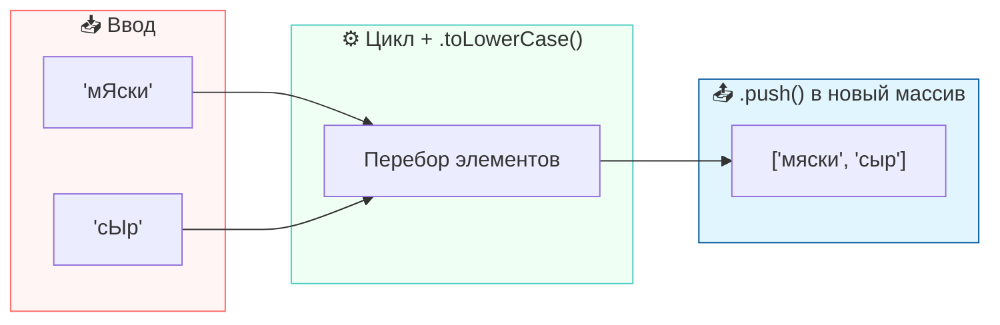

## Индексы и поиск элементов: Где лежит мой товар? 🔍

Массив — это не просто коробка с вещами, это строго упорядоченный стеллаж. У каждого предмета на этом стеллаже есть свой номер, который в программировании называется **индексом**.

### 1. Как работают индексы 🔢

Самое важное правило, которое нужно выучить как таблицу умножения: **отсчет в программировании начинается с нуля (0).**

- Первый элемент — индекс `0`.
- Второй элемент — индекс `1`.
- Последний элемент — индекс `длина массива минус один`.

```javascript
# sample_011_10.js

let productsCart = ["яйца", "хлеб", "молоко", "мяски"];

// Доступ по индексу осуществляется в квадратных скобках []
console.log(productsCart[0]); // Выведет: "яйца"
console.log(productsCart[2]); // Выведет: "молоко"
```

---

### 2. Поиск через `indexOf()` 🕵️‍♂️

Если вы знаете, как называется товар, но не знаете, где он лежит, вам поможет метод `.indexOf()`. Он работает как поисковый робот: идет по массиву слева направо и останавливается, как только находит первое совпадение.

- **Если элемент найден:** метод возвращает его индекс (число).
- **Если элемента нет:** метод возвращает `-1`.

```javascript
# sample_011_11.js

productsCart.push("мяски"); // Добавляем еще одни "мяски" в конец
console.log(productsCart); // ["яйца", "хлеб", "молоко", "мяски", "мяски"]

// indexOf ищет только ПЕРВОЕ вхождение
console.log(productsCart.indexOf("мяски")); // Выведет: 3 (индекс первой находки)
```

>[!warning]
>
>#### Ловушка первого вхождения ⚠️
>
>Метод `.indexOf()` очень ленив. Как только он увидел первые "мяски", он тут же прекращает работу и выдает результат. Он «не видит» дубликаты, которые находятся дальше по списку.

---

### 3. "А если мне нужно найти все или посчитать?" 🧮

Если в вашей корзине три пачки молока и вам нужно узнать их точное количество или позиции всех трех, обычный `indexOf` вам не поможет. В таких случаях мы возвращаемся к нашим надежным **циклам**.

Чтобы найти **все** вхождения или **подсчитать** их, используется классический алгоритм «Счетчик + Цикл + Условие»:

```javascript
# sample_011_12.js

let searchCount = 0;
let target = "мяски";

for (let product of productsCart) {
    if (product === target) {
        searchCount++;
    }
}

console.log(`Продукт '${target}' встретился в корзине ${searchCount} раз(а)`);
```

---

### Резюме по поиску 📋

| Задача | Инструмент | Результат |
| :--- | :--- | :--- |
| **Узнать, где ПЕРВЫЙ такой элемент** | `.indexOf()` | Число (индекс) или `-1` |
| **Просто проверить «да/нет»** | `.includes()` | `true` или `false` |
| **Подсчитать ВСЕ дубликаты** | Цикл `for...of` + счетчик | Точное количество |

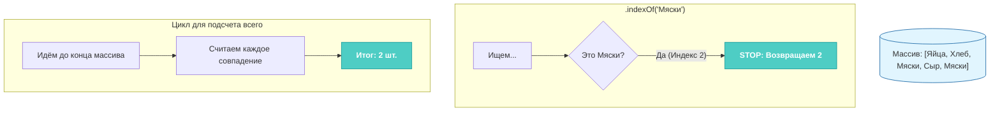

>[!tip]
>
>#### Как не запутаться в индексах? 💡
>
>Всегда помните: количество элементов (длина) и индекс последнего элемента — это разные вещи. В массиве из 5 элементов индексы будут: `0, 1, 2, 3, 4`. Последний индекс всегда на единицу меньше длины!
