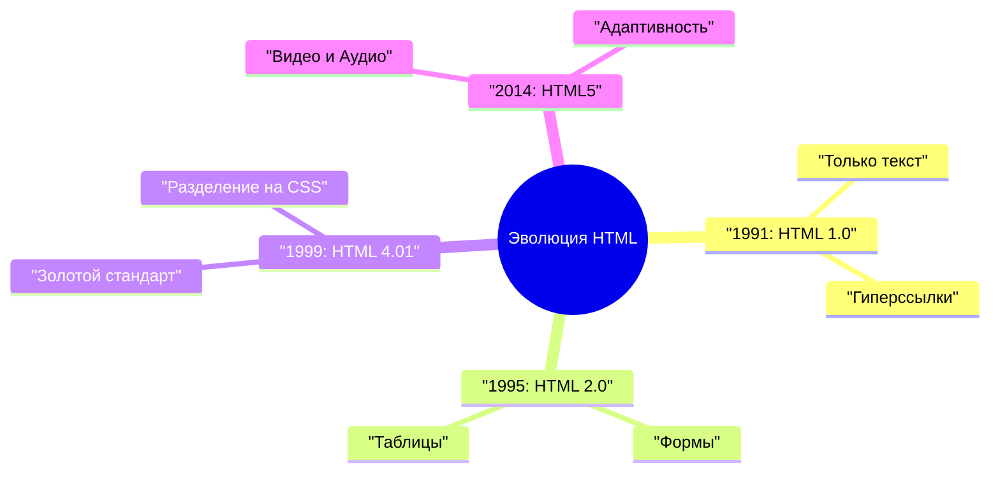
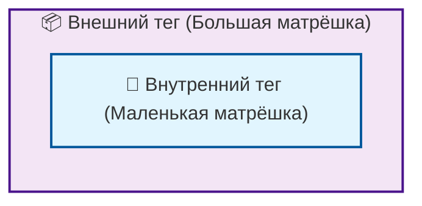
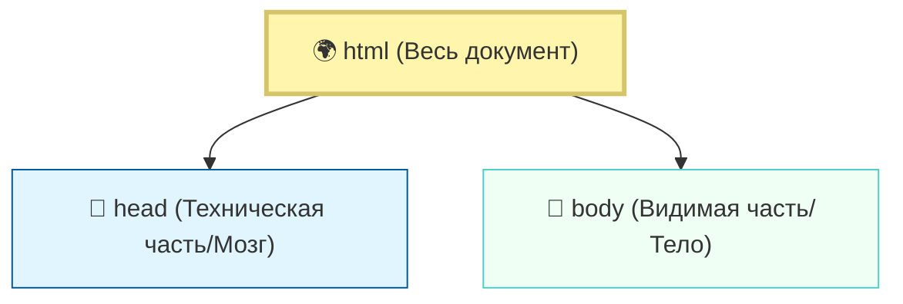
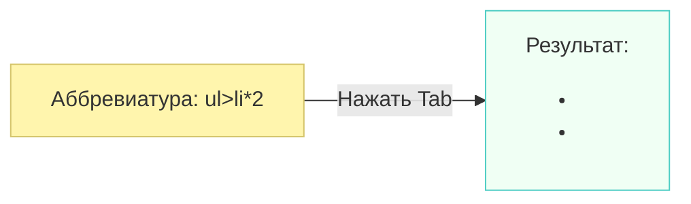
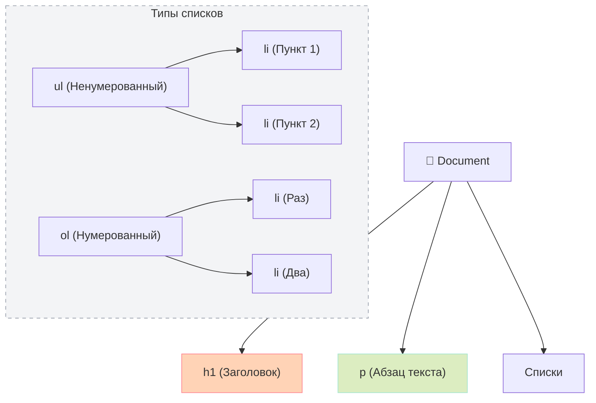

# Урок: История создания HTML. Как текст стал гипертекстом 🌐

История веба началась не с красивых картинок или сложных скриптов, а с попытки решить фундаментальную проблему обмена знаниями между учеными. HTML стал тем самым «клеем», который соединил разрозненные документы в единую паутину.

## Рождение стандарта: От идеи к реализации 🧪

В конце 1980-х международный исследовательский центр **CERN** (Европейская организация по ядерным исследованиям) столкнулся с проблемой: тысячи ученых использовали разные системы для оформления отчетов. Информация терялась в архивах, а ссылки на исследования коллег приходилось искать вручную.

>[!info]
>
>#### Кто стоит у истоков? 👨‍🔬
>
>Создателем HTML является **Тим Бернерс-Ли**, британский ученый, который в 1989 году предложил проект глобального гипертекста. За это достижение в 2004 году он был удостоен рыцарского титула.

> The Web is more a social creation than a technical one.
> — **Тим Бернерс-Ли**, создатель Всемирной паутины

Первая официальная версия **HTML 1.0** увидела свет в **1991 году**. Она была предельно простой и содержала всего около 20 тегов, многие из которых (например, `<a>`, `<h1>-<h6>`, `<p>`) мы используем до сих пор.

## Какие задачи решал HTML? 🛠️

Создание языка разметки не было просто «хобби» — это была острая необходимость. HTML должен был ответить на три главных вызова:

1. **Универсальность**: Текст должен был одинаково отображаться на любом компьютере, будь то мощная рабочая станция или старый терминал.
2. **Гипертекст**: Главная инновация. Возможность «прыгнуть» из одного документа в другой по прямой ссылке.
3. **Структура, а не оформление**: HTML создавался для того, чтобы пометить, где в тексте заголовок, а где — абзац, оставляя вопрос внешнего вида на усмотрение браузера.

>[!tip]
>
>#### Что такое тег? 🔖
>
>**Тег** — это базовая единица разметки HTML. Это специальные метки в угловых скобках `<...>`, которые говорят браузеру, как интерпретировать текст внутри них.

## Эпоха «человекочитаемости» или IT-приколы 90-х 🤡

Сегодня, когда мы видим сложные React-компоненты или нагромождение атрибутов, HTML кажется нам «кодом». Но на заре его создания главным преимуществом считалось то, что он **человекочитаем** (human-readable).

В понимании Тима Бернерса-Ли и его коллег, HTML был настолько простым, что любой человек мог открыть текстовый редактор и «с ходу» понять структуру документа.

```html
<!-- Так выглядел "код", который считался легким для чтения -->
<h1>Мой отчет</h1>
<p>Это исследование о <b>частицах</b>.</p>
<a href="http://info.cern.ch">Ссылка на подробности</a>
```

>[!warning]
>
>#### Ирония судьбы 🪤
>
>То, что в 1991 году считалось «простым текстом для людей», сегодня стало сложной индустрией. Современная верстка страницы может занимать тысячи строк кода, который человек без специальной подготовки вряд ли назовет «легким для чтения».

Для того чтобы понять, насколько путь развития технологий был стремительным, давайте взглянем на хронологию развития стандарта:



## Итог 🎓

HTML прошел путь от простого инструмента для академических отчетов до фундамента, на котором строится весь современный интернет. Его сила оказалась в простоте: использование понятных слов (head, body, table) позволило миллионам людей стать соавторами глобальной сети.

В следующем разделе мы подробнее разберем, как именно браузер превращает эти текстовые теги в те страницы, которые мы видим каждый день.

---

## Анатомия HTML: От каркаса до матрёшки 🏗️

Если представить веб-страницу как здание, то **HTML** — это его каркас или фундамент. Без него дизайн (CSS) и логика (JavaScript) просто повиснут в воздухе. Чтобы этот каркас держался крепко, важно понимать, как устроены его «кирпичики» — теги.

## 1. Анатомия тега: Угловые скобки и слэши 🔍

Тег — это команда для браузера. Большинство тегов в HTML — **парные**. Они работают как контейнеры: у них есть начало и конец, а внутри находится контент (текст или другие теги).

Разберем структуру на примере простого тега для абзаца — `<p>`:

```html
<p>Я — контент внутри тега</p>
```

1. **Открывающий тег `<p>`**: Состоит из левой угловой скобки, имени тега и правой угловой скобки. Он говорит браузеру: «Внимание, здесь начинается абзац!».
2. **Контент**: Это то, что увидит пользователь (текст, картинка и т.д.).
3. **Закрывающий тег `</p>`**: Почти такой же, как открывающий, но содержит **прямой слэш `/`** перед именем. Это сигнал для браузера: «Абзац закончился, закрывай контейнер».

>[!warning]
>
>#### Забытый слэш — залог хаоса 🪤
>
>Если вы забудете закрыть тег или поставите слэш не туда, браузер может «запутаться». Например, если не закрыть тег жирного шрифта, вся оставшаяся часть страницы может стать жирной.

## 2. Принцип Матрёшки: Вложенность и порядок 🪆

Главное правило HTML — **строгая вложенность**. Если вы открыли одну «матрёшку» внутри другой, вы должны сначала закрыть внутреннюю, и только потом — внешнюю.

Представьте это так: вы не можете закрыть большую матрёшку, пока внутри неё торчит не собранная маленькая.



**Пример правильной и неправильной вложенности:**

✅ **Правильно:**  `<p>Привет, <b>Мир</b>!</p>` — (Сначала закрыли `<b>`, потом `<p>`)
❌ **Неправильно:** `<p>Привет, <b>Мир!</p></b>` — (Теги «пересекаются», это сломает структуру)

## 3. Глобальный каркас страницы 🏛️

Любая HTML-страница имеет стандартную «скелетную» структуру. Она состоит из трёх главных элементов, которые вложены друг в друга.



Опишем эти части:

* **`<html>...</html>`**: Самая большая «матрёшка». Она объединяет в себе абсолютно всё содержимое страницы.
* **`<head>...</head>`**: Это «мозг» страницы. Содержимое этого тега **не отображается** в окне браузера прямо на странице. Здесь хранятся служебные данные: заголовок вкладки, кодировка и подключения стилей.
* **`<body>...</body>`**: Это «тело» страницы. Всё, что вы видите в браузере — тексты, кнопки, видео — находится именно здесь.

**Как это выглядит в коде:**

```html
<html>
    <head>
        <!-- Здесь живет заголовок вкладки и настройки -->
    </head>
    <body>
        <h1>Привет! Я — заголовок на странице</h1>
        <p>А я — обычный текст в теле документа.</p>
    </body>
</html>
```

## 4. Секрет браузера: Отступы не важны? 🤫

Важный момент для новичков: браузеру абсолютно всё равно, как вы отформатировали свой код. Вы можете написать всё в одну длинную строку или сделать огромные отступы — результат на экране будет одинаковым.

```html
<!-- Для браузера эти записи идентичны -->
<p>Текст</p>

<p>
    Текст
</p>
```

**Зачем тогда нужны отступы?**
Отступы (табуляция) нужны **людям**. Они визуально показывают вложенность «матрёшек», позволяя с первого взгляда понять, какой тег находится внутри какого. Хороший тон — делать один отступ (обычно 2 или 4 пробела) для каждого нового уровня вложенности.

>[!tip]
>
>#### Золотое правило чистого кода ✨
>
>Пишите код так, чтобы его было удобно читать вам и вашим коллегам. Хорошая структура отступов помогает мгновенно найти ошибку в закрытии тегов.

В итоге, HTML-разметка — это дисциплина. Следите за парами скобок, не забывайте слэши и всегда закрывайте матрёшки в правильном порядке!

---

## Emmet: Магия ускорения верстки ⚡

Если вы когда-нибудь ловили себя на мысли, что писать угловые скобки для каждого тега — это слишком долго, то **Emmet** станет вашим любимым инструментом. Emmet — это встроенный в большинство редакторов (например, в VS Code) плагин, который превращает короткие аббревиатуры в полноценный HTML-код.

Это похоже на «стенографию» для программистов: вы пишете короткую формулу, нажимаете клавишу `Tab`, и она разворачивается в готовый блок кода.

---

## 1. Базовые правила: От слова к тегу 📝

Самый простой способ использовать Emmet — просто написать название тега. Вам не нужно открывать скобку `<` или писать закрывающий тег.

* **Действие:** Напечатайте `p` и нажмите `Tab`.
* **Результат:** Редактор сам превратит это в `<p></p>`.

Это работает с любым стандартным тегом: `h1`, `body`, `html`, `head`. Emmet берет на себя всю рутину с угловыми скобками и слэшами.

---

## 2. Наполнение контентом: Фигурные скобки `{}` 📦

Часто нам нужно не просто создать тег, но и сразу положить в него какой-то текст. В Emmet для этого используются фигурные скобки. Текст, который вы напишете внутри них, станет содержимым тега (тем самым «наполнителем» матрёшки).

* **Аббревиатура:** `h1{Привет, Мир!}`
* **Результат после Tab:**

  ```html
  <h1>Привет, Мир!</h1>
  ```

---

## 3. Управление вложенностью: Символ `>` 🪆

Как мы уже знаем, HTML — это система вложенных «матрёшек». Чтобы сказать Emmet, что один тег должен находиться **внутри** другого (прямое наследование), используется знак «больше» — `>`.

* **Аббревиатура:** `body>p`
* **Результат:**

  ```html
  <body>
      <p></p>
  </body>
  ```

Вы можете выстраивать целые цепочки, например: `html>body>p{Текст}`.

---

## 4. Множитель: Символ `*` ✖️

Когда нужно создать несколько одинаковых элементов (например, пункты меню или строки таблицы), на помощь приходит знак умножения. Это избавляет от копипасты.

* **Аббревиатура:** `li*3`
* **Результат:**

  ```html
  <li></li>
  <li></li>
  <li></li>
  ```

---

## 5. Комбинируем всё вместе: Сложные структуры 🛠️

Самое мощное в Emmet — это возможность объединять все эти правила в одну мощную формулу. Давайте создадим список покупок из трех элементов одним движением руки.

* **Аббревиатура:** `ul>li*3{Купить молоко}`
* **Результат после нажатия Tab:**

  ```html
  <ul>
      <li>Купить молоко</li>
      <li>Купить молоко</li>
      <li>Купить молоко</li>
  </ul>
  ```

>[!tip]
>
>#### Король всех сниппетов: восклицательный знак `!` 👑
>
>Если вы создаете новый файл и вам нужна базовая структура (каркас) страницы, просто введите один знак `!` и нажмите `Tab`. Emmet мгновенно развернет полный скелет документа с тегами `<html>`, `<head>`, `<body>` и всеми необходимыми настройками.

>[!info]
>
>#### Почему это важно? 💡
>
>Использование Emmet не только ускоряет вашу работу в 3-5 раз, но и **минимизирует ошибки**. Emmet никогда не забудет закрыть тег или поставить правильный слэш, что делает ваш код чище и надежнее.



---

## Язык сокращений: Как названия тегов отражают их суть 🗣️

Если присмотреться к названиям тегов, можно заметить, что это не случайный набор букв. HTML-теги — это **аббревиатуры и сокращения** английских слов, которые описывают роль контента. Понимая расшифровку, вы перестанете «зубрить» теги и начнете их просто «называть».

---

## 1. Заголовки (Headings): Иерархия смыслов 👑

Заголовки в HTML обозначаются буквой **h** (от английского *Header* — заголовок) и цифрой от **1 до 6**. Цифра определяет «важность» заголовка в структуре страницы:

* **`<h1>` (Header 1)**: Самый главный заголовок страницы (как название книги). Должен быть только один.
* **`<h2>` – `<h6>`**: Подзаголовки разного уровня. Чем больше цифра, тем меньше важность (и обычно размер шрифта).

**Принцип иерархии:** Не перескакивайте через уровни. После `<h1>` должен идти `<h2>`, а не сразу `<h4>`. Это важно для поисковых систем и экранных дикторов.

```html
<h1>Мой блог</h1>
<h2>Статья о HTML</h2>
<h3>Введение в теги</h3>
```

---

## 2. Параграф (Paragraph): Основа текста 📝

Для обычного текста используется тег **`<p>`**. Это сокращение от английского *Paragraph* (параграф или абзац).

Браузер автоматически добавляет небольшие отступы сверху и снизу от параграфа, чтобы текст не слипался в одну нечитаемую простыню.

* **Аббревиатура:** `p` → *Paragraph*
* **Пример:**

```html
<p>Это обычный текст абзаца.</p>
```

---

## 3. Списки: Порядок против хаоса 📋

В HTML есть два основных типа списков. Их названия также логично сокращены:

### Unordered List (`<ul>`) — Ненумерованный список

Используется, когда порядок элементов **не важен** (например, список покупок). Обычно отображается с «маркерами» (точками).
* **Аббревиатура:** `ul` → *Unordered List*

### Ordered List (`<ol>`) — Нумерованный список

Используется, когда важна **последовательность** (например, шаги рецепта). Браузер сам ставит цифры 1, 2, 3...
* **Аббревиатура:** `ol` → *Ordered List*

### List Item (`<li>`) — Пункт списка

И в том, и в другом случае сами элементы списка внутри обозначаются тегом `<li>`.
* **Аббревиатура:** `li` → *List Item* (элемент списка).

---

## 4. Визуализация структур 📊

Чтобы лучше запомнить, как эти «сокращения» превращаются в структуру, взгляните на эту схему:



---

## Итоговая таблица-шпаргалка 💡

| Тег | Полное название | Роль | В Emmet |
| :--- | :--- | :--- | :--- |
| **`<h1>`** | Header 1 | Главный заголовок | `h1` |
| **`<p>`** | Paragraph | Обычный текст | `p` |
| **`<ul>`** | Unordered List | Список с точками | `ul>li*2` |
| **`<ol>`** | Ordered List | Список с цифрами | `ol>li*2` |
| **`<li>`** | List Item | Один пункт в списке | `li` |

>[!tip]
>
>#### Подсказка от наставника 🧠
>
>Если вы забыли, как называется тег, попробуйте перевести слово на английский. «Список» — *List*, «Неупорядоченный» — *Unordered*. Соединяем первые буквы: **u** + **l** = `<ul>`. Это работает в 90% случаев!

>[!info]
>
>#### Контроль вложенности ⚠️
>
>Помните про «матрешку»: тег `<li>` **всегда** должен находиться внутри `<ul>` или `<ol>`. Никогда не используйте `<li>` сам по себе, это нарушит логику HTML-каркаса.
