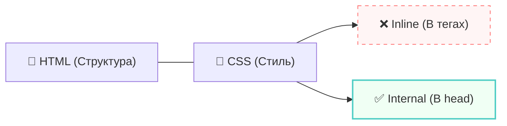
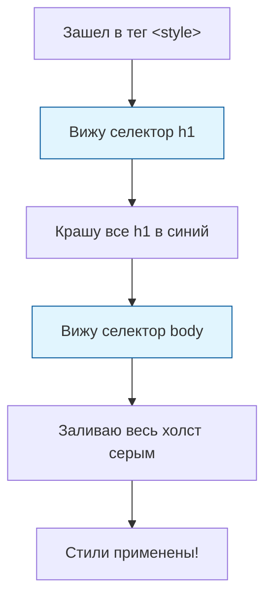
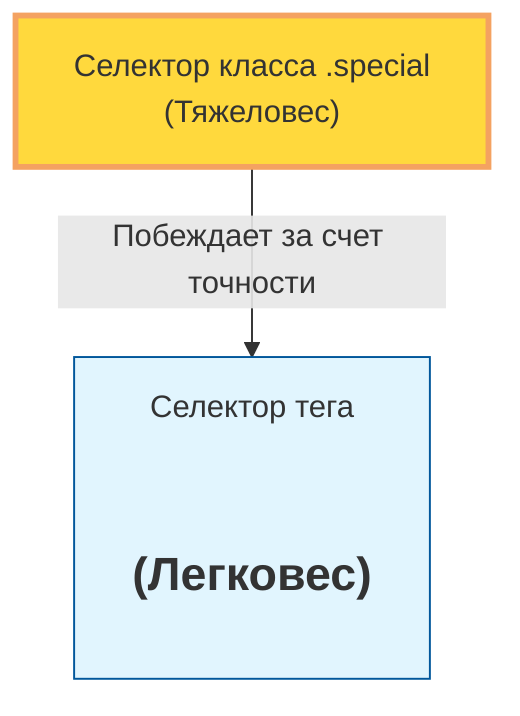
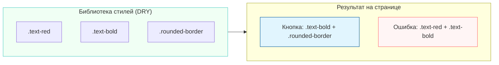
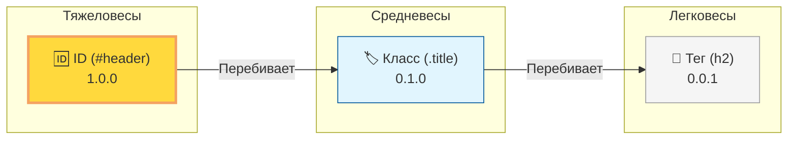
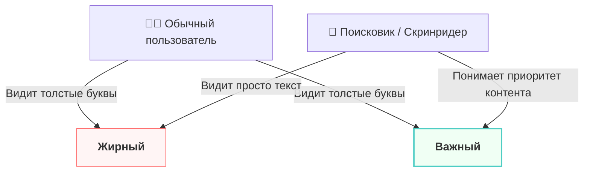
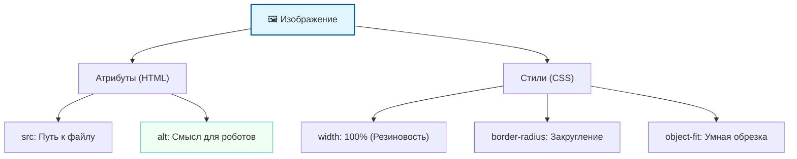
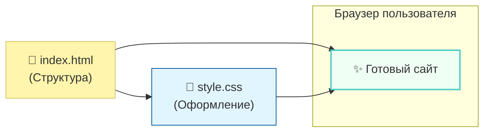

# Урок 2. Основы стилизации и рождение CSS 🎨

Мы уже изучили, как строить «каркас» документа с помощью HTML. Но голый каркас выглядит скучно и аскетично — как чертеж или голые бетонные стены. Чтобы превратить этот чертеж в современный, красивый интерфейс, нам необходим **CSS** (Cascading Style Sheets — каскадные таблицы стилей).

## 1. Зачем миру понадобился CSS? 🌍

В самом начале развития интернета (начало 90-х) HTML использовался только для передачи научной информации. Никто не думал о дизайне: были только заголовки, текст и ссылки. Но по мере того, как интернет становился публичным, владельцы сайтов захотели выделяться: менять цвета, шрифты и расположение элементов.

Сначала это пытались делать силами самого HTML. Появились теги вроде `<font>` для цвета текста или атрибуты для выравнивания. Но это привело к **катастрофе**:

- Код стал раздутым и нечитаемым.
- Чтобы сменить цвет всех заголовков на сайте из 100 страниц, программисту приходилось вручную менять каждый тег.
- Дизайн и структура были перемешаны в «винегрет».

Так в 1996 году появился CSS — технология, которая позволила отделить «то, **что** мы пишем» (HTML) от того, «**как** это выглядит» (CSS).

## 2. Эволюция подходов: От хаоса к порядку 📈

Разработчики не сразу пришли к идеальному способу написания стилей. Давай рассмотрим, как развивалась логика размещения стилей в документе.

### Шаг 1: Inline-стили (Встроены в тег)

Самый примитивный способ. Стили записываются прямо внутри HTML-тега через специальный атрибут `style`.

> [!warning]
>
> #### Ловушка «грязного» кода 🪤
>
> Представь, что у тебя в комнате на каждом предмете приклеена инструкция: на стуле написано «я красный», на столе — «я красный», на полке — «я красная».
> Если ты решишь сменить цвет на синий, тебе придется переклеивать каждую этикетку вручную. Это и есть главная проблема **inline-стилей**: их невозможно масштабировать.

Сегодня inline-стили считаются «плохим тоном» (bad practice) и используются крайне редко, например, для динамических изменений через JavaScript.

### Шаг 2: Внутренние стили (Тег `<style>` в «голове»)

Чтобы не пачкать каждый кирпичик (тег) в отдельности, разработчики придумали собирать все инструкции по дизайну в одном месте — в «мозговом центре» страницы.

Этот центр находится внутри тега **`<head>`**. Там создается специальный контейнер **`<style>`**, где разработчик один раз пишет правило: «Все заголовки `<h1>` на этой странице должны быть синими».

**Это дало огромный плюс:**

- HTML-код в теле страницы (`<body>`) снова стал чистым.
- Управлять внешним видом страницы стало можно из одного места.

---

> [!info]
>
> #### Как мыслит браузер 🧠
>
> Когда браузер загружает страницу, он в первую очередь заглядывает в тег `<head>`. Если он видит там стили, он заранее «подготавливает краски». К моменту, когда он начнет отрисовывать элементы из `<body>`, он уже точно знает, в какой цвет их красить, какими шрифтами писать и какие отступы соблюдать.

Конечно, это был не финал эволюции (ведь есть еще внешние файлы стилей), но именно перенос логики оформления в `<head>` стал первым серьезным шагом к профессиональной верстке.



---

## Синтаксис CSS: Правила внутреннего оформления 🖌️

Как мы уже выяснили, для небольших проектов или учебных задач вполне допустимо размещать стили прямо в HTML-файле. Для этого используется тег `<style>`, который «живет» внутри секции `<head>`.

Давайте разберем, как именно пишутся эти правила. У CSS есть свой строгий этикет — его синтаксис.

---

## 1. Анатомия CSS-правила 🏗️

Любое правило в CSS состоит из двух частей: **кого** мы красим и **что именно** мы меняем.

```css
селектор {
    свойство: значение;
}
```

Разберем на детали:

1. **Селектор (Selector)** — это «адрес» или название тега, к которому мы обращаемся (например, `h1`, `p`, `body`).
2. **Фигурные скобки `{ }`** — это границы нашего приказа. Всё, что внутри них, относится только к выбранному селектору.
3. **Свойство (Property)** — это параметр, который мы хотим изменить (например, `color` — цвет текста).
4. **Значение (Value)** — конкретная настройка (например, `red` — красный).
5. **Точка с запятой `;`** — **критически важный символ**. Она говорит браузеру: «Эта инструкция закончена, переходи к следующей». Если её забыть, CSS «сломается».

---

## 2. Примеры базовых стилей 🎨

Давайте посмотрим, как можно преобразить страницу, задав цвет фона и настроив заголовки.

```html
<head>
    <style>
        /* Стилизация всего фона страницы */
        body {
            background-color: #f0f2f5; /* Светло-серый фон */
            color: #333333;            /* Основной цвет текста */
        }

        /* Настройка заголовков */
        h1 {
            color: midnightblue;       /* Темно-синий цвет */
            text-align: center;        /* Выравнивание по центру */
        }

        h2 {
            color: darkslateregray;    /* Серый оттенок */
            border-bottom: 2px solid;  /* Линия под заголовком */
        }

        h3 {
            color: orangered;          /* Акцентный оранжевый */
        }
    </style>
</head>
```

---

## 3. Разбор основных свойств 🔍

| Свойство | За что отвечает | Пример значения |
| :--- | :--- | :--- |
| **`color`** | Цвет самого текста | `red`, `blue`, `#ffffff` |
| **`background-color`** | Цвет фона элемента | `black`, `yellow` |
| **`text-align`** | Горизонтальное выравнивание | `left`, `center`, `right` |
| **`font-size`** | Размер шрифта | `20px`, `large` |

> [!warning]
>
> #### Классическая ошибка новичка 🪤
>
> Самая частая причина, по которой стили не работают — это пропущенная **двоеточие** между свойством и значением или **точка с запятой** в конце строки.
> Перепроверяйте: `color: red;` — это верно. `color-red` или `color: red` (без `;`) — приведет к ошибке.

---

## 4. Как браузер читает эти правила? ⚙️

Представьте, что вы — браузер. Вы читаете CSS как список задач:



>[!info]
>
>#### Цвета в CSS 🌈
>
>Вы можете указывать цвета простыми словами (`red`, `green`), но профессионалы используют HEX-коды (например, `#FF5733`) или RGB-значения. Это позволяет выбирать из миллионов оттенков, а не только из базового набора.

>[!tip]
>
>#### Группировка правил 💡
>
>Если вы хотите, чтобы `h1`, `h2` и `h3` были одного цвета, не обязательно писать три правила. Можно перечислить их через запятую: `h1, h2, h3 { color: blue; }`. Это сделает ваш код короче и изящнее.

---

Здесь можно рассказать про универсальный атрибут `class`.

Что такое `class`? Допустим, все заголовки H2 зеленые, а нам нужен один коричневый. Как нам это сделать? Наделяем его классом. Размещаем это в нашей стилизации. Действительно работает.

---

## Универсальное оружие: Атрибут `class` 🛡️

Мы уже научились красить все заголовки `<h2>` разом. Это удобно, но в реальной жизни всё сложнее. Представьте: у вас на странице пять зеленых заголовков, но один из них — «особенный» (например, заголовок важного объявления), и он должен быть **коричневым**.

Если мы просто напишем новое правило для `h2`, каскад перекрасит *вообще все* заголовки. Как же нам прицелиться в один конкретный элемент? Для этого существуют **классы**.

---

### 1. Что такое класс? 🏷️

**Класс** — это «наклейка» или «метка», которую мы можем повесить на любой HTML-тег. С помощью этой метки мы говорим браузеру: «Этот элемент принадлежит к особой группе, примени к нему специальные настройки».

В отличие от самих тегов (которые мы не можем выдумать), названия классов мы придумываем сами.

---

### 2. Решаем задачу: Индивидуальный стиль 🎯

Допустим, у нас есть обычные заголовки и один особенный.

**Шаг 1. Помечаем элемент в HTML:**
Мы добавляем атрибут `class` нашему тегу. Назовем наш класс, например, `special-title`.

```html
<h2>Обычный заголовок (будет зеленым)</h2>
<h2 class="special-title">Я особенный (хочу быть коричневым!)</h2>
<h2>Еще один обычный заголовок</h2>
```

**Шаг 2. Описываем стиль в CSS:**
Чтобы браузер понял, что мы обращаемся не к тегу, а к классу, в CSS перед названием ставится **точка** (`.`).

```css
/* Общее правило для всех h2 */
h2 {
    color: green;
}

/* Специальное правило для тех, у кого есть класс special-title */
.special-title {
    color: brown;
}
```

**Результат:** Все `<h2>` станут зелеными, но тот, у которого есть «метка» `.special-title`, станет коричневым.

---

### 3. Почему класс победил тег? 🥊 (Приоритет)

Вы можете спросить: «Но ведь правило для `h2` всё еще существует! Почему заголовок не остался зеленым по каскаду?».

Здесь в игру вступает новое правило CSS — **Специфичность (Вес)**.

- Селектор по **тегу** (например, `h2`) — это общее правило (мало веса).
- Селектор по **классу** (например, `.special-title`) — это более точное, адресное правило (много веса).

Для браузера класс всегда «важнее» и «тяжелее», чем просто название тега. Поэтому специфичное правило класса «перевешивает» общее правило тега, даже если тег написан ниже в коде.



---

### 4. Главные преимущества классов 💡

> [!info]
>
> #### Почему классы — это круто?
>
> 1. **Многократность:** Один и тот же класс можно повесить на 10, 100 или 1000 элементов. Все они мгновенно примут нужный стиль.
> 2. **Гибкость:** Вы можете повесить класс `.brown-text` и на заголовок `<h2>`, и на обычный абзац `<p>`. Оба элемента станут коричневыми.
> 3. **Понятность:** Хорошие названия классов (например, `.main-header`, `.error-message`) делают ваш код понятным — сразу ясно, за что отвечает этот элемент.

> [!tip]
>
> #### Имена классов 📝
>
> Используйте только латинские буквы, цифры и дефисы. Имя класса не может начинаться с цифры и не должно содержать пробелов. Старайтесь давать осмысленные имена: вместо `.c123` лучше написать `.card-description`.

---

### Эксперимент на закрепление 🧪

Попробуйте создать два разных класса: `.highlight` (желтый фон) и `.urgent` (красный текст). Теперь примените их к разным абзацам. Вы увидите, что HTML-элементы теперь подчиняются не своей "природе" (тегу), а тем "ролям" (классам), которые вы им назначили.

## Мощь комбинаций: Несколько классов и принцип DRY 🧱

Мы научились давать элементам «имена» через классы. Но что, если мы хотим, чтобы наш заголовок был не только **коричневым**, но и имел **светло-желтый фон**? Конечно, можно создать один огромный класс со всеми свойствами сразу, но профессионалы делают иначе.

### 1. Как надеть две «одежки» сразу 👕🧥

В HTML один элемент может иметь **сколько угодно классов**. Для этого их нужно просто перечислить внутри атрибута `class`, разделив обычным пробелом.

**Пример в HTML:**

```html
<!-- Элемент с двумя классами -->
<h2 class="text-brown bg-yellow">Я коричневый заголовок на желтом фоне!</h2>
```

**Пример в CSS:**

```css
.text-brown {
    color: brown;
}

.bg-yellow {
    background-color: #fff9c4;
}
```

Браузер найдет оба правила и аккуратно объединит их для одного элемента. Это похоже на конструктор: вы собираете итоговый вид из маленьких деталей.

---

### 2. Принцип DRY: Не повторяйся! 🔄

В программировании есть священное правило — **DRY (Don't Repeat Yourself)**, что в переводе означает «Не повторяйся».

Представьте, что у вас 10 разных элементов, и все они должны иметь одинаковую тень и закругленные углы. Если вы будете прописывать эти свойства в 10 разных больших классах, ваш код раздуется. А если вы решите изменить цвет тени? Придется менять его в 10 местах!

**Как делать правильно:**
Создайте маленькие «утилитарные» классы, которые делают только одну вещь, и комбинируйте их.



---

### 3. Культура нейминга: Как называть классы 📛

Назвать класс — это целое искусство. От этого зависит, поймете ли вы свой собственный код через неделю.

#### ✅ Хорошо (Семантично)

Названия описывают **роль** или **функцию** элемента.

- `.main-nav` (главная навигация)
- `.btn-submit` (кнопка отправки)
- `.card-user` (карточка пользователя)

#### ❌ Плохо (Ошибочно)

- `.krasniy-tekst` — никогда не используйте транслит.
- `.big-blue-button-with-shadow-final-2` — слишком длинно и неудобно.
- `.left-block` — сегодня он слева, а завтра дизайнер перенесет его вправо. Название станет ложью!

> [!tip]
>
> #### Правило «Дефиса» ➖
>
> В CSS принято разделять слова в именах классов дефисом: `.profile-image` вместо `.profileImage` или `.profile_image`. Это стандарт индустрии.

---

### 4. Резюме: Качественный подход к CSS 💎

Чтобы ваш код не превратился в «спагетти», следуйте трем правилам:

1. **Дробите стили:** Лучше создать три маленьких класса, чем один огромный. Это и есть переиспользование.
2. **Думайте о будущем:** Завтра вам понадобится такой же желтый фон, но уже для футера сайта. Если класс называется `.bg-yellow`, вы просто его добавите. Если он называется `.header-background`, вам придется дублировать код.
3. **Будьте логичны:** Класс должен отвечать на вопрос «Что это за объект?» или «Какое свойство он добавляет?».

>[!info]
>
>#### Итог по классам 🎯
>
>Благодаря комбинации нескольких классов и принципу DRY, CSS превращается из хаотичного раскрашивания в стройную систему. Вы пишете меньше кода, а получаете больше гибкости.

---

**Что мы теперь умеем:**

- Красить теги целиком.
- Управлять миром через Каскад.
- Точечно бить по целям с помощью Классов.
- Собирать сложные интерфейсы из маленьких переиспользуемых кусочков.

Это фундамент современной верстки!

## Специфичность: Кто на самом деле «главный»? 👑

Мы уже столкнулись с ситуацией, когда заголовок `<h2>` с классом `.special` становился коричневым, хотя общее правило для `h2` диктовало зеленый цвет. Вы могли подумать, что дело снова в каскаде (порядке строк), но это не так. Здесь вступает в силу вторая фундаментальная особенность CSS — **Специфичность (Specificity)**.

### 1. Вес имеет значение ⚖️

Специфичность — это «вес» селектора. Браузер — это математик. Когда он видит несколько правил для одного элемента, он не просто смотрит на порядок строк, он **вычисляет вес** каждого правила. Тот, кто «тяжелее», тот и побеждает.

Давайте проведем эксперимент. Поменяем правила местами:

```css
/* Теперь правило класса стоит ПЕРВЫМ */
.special-title {
    color: brown;
}

/* А общее правило тега — ВТОРЫМ (после него) */
h2 {
    color: green;
}
```

**Что увидит пользователь?** Заголовок всё равно останется **коричневым**!

Несмотря на то что по правилам каскада «зеленый» идет последним, браузер игнорирует это, потому что селектор по классу **специфичнее** (точнее), чем селектор по тегу. Для браузера это звучит так: *«Зеленый для всех вообще, но коричневый — для этой конкретной группы. Конкретика важнее!»*

---

### 2. Как считаются «очки» специфичности? 🔢

Представьте, что специфичность — это трехзначное число (0.0.0). Чем больше число, тем сильнее селектор:

1. **Теги (0.0.1):** Самый низкий приоритет. Вы просто указываете на тип элемента.
2. **Классы (0.1.0):** Средний приоритет. Вы указываете на группу.
3. **ID (1.0.0):** Высокий приоритет (идентификатор уникален, поэтому он очень «тяжелый»).

| Селектор | Пример | Вес (очки) | Сила |
| :--- | :--- | :--- | :--- |
| **Тег** | `h2` | 0.0.1 | 🥉 Бронза |
| **Класс** | `.title` | 0.1.0 | 🥈 Серебро |
| **ID** | `#main` | 1.0.0 | 🥇 Золото |

**Визуализация битвы весов:**



---

### 3. Ядерное оружие CSS: `!important` ☢️

Иногда разработчики попадают в тупик: специфичности не хватает, а перекрасить элемент нужно позарез. В таких случаях используют «грязный хак» — ключевое слово `!important`.

```css
h2 {
    color: red !important; /* Я сказал КРАСНЫЙ, и точка! */
}

.special-title {
    color: brown;
}
```

В этом примере заголовок станет **красным**, хотя класс специфичнее. `!important` — это магическая сила, которая ломает все расчеты веса и каскада.

> [!warning]
>
> #### Осторожно: Ловушка импотентности! 🪤
>
> `!important` делает ваш CSS «импотентным» (бессильным) перед лицом будущих правок. Если вы один раз использовали `!important`, то чтобы перебить это правило позже, вам придется использовать **еще один** `!important`.
>
> Разработчики называют это «войной импортантов». Это плохой тон. Используйте его только в крайних случаях (например, когда нужно перебить стили стороннего плагина, к коду которого у вас нет доступа).

---

### 4. Золотые правила работы со специфичностью 💡

1. **Стремитесь к легкости:** Старайтесь писать стили на классах. Это дает идеальный баланс: они достаточно сильны, чтобы перебить теги, но достаточно гибки, чтобы вы могли их комбинировать.
2. **Избегайте ID в стилях:** Они слишком «тяжелые». Если вы захотите перекрасить элемент с ID, вам придется очень сильно постараться.
3. **Каскад — ваш друг:** Если веса равны (например, два класса), вот тогда и только тогда победит тот, кто написан ниже.

>[!info]
>
>#### Главный вывод
>
>Каскад (порядок) важен только тогда, когда специфичность (вес) одинакова. Во всех остальных случаях побеждает тот, кто «точнее» попал в цель. Точный класс всегда сильнее общего тега.

## Эволюция акцентов: Почему `<b>` уступил место `<strong>` 🚀

В старые добрые времена (когда интернет был медленным, а мониторы — огромными и пузатыми) для оформления текста использовались теги-команды. Нам нужно было просто «сделать жирным» — мы брали тег `<b>`. Нужно было «сделать курсивом» — брали `<i>`.

Сегодня подход полностью изменился. Мы перешли от **визуального оформления** к **смысловому значению (семантике)**.

---

### 1. Трудности перевода: Кто есть кто? 🔍

Давайте расшифруем эти аббревиатуры:

- **`<b>` (bold)** — «жирный». Он просто меняет толщину букв.
- **`<i>` (italic)** — «курсив». Он просто наклоняет буквы.
- **`<strong>` (strong importance)** — «сильная важность». Он говорит браузеру, что этот текст критически важен.
- **`<em>` (emphasis)** — «акцент/эмфаза». Он выделяет слово, на котором нужно сделать логическое ударение при чтении.

Визуально `<strong>` выглядит как жирный, а `<em>` — как курсив. Так в чем же разница?

---

### 2. Принцип разделения властей ⚖️

Одна из главных заповедей современного веба гласит: **Разделяй структуру и оформление.**

- **HTML** отвечает только за **смысл** (структуру). Мы помечаем текст: «Это заголовок», «Это важная цитата», «Это акцент на слове».
- **CSS** отвечает только за **красоту** (стиль). С помощью CSS мы решаем: будет ли «важный» текст жирным, красным или вообще мигающим.

Использование `<b>` и `<i>` — это попытка HTML-тега залезть на территорию CSS. Это «дизайнерские» теги. А `<strong>` и `<em>` — это «смысловые» теги. Они описывают **что** это, а не **как** оно выглядит.

---

### 3. Почему семантика важна? (Слепые браузеры) 🤖

Представьте себе пользователя, который не видит экран. Он использует **скринридер** (программу-читалку), которая озвучивает текст сайта.

- Когда читалка встречает тег `<b>`, она просто читает текст обычным голосом. Для неё это просто "жирный шрифт", который не слышно.
- Когда читалка встречает `<strong>`, она может изменить интонацию на более строгую или громкую. Она понимает: **это важно**.
- Когда она встречает `<em>`, она делает **логическое ударение**, выделяя слово голосом, как это сделал бы живой человек.



---

### 4. Семантика для поисковиков 🔍

Google и Яндекс — это тоже «слепые» пользователи. Они не оценивают красоту вашего курсива. Но они очень внимательно смотрят на теги `<strong>`. Если вы выделили ключевое слово этим тегом, поисковик поймет: «Ага, эта страница действительно посвящена этой теме».

Использование правильных семантических тегов помогает вашему сайту подниматься выше в результатах поиска.

---

### Резюме: Правила хорошего тона 💎

>[!info]
>
>#### Запоминаем
>
>- Используйте `<strong>` для смысловой важности (предупреждения, ключевые мысли).
>- Используйте `<em>` для выделения слов в предложении (логическое ударение).
>- **Забудьте про `<b>` и `<i>`**. Если вам просто хочется сделать текст наклонным для красоты, используйте CSS-свойство `font-style: italic`.

HTML — это про **смысл**. CSS — про **стиль**. Когда вы путаете их полномочия, вы делаете сайт менее доступным для людей и менее понятным для машин. Будьте семантичны!

## Изображения на странице: Тег `` и визуальная гармония 🖼️

Сайт без картинок — это просто бесконечная стена текста. Чтобы добавить изображение, в HTML используется тег ``. У него есть две важные особенности: он **одиночный** (не требует закрывающего тега) и он ничего не значит без своих **атрибутов**.

### 1. Анатомия тега: `src` и `alt` 🔍

Самый важный атрибут — это `src` (source), который указывает путь к файлу. Но есть и второй, не менее важный — `alt` (alternative text).

#### Почему `alt` — это не просто формальность?

1. **Для людей:** Если интернет медленный или файл удален, пользователь увидит текст вместо пустой рамки. Это критично для пользователей со **скринридерами** — программа вслух произнесет описание картинки.
2. **Для роботов:** Поисковики (Google, Яндекс) не «видят» картинку. Они узнают, что на ней изображено (например, «Золотистый ретривер на траве»), именно из атрибута `alt`. Это помогает вашему сайту попадать в поиск по картинкам.

---

### 2. Откуда брать картинки? 🌍

Вы можете подключать изображения двумя способами:

**А. Локальный путь (из папки вашего проекта):**
Обычно картинки хранят в специальной папке `images`.

```html

```

**Б. Прямая ссылка из интернета:**
Вы можете указать URL любого изображения, которое уже опубликовано в сети.

```html

```

---

### 3. Управление размером через CSS 📏

Для изменения размеров изображения используются свойства `width` (ширина) и `height` (высота). Их можно задавать в пикселях (`px`) или процентах (`%`).

#### ⚠️ Ловушка пропорций: Берегите картинку

Самая частая ошибка новичка — задать одновременно и ширину, и высоту для прямоугольной картинки, пытаясь сделать её квадратной.

**Пример «катастрофы»:**
Если у вас фото 1920x1080 (прямоугольник), а вы напишете:

```css
img {
    width: 300px;
    height: 300px; /* ОШИБКА! Картинка сплющится */
}
```

Ваше изображение исказится, люди на фото станут неестественно узкими или широкими.

**Правильный подход:**
Задавайте **только один** параметр (либо ширину, либо высоту). Второй браузер вычислит **автоматически**, сохраняя исходные пропорции.

```css
img {
    width: 300px;
    height: auto; /* Браузер сам подберет высоту, чтобы не было искажений */
}
```

---

### 4. Продвинутые свойства для профи 🎨

Когда вы хотите сделать изображения более стильными, на помощь приходят дополнительные CSS-свойства:

- **`border-radius`** — закругление углов. Если задать `50%` для квадратной картинки, она станет круглой.
- **`box-shadow`** — добавляет тень, создавая эффект объема.
- **`object-fit`** — магическое свойство. Если вам всё-таки *нужно* вписать картинку в квадрат 300x300 без искажений, используйте `object-fit: cover;`. Картинка не сплющится, а аккуратно обрежется по краям, сохранив центр.



>[!tip]
>
>#### Золотое правило «Резиновой верстки» 🔗
>
>Чтобы картинка не «вываливалась» за пределы экрана на телефонах, всегда добавляйте ей в CSS: `max-width: 100%; height: auto;`. Это сделает её адаптивной!

---

**Подведем итог:**
Изображение в HTML — это семантическая единица. Мы даем ему источник (`src`) и объясняем смысл (`alt`). А все визуальные манипуляции — размеры, тени и рамки — мы оставляем для CSS, строго следя за тем, чтобы не нарушить естественные пропорции.

## Модульность: Почему CSS должен жить отдельно? 📂

На первых этапах обучения удобно писать стили прямо внутри HTML-файла в теге `<style>`. Но как только ваш проект вырастает из одной страницы в полноценный сайт, такой подход превращается в технический кошмар.

### 1. Проблема «Всё в одном» 🏚️

Почему хранить CSS внутри тега `<head>` — плохая идея для больших проектов?

1. **Дублирование кода:** Представьте, что у вас 10 страниц. На каждой должен быть одинаковый шрифт и цвет кнопок. Если стили внутри HTML, вам придется скопировать их 10 раз. Решили поменять цвет? Придется зайти в каждый из 10 файлов.
2. **Размер страницы:** HTML-файл становится огромным и трудночитаемым. Разработчику приходится пролистывать сотни строк CSS, чтобы добраться до структуры страницы.
3. **Скорость загрузки (Кэширование):** Браузеры умеют сохранять отдельные CSS-файлы в памяти (кэш). Когда пользователь переходит с главной страницы на страницу «Контакты», браузер не загружает стили заново, а берет их из памяти. Если стили вшиты в HTML, браузер вынужден скачивать их каждый раз.

---

### 2. Принцип разделения ответственности 🎯

В профессиональной разработке принято правило: **один файл — одна задача**.

- **`index.html`** — содержит только структуру и контент (скелет).
- **`style.css`** — содержит только правила оформления (кожу и одежду).

В больших проектах стили дробят еще сильнее: `header.css`, `footer.css`, `buttons.css`. Это позволяет команде разработчиков работать над разными частями сайта, не мешая друг другу.

---

### 3. Как подключить CSS-документ: Тег `<link>` 🔗

Чтобы соединить «скелет» (HTML) с его «гардеробом» (CSS), используется специальный тег `<link>`. Он всегда размещается внутри секции `<head>`.

```html
<head>
    <meta charset="UTF-8">
    <title>Мой супер проект</title>
    <!-- Подключаем внешний файл стилей -->
    <link rel="stylesheet" href="style.css">
</head>
```

#### Разбор атрибутов

- **`rel="stylesheet"`** (relationship) — объясняет браузеру, что именно мы подключаем. В данном случае мы говорим: «Этот файл является **таблицей стилей**». Без этого атрибута браузер не поймет, что делать с файлом.
- **`href`** (hypertext reference) — путь к самому файлу.

---

### 4. Пути к файлам: Локальные и внешние 📌

Путь в `href` работает так же, как и в теге ``.

**А. Если CSS лежит в той же папке:**

```html
<link rel="stylesheet" href="style.css">
```

**Б. Если CSS лежит в отдельной папке (рекомендуемый порядок):**

```html
<link rel="stylesheet" href="css/main-style.css">
```

**В. Подключение стилей из интернета (например, шрифты Google или библиотеки):**

```html
<link rel="stylesheet" href="https://cdnjs.cloudflare.com/ajax/libs/animate.css/4.1.1/animate.min.css">
```

---

### Визуализация связи



>[!tip]
>
>#### Порядок имеет значение! ⚡
>
>Если вы подключаете несколько CSS-файлов, помните о правилах каскада. Если в первом файле написано, что фон красный, а во втором — что синий, победит второй файл (тот, что подключен ниже). Всегда подключайте свои основные стили после сторонних библиотек, чтобы иметь возможность их переопределить.

---

**Итог:** Вынос CSS в отдельные файлы — это не просто каприз программистов, а фундамент **поддерживаемого** и **быстрого** кода. Это позволяет разделять логику, переиспользовать стили на тысячах страниц и ускорять работу сайта за счет кэширования в браузере.
