# Урок 3. Более сложные CSS-теги, таблицы и подключение разных вещей по CDN 🌐

Добро пожаловать на третий урок! Сегодня мы сделаем шаг в сторону профессиональной веб-разработки и разберем, как подключать внешние ресурсы, не скачивая их на свой компьютер, а также научимся работать с более сложными структурами данных.

---

## 1. Что такое CDN и зачем это нужно? 🛰️

Когда мы хотим добавить на сайт что-то готовое — например, красивые иконки или библиотеку стилей — у нас есть два пути:
1. Скачать файлы к себе в проект (локально).
2. Подключить их через **CDN**.

**CDN (Content Delivery Network)** — это сеть серверов, распределенных по всему миру. Когда вы подключаете файл через CDN, браузер пользователя скачивает его с ближайшего к нему сервера. Если пользователь находится в Берлине, файл прилетит из Германии, если в Токио — из Японии. Это делает загрузку сайта максимально быстрой.

### Пример использования: Bootstrap Icons 🎨

Допустим, нам нужны иконки соцсетей или корзины. Вместо того чтобы рисовать их самому или хранить десятки картинок, мы можем подключить готовую библиотеку **Bootstrap Icons** одной строчкой кода в разделе `<head>`.

```html
<link rel="stylesheet" href="https://cdn.jsdelivr.net/npm/bootstrap-icons@1.11.1/font/bootstrap-icons.css">
```

>[!info]
>#### Как это работает? 💡
>После подключения этой ссылки вы можете использовать иконки в любом месте текста, просто добавив тег `<i>` со специальным классом:
>`<i class="bi bi-alarm"></i>` — и вуаля, на странице появится будильник!

---

### Почему CDN — это удобно?

- **Скорость:** Серверы CDN оптимизированы для отдачи файлов гораздо лучше, чем обычные хостинги.
- **Кэширование:** Если пользователь до вашего сайта заходил на другой ресурс, который тоже использует ту же версию Bootstrap, файл уже лежит в его браузере. Сайт откроется **мгновенно**, так как скачивать ничего не придется.
- **Экономия места:** Вам не нужно хранить тяжелые библиотеки в своей папке с проектом.

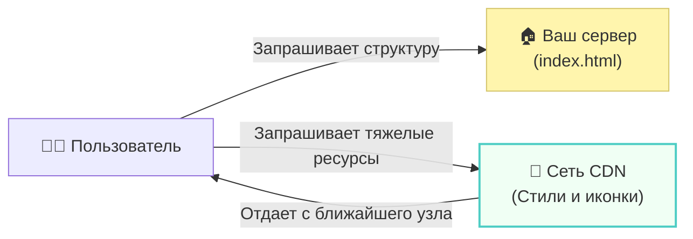

---

### Но будьте осторожны! ⚠️

Несмотря на все плюсы, у CDN есть одна особенность: если у пользователя пропадет связь с сервером CDN (или сам сервис упадет, что бывает крайне редко), ваш сайт останется без стилей или иконок. Поэтому в критически важных проектах разработчики иногда делают «запасной вариант» (fallback), но для большинства задач CDN — это стандарт индустрии.

>[!tip]
>#### Помните о версиях 📌
>В ссылке выше вы видите `@1.11.1`. Это версия библиотеки. Если вы захотите обновиться, достаточно будет просто поменять цифры в ссылке, и ваш проект сразу получит новые возможности без ручного обновления файлов.

---

### Практический пример: Оживляем интерфейс иконками 🎨

Теперь давайте разберем, как применить теорию на практике. Мы подключим библиотеку иконок и выведем одну из них на экран.

```html
<!-- index.html -->
<!doctype html>
<html lang="ru">
  <head>
    <meta charset="UTF-8" />
    <meta name="viewport" content="width=device-width, initial-scale=1.0" />
    <!-- Подключаем наши локальные стили -->
    <link rel="stylesheet" href="./lesson_3.css" />
    <!-- Подключаем внешнюю библиотеку иконок через CDN -->
    <link
      rel="stylesheet"
      href="https://cdn.jsdelivr.net/npm/bootstrap-icons@1.11.1/font/bootstrap-icons.css"
    />
    <title>Lesson 3</title>
  </head>
  <body>
    <!-- Тег i используется для иконок по традиции -->
    <i class="bi bi-virus"></i>
  </body>
</html>
```

#### Как это работает? ⚙️

1.  **Подключение:** В секции `<head>` мы добавили тег `<link>`, который загружает CSS-файл с CDN. В этом файле уже прописаны правила для отображения сотен различных символов.
2.  **Тег `<i>`:** Исторически для иконок используется тег `<i>` (от слова *italic*), хотя сейчас это скорее общепринятое соглашение, чем строгое правило. 
3.  **Система классов:** Магия происходит благодаря атрибуту `class`. 
    -   `bi` — базовый класс, который говорит браузеру: «Используй шрифт Bootstrap Icons».
    -   `bi-virus` — конкретное имя иконки. Если заменить его на `bi-alarm` или `bi-heart`, картинка мгновенно поменяется.

---

### Спецэффекты: Красим и масштабируем 🌈

Самая приятная новость: иконки из этого набора — это не картинки, а **шрифты**. Это значит, что вы можете управлять ими так же легко, как обычным текстом в вашем CSS-файле. Им не страшна потеря качества при увеличении!

Чтобы изменить внешний вид иконки, обратитесь к её классу в файле `lesson_3.css`:

```css
/* lesson_3.css */

.bi-virus {
    /* Меняем размер шрифта = размер иконки */
    font-size: 4rem; 
    
    /* Красим иконку в любой цвет */
    color: #2ecc71; 
    
    /* Можно даже добавить свечение */
    text-shadow: 0 0 10px rgba(46, 204, 113, 0.5);
}
```

>[!tip]
>#### Гибкость стилизации 💡
>Если вы хотите покрасить **все** иконки на сайте разом, используйте общий селектор `.bi`. А если нужно выделить только одну — используйте её специфичное имя, например `.bi-heart`.

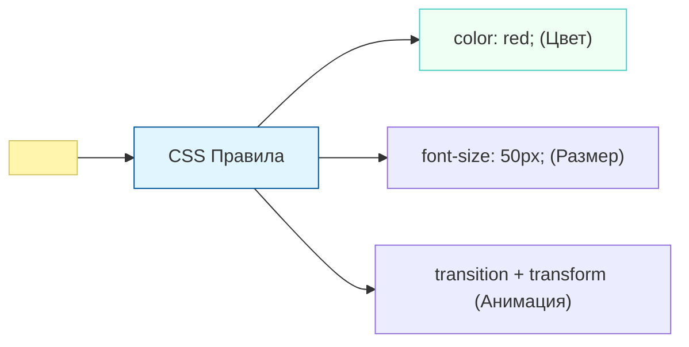

Этот подход позволяет создавать профессиональные интерфейсы с минимальным количеством кода и идеальной четкостью на любых экранах (от старых мониторов до Retina-дисплеев смартфонов).

---

### Альтернативные наборы иконок: Что выбрать? 🛠️

Мир веб-разработки не ограничивается только Bootstrap Icons. Существует несколько гигантов, которые предлагают тысячи иконок под любые задачи. Выбор библиотеки зависит от дизайна вашего проекта и требований к скорости загрузки.

---

### 1. Font Awesome — «Золотой стандарт» 👑

Это, пожалуй, самая популярная библиотека иконок в мире. У неё есть как огромная бесплатная коллекция, так и платная версия (Pro).

- **Плюсы:** Невероятное количество иконок (даже в бесплатной версии их более 2000), отличная документация и поддержка всех фреймворков.
- **Подключение:** Чаще всего через CDN (требуется регистрация для получения персонального „кита“) или прямую ссылку.

```html
<!-- Пример подключения через открытый CDN -->
<link rel="stylesheet" href="https://cdnjs.cloudflare.com/ajax/libs/font-awesome/6.4.2/css/all.min.css">

<!-- Использование -->
<i class="fa-solid fa-ghost"></i> <!-- Привидение -->
<i class="fa-brands fa-github"></i> <!-- Логотип GitHub -->
```

---

### 2. Google Fonts Icons (Material Symbols) 🔍

Если вы любите дизайн в стиле Android или сервисов Google, то это ваш выбор. В отличие от других, Google использует современный подход «вариативных шрифтов».

- **Плюсы:** Максимально чистый, «инженерный» дизайн. Можно настраивать толщину линий и степень заливки иконки через CSS.
- **Подключение:**

```html
<link rel="stylesheet" href="https://fonts.googleapis.com/css2?family=Material+Symbols+Outlined:opsz,wght,FILL,GRAD@24,400,0,0" />

<!-- Использование -->
<span class="material-symbols-outlined">settings</span>
```

---

### 3. Boxicons — Лаконичность и стиль 📦

Отличная бесплатная альтернатива, если Bootstrap Icons кажутся слишком простыми, а Font Awesome — слишком «тяжелыми».

- **Плюсы:** Очень стильные, современные иконки, которые отлично смотрятся в веб-приложениях. Есть анимированные версии иконок «из коробки».
- **Подключение:**

```html
<link href='https://unpkg.com/boxicons@2.1.4/css/boxicons.min.css' rel='stylesheet'>

<!-- Использование -->
<i class='bx bx-rocket'></i> <!-- Ракета -->
<i class='bx bx-loader-alt bx-spin'></i> <!-- Крутящаяся загрузка -->
```

---

### Матрица выбора: Что и когда использовать? 🧠

| Библиотека | Когда выбирать? | Характер дизайна |
| :--- | :--- | :--- |
| **Bootstrap Icons** | Идеально для простых проектов и учебных задач. | Прагматичный, стандартный. |
| **Font Awesome** | Когда нужен огромный выбор (соцсети, разные формы). | Детализированный, узнаваемый. |
| **Google Icons** | Для строгих интерфейсов и панелей управления. | Минималистичный (Material Design). |
| **Boxicons** | Для современных сайтов и лендингов. | Мягкий, трендовый. |

---

### Сводная схема подключения внешних ресурсов

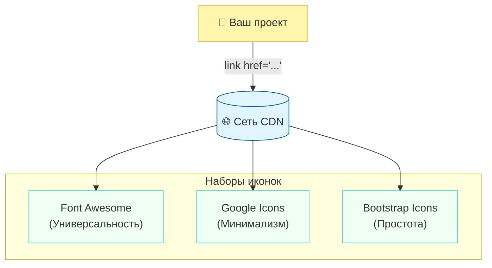

>[!warning]
>#### Не подключайте всё сразу! 🪤
>Начинающие разработчики иногда подключают 3-4 библиотеки иконок одновременно. Это плохая практика: каждая библиотека — это лишние килобайты, которые должен скачивать пользователь. Выберите **одну** основную библиотеку для проекта и придерживайтесь её для сохранения единого стиля.

>[!tip]
>#### Главный секрет настройки 🎨
>Помните, что во всех этих библиотеках иконки — это **текст**. Если иконка не красится через `color`, проверьте, нет ли у неё внутренних стилей, которые это запрещают, но в 99% случаев `font-size` и `color` — ваши главные инструменты.

---

## 2. Таблицы в HTML: Прошлое и настоящее 📊

Таблицы в веб-разработке прошли длинный путь. Когда-то, на заре интернета, они были единственным способом «собрать» скелет сайта.

До появления современных инструментов (Flexbox и Grid), разработчики использовали таблицы для **верстки макетов**. Выглядело это так: левая колонка таблицы служила меню, правая — основным контентом, а верхняя строка — шапкой. Это было неудобно, громоздко и создавало огромные проблемы для мобильных устройств.

Сегодня таблицы используются строго по назначению: для отображения **структурированных данных**, таких как прайс-листы, расписания или финансовые отчеты.

### Анатомия стандартной таблицы

Для создания таблицы используется целая группа тегов. Давайте разберем пример, который вы написали с помощью сокращения Emmet (`table>tr*3>td{$}*3`):

```html
<table>
  <!-- Первая строка (row) -->
  <tr>
    <td>1</td> <!-- Ячейка (data) -->
    <td>2</td>
    <td>3</td>
  </tr>
  <!-- Вторая строка -->
  <tr>
    <td>1</td>
    <td>2</td>
    <td>3</td>
  </tr>
  <!-- Третья строка -->
  <tr>
    <td>1</td>
    <td>2</td>
    <td>3</td>
  </tr>
</table>
```

#### Ключевые теги:
- `<table>` — контейнер для всей таблицы.
- `<tr>` (**Table Row**) — определяет строку таблицы.
- `<td>` (**Table Data**) — стандартная ячейка с данными внутри строки.

---

### Как это выглядит в структуре? 🏗️

Таблицу можно представить как сетку, где каждая строка — это горизонтальный ряд, а ячейки внутри неё выстраиваются в колонки.

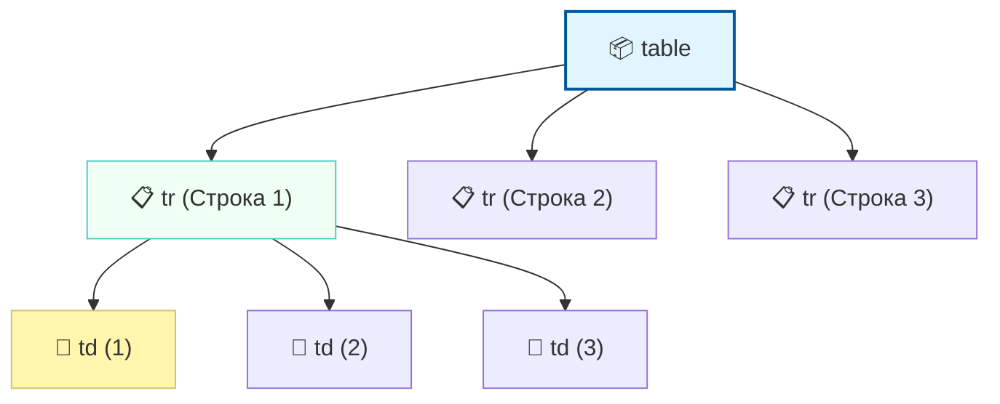

---

### Оформление таблиц через CSS 🎨

По умолчанию таблицы выглядят очень невзрачно — у них нет даже видимых границ. Чтобы превратить их в читаемый отчет, нам понадобится CSS.

```css
/* Делаем границы видимыми */
table {
    width: 100%;
    border-collapse: collapse; /* Схлопывает двойные границы в одну */
}

td {
    border: 1px solid #ddd;
    padding: 8px;
    text-align: center;
}

/* Добавляем «зебру» для удобства чтения */
tr:nth-child(even) {
    background-color: #f2f2f2;
}
```

>[!warning]
>#### Таблицы — не для дизайна! 🛑
>Никогда не используйте таблицы для расположения блоков сайта (например, чтобы поставить картинку рядом с текстом). Для этого существуют современные методы верстки. Таблицы — только для данных, которые можно представить в Excel.

>[!info]
>#### Семантика важна 💡
>Для заголовочных ячеек (например, «Имя», «Цена») вместо `<td>` лучше использовать тег `<th>` (**Table Header**). По умолчанию браузер делает текст внутри него жирным и центрирует его, а поисковики лучше понимают структуру вашего контента.

---

### Эволюция верстки: От «сетки» до гибкости ⏳

История веб-разработки напоминает смену архитектурных стилей: от тяжелых каменных блоков к легким стеклянным конструкциям. Давайте проследим этот путь по годам.

#### Эпоха табличного хаоса (1995 — 2005) 🦖
В середине 90-х разработчики обнаружили, что тег `<table>` — это единственный способ заставить контент стоять в две колонки. 
- **Как это было:** Весь сайт представлял собой одну гигантскую невидимую таблицу. Внутри ячеек таблицы лежали другие таблицы, а в них — еще одни.
- **Главная проблема:** «Табличная верстка» была кошмаром для поисковых роботов и людей с нарушениями зрения. Кроме того, сайт не начинал отображаться, пока браузер не загружал таблицу полностью до самого конца.

#### Эпоха Float-хаков (2005 — 2015) 🛠️
На смену таблицам пришло свойство `float` (обтекание), которое изначально создавалось для того, чтобы текст просто огибал картинку. Разработчики научились «прижимать» блоки к краям экрана. Это было лучше таблиц, но требовало постоянного использования «костылей» (например, знаменитого `clearfix`) для того, чтобы дизайн не «разваливался».

#### Эпоха Просвещения: Flexbox и Grid (2015 — сегодня) ✨
- **2015-2017 гг:** Технология **Flexbox** получила массовую поддержку в браузерах. Она совершила революцию в выравнивании элементов внутри строк и колонок.
- **2017 г:** Появился **CSS Grid** — «старший брат» Flexbox, который позволил создавать сложные двумерные макеты (настоящие сетки) без лишних тегов.

---

### Используются ли таблицы для расположения элементов в 2026 году? 🔭

В 2026 году ответ практически однозначный: **НЕТ**, для обычных сайтов это считается признаком крайне низкого качества кода («индийский код» в плохом смысле слова). Однако есть одна крепость, которая до сих пор не сдалась под натиском прогресса.

#### Единственное исключение: HTML-письма 📧
Если вы откроете код рекламного письма от крупного магазина или банка (e-mail рассылки), вы обнаружите там те самые таблицы из 1998 года. 

**Почему так происходит?**
Почтовые клиенты (особенно старые версии Outlook) крайне консервативны. Они очень плохо понимают современные Flexbox и Grid. Чтобы ваше письмо выглядело одинаково хорошо и в Gmail, и в приложении на смартфоне, и в Outlook на офисном компьютере, разработчикам приходится «строить» его на таблицах.

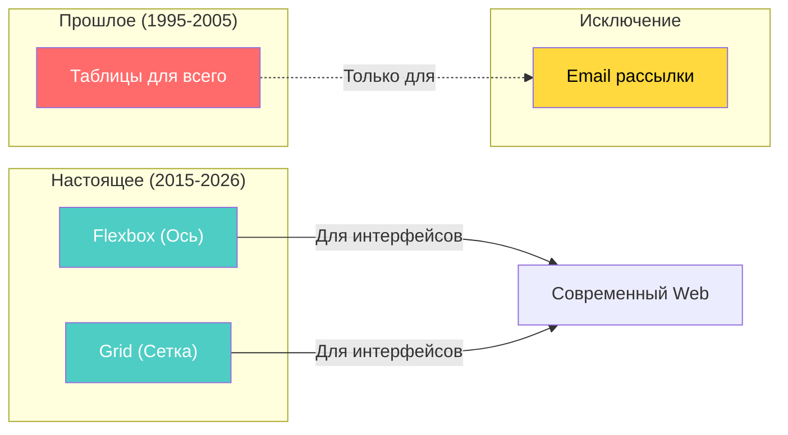

>[!info]
>#### Резюме для будущего профи 🎓
>- **Таблицы (`<table>`)** — для данных и финансовых отчетов.
>- **Flexbox** — для выравнивания элементов в ряд или столбик (меню, карточки).
>- **Grid** — для общей структуры страницы (шапка, подвал, боковые панели).
>- **Таблицы в верстке** — только если вы профессионально занимаетесь созданием e-mail шаблонов.

Жирным шрифтом в 2026 году стоит запомнить: **таблица — это контент, а не каркас**. Мы используем её только тогда, когда хотим показать пользователю список значений, которые удобно сравнивать между собой.

---

### Превращаем «голый» HTML в читаемую таблицу 💎

Как вы уже заметили, по умолчанию таблица в браузере выглядит как обычный текст, разбросанный по невидимым колонкам. Чтобы она стала похожа на настоящий документ, нам нужно поработать с границами и отступами в CSS.

Давайте пошагово приведем вашу таблицу `table>tr*3>td{$}*3` в идеальный вид.

---

### 1. Проблема двойных рамок и решение: `border-collapse`

Если вы просто добавите рамку (`border`) к таблице и ячейкам, вы увидите «эффект тетрадки» — между ячейками будут крошечные пустые зазоры. Чтобы ячейки плотно прилегали друг к другу и имели одну общую линию границы, используется магическое свойство `border-collapse`.

```css
table {
    /* Схлопываем двойные границы в одну четкую линию */
    border-collapse: collapse; 
    width: 100%; /* Растягиваем таблицу на всю ширину контейнера */
    margin: 20px 0; /* Добавляем отступы сверху и снизу */
}
```

---

### 2. Дизайн ячеек: Рамки и «воздух»

Чтобы цифры не прилипали к линиям, нам нужен `padding` (внутренний отступ). Это создаст тот самый «воздух», который делает интерфейс приятным.

```css
td {
    border: 1px solid #dee2e6; /* Тонкая серая рамка */
    padding: 12px 15px; /* Отступы: 12px сверху/снизу, 15px слева/справа */
    text-align: left; /* Выравнивание текста по левому краю */
    color: #212529; /* Цвет текста — темно-серый, почти черный */
}
```

---

### 3. Финальный штрих: Стилизуем строки

Для лучшей читаемости часто добавляют легкую подсветку каждой второй строки (**Zebra Striping**) или выделяют строку при наведении. Это помогает глазу не терять строку в больших таблицах.

```css
/* Каждая четная строка получает легкий серый фон */
tr:nth-child(even) {
    background-color: #f8f9fa;
}

/* Красивый эффект: строка подсвечивается при наведении мышки */
tr:hover {
    background-color: #e9ecef;
    transition: background-color 0.2s ease; /* Плавный переход цвета */
}
```

---

### Как это работает вместе? 🧩

Представьте таблицу как слоеный пирог, где CSS управляет каждым слоем: слой общей структуры, слой линий и слой декора.

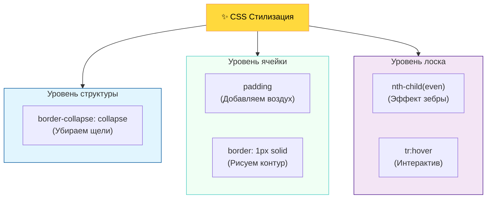

>[!tip]
>#### Используйте переменную цвета 🎨
>В современной разработке (даже в 2026 году) для рамок таблиц лучше использовать не чисто черный (`#000`), а мягкие оттенки серого, например `#ccc` или `#dee2e6`. Это делает таблицу визуально «легче» и она меньше отвлекает от самих данных.

>[!info]
>#### Быстрый хак для рамок в HTML 💡
>В старых учебниках вы можете встретить атрибут напрямую в HTML: `<table border="1">`. **Не используйте его!** Это устаревший подход. Все визуальное оформление (рамки, цвета, отступы) должно находиться исключительно в вашем CSS-файле.

---

## 2. Селекторы CSS: Как браузер находит элементы 🎯

Чтобы применить стили к нашей таблице или любому другому элементу, CSS должен понимать, к кому именно мы обращаемся. Для этого используются **селекторы** — это своего рода «адресная система» в мире кода.

Разберем основные виды селекторов, от простых к более точным.

---

### 1. Базовые селекторы

Это фундамент, на котором строится вся стилизация страницы.

| Селектор | Пример | Описание |
| :--- | :--- | :--- |
| **По тегу** | `h2` | Выбирает **все** элементы с данным именем тега на странице. Удобно для задания общих правил (например, шрифт для всех заголовков). |
| **По классу** | `.green-text` | Самый популярный вид. Выбирает элементы, у которых прописан атрибут `class="green-text"`. Классы можно использовать многократно. |
| **По ID** | `#main-table` | Выбирает уникальный элемент с `id="main-table"`. На одной странице такой ID должен быть только у **одного** элемента. Используется редко, в основном для якорей или JS. |

---

### 2. Комбинированные селекторы

Иногда нам нужно уточнить цель, чтобы не «зацепить» лишние элементы.

#### Селектор по тегу и классу (`h2.classname`)
Мы пишем тег и класс слитно. Это означает: «найди заголовок `h2`, но только если у него есть класс `classname`».
```css
h2.highlight {
    color: orange; /* Применится только к <h2 class="highlight"> */
}
```

#### Селектор по потомкам (`table td`)
Мы пишем теги через **пробел**. Это означает: «найди все `td`, которые находятся внутри `table` на **любом** уровне вложенности». Неважно, лежат они в строке или в глубоко вложенной структуре — они будут выбраны.

#### Селектор по дочерним элементам (`table > tr`)
Мы используем символ «больше» (`>`). Это более строгий выбор. Он означает: «найди `tr`, который является **непосредственным ребенком** `table`». Если `tr` будет обернут, например, в `tbody`, такой селектор его уже не увидит.

---

### Иерархия связей в CSS 🌳

Чтобы лучше запомнить разницу между «потомками» и «детьми», представьте семейное древо:

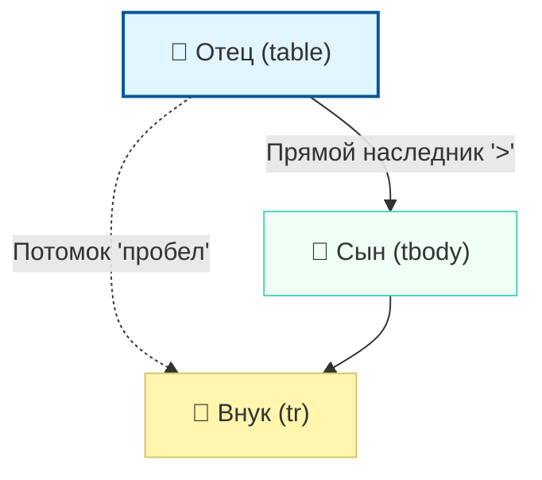

---

### Как это выглядит на практике? 💻

Рассмотрим пример с нашей таблицей:

```css
/* 1. Стили для всех таблиц */
table {
    border: 2px solid black;
}

/* 2. Только для таблицы с конкретным ID */
#price-list {
    width: 500px;
}

/* 3. Только ячейки внутри конкретного класса */
.dark-theme td {
    background-color: #333;
    color: white;
}

/* 4. Уточняем: ячейка должна иметь класс 'active' */
td.active {
    background-color: yellow;
}
```

>[!warning]
>#### Приоритет (Специфичность) ⚖️
>Запомните: селектор по **ID** всегда сильнее, чем селектор по **классу**, а класс сильнее, чем просто **тег**. Если вы напишете для `h2` красный цвет, а для `.title` синий — текст будет синим, потому что класс «весит» больше.

>[!tip]
>#### Правило хорошего тона 💡
>Старайтесь чаще использовать **классы** (`.classname`). Это делает ваш код гибким: вы можете повесить один и тот же класс на разные элементы. Селекторы по тегам слишком общие, а ID слишком жесткие — их сложно переиспользовать.

---

### Ловушка прямого наследника: Почему `table > td` не сработал? 🧩

Давайте разберем, почему ваш код не окрасил ячейки в фиолетовый цвет. В CSS символ `>` означает **строгое отцовство**. Селектор `table > td` приказывает браузеру: *«Найди ячейку `td`, которая является **непосредственным** (прямым) ребенком тега `table`»*.

#### Разбор иерархии

Посмотрим на структуру вашей таблицы еще раз:

```html
<table class="stripped-table">
  <tr> <!-- Это "ребенок" (дочерний элемент) для table -->
      <td>1</td> <!-- Это "внук" (потомок) для table, но ребенок для tr -->
      <td>2</td>
  </tr>
</table>
```

В этой структуре:
1. Тег `<tr>` является **дочерним** элементом для `<table>`.
2. Тег `<td>` является **дочерним** элементом для `<tr>`.
3. Для `<table>` ячейка `<td>` — это **потомок** (внук), а не прямой ребенок.

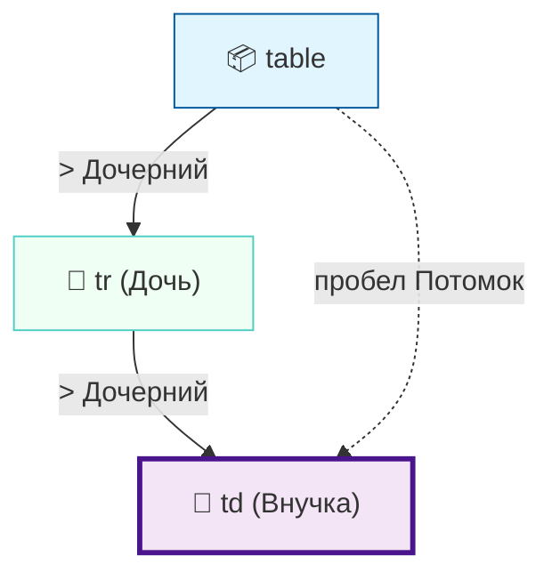

#### Почему фиолетовый цвет «не включился»?

Взглянем на ваш код:

```css
/* ✅ РАБОТАЕТ: "найди любой td внутри table" (потомок) */
table td {
    background-color: #2ecc71; /* Зеленый */
}

/* ❌ НЕ РАБОТАЕТ: "найди td, который лежит прямо в table" */
table > td {
    background-color: #c417bb; /* Фиолетовый */
}
```

Браузер проходит по дереву документа, ищет `td` прямо внутри `table`, не находит их (потому что они спрятаны внутри `tr`) и просто игнорирует это правило. В итоге побеждает предыдущее рабочее правило с зеленым фоном.

>[!warning]
>#### Невидимый посредник: tbody 👻
>Даже если вы напишете `table > tr`, это может не сработать! Современные браузеры автоматически оборачивают все строки `tr` в невидимый в коде тег `<tbody>`.
>Тогда цепочка превращается в `table > tbody > tr > td`. Именно поэтому безопаснее использовать селектор через пробел (`table td`), если только вам не нужна хирургическая точность.

---

### Как заставить это работать?

Если вы хотите использовать именно селектор «дочернего элемента» для ячеек, вам придется прописать всю цепочку родства полностью:

```css
/* Теперь цепочка верна: стол → строка → ячейка */
table > tr > td {
    background-color: #c417bb; 
}
/* Или с учетом авто-вставки браузером: */
table > tbody > tr > td {
    background-color: #c417bb;
}
```

>[!tip]
>#### Практический совет 💡
>В реальной разработке селекторы типа `table > tr > td` используются редко, так как они слишком хрупкие. Если структура таблицы чуть-чуть изменится, стили сломаются. Используйте **пробел** (`table td`) для большинства задач или **классы** (`.my-cell`) для точечной настройки.

---

### 3. Проблема масштабирования: Когда простых селекторов мало 📈

Когда мы работаем с маленькой таблицей из трех строк, нам легко управлять ей. Но что, если в вашей таблице **100, 500 или 1000 строк**? 

Предположим, вы хотите сделать «зебру» (чередование цветов строк), чтобы пользователю было удобно читать данные.

#### Почему текущий подход — плохой вариант?

Посмотрите на этот код, если бы мы пытались раскрасить строки вручную:

```css
/* ❌ Плохой вариант: ручное назначение классов каждой строчке */
.row-odd { background-color: #f8f9fa; }
.row-even { background-color: #ffffff; }
```

**Проблемы этого метода:**
1. **Громоздкость:** Вам придется добавить класс каждой из 1000 строк в HTML. Файл станет огромным.
2. **Хрупкость:** Если вы удалите одну строку из середины или добавите новую, «зебра» сломается. Четная строка станет нечетной, и вам придется переписывать классы вручную для всех строк ниже.
3. **Нечитаемость селекторов по потомкам:** Использование конструкций вроде `.stripped-table > tr > td` для каждой строки превратит CSS в бесконечный список правил.

---

### Знакомьтесь: Псевдоклассы и магия `:nth-child` ✨

Чтобы решать такие задачи элегантно, в CSS существуют **псевдоклассы**. Они позволяют выбирать элементы не по имени или классу, а по их **порядковому номеру** или положению в дереве документа.

Самый мощный инструмент здесь — селектор `:nth-child()`. 

#### Как работает :nth-child

Вместо того чтобы вручную помечать строки, мы даем браузеру формулу:

```css
/* ✅ Умный вариант: браузер сам считает строки */

/* Красим каждую четную строку (2, 4, 6, ...) */
.stripped-table tr:nth-child(even) {
    background-color: #f2f2f2;
}

/* Или используем формулу (2n — каждая вторая) */
.stripped-table tr:nth-child(2n) {
    background-color: #f2f2f2;
}
```

---

### Анализ взаимодействия селектора

Когда вы используете `.stripped-table tr:nth-child(even)`, браузер работает как автоматический счетчик:

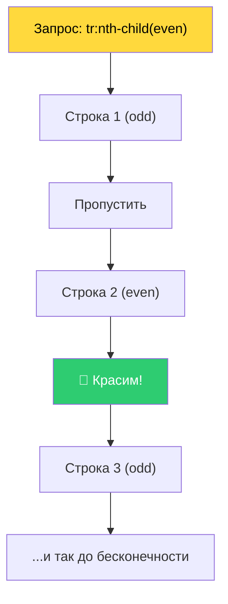

#### Почему это идеальный выбор для больших данных?

1. **Автоматизация:** Неважно, 10 строк в таблице или 10 000. Это одно правило CSS обработает их все.
2. **Динамика:** Если вы добавите новую строку в начало таблицы с помощью JavaScript, браузер мгновенно пересчитает порядок и обновит «зебру».
3. **Чистый HTML:** Ваш HTML-код остается чистым, без лишних классов типа `row-1`, `row-2`.

>[!info]
>#### Что такое "nth"? 💡
>Буква **n** в названии — это переменная из математики (целое число от 0 до бесконечности). 
>- `nth-child(3)` — выберет строго третьего ребенка.
>- `nth-child(odd)` — выберет всех нечетных.
>- `nth-child(3n)` — выберет каждого третьего (3, 6, 9...).

>[!warning]
>#### Важный нюанс
>Помните, что `:nth-child` считает **всех** детей родителя. Если у вас внутри таблицы внезапно окажется какой-то другой тег (не `tr`), счетчик может сбиться. Всегда следите за тем, чтобы селектор был направлен на однородные элементы.

---

### 4. Сложные структуры и Emmet-магия 🪄

Прежде чем мы перейдем к финальной стилизации полосатых столбцов, давайте разберем, как быстро создавать профессиональные таблицы. Если писать каждый тег `<thead>`, `<tbody>` и `<tfoot>` вручную, можно легко запутаться в закрывающих скобках.

Для этого в VS Code есть **Emmet** — система сокращений, которая превращает короткие строчки в огромные блоки кода.

#### Разбор Emmet-кода: Оператор «Шляпа» (`^`)

Чтобы создать полноценную таблицу с «шапкой», «телом» и «подвалом», мы использовали такую команду:

`table>thead>tr>th*3^^tbody>tr*3>td*3^^tfoot>tr>td*3`

**Что здесь происходит?**
- `table>` — создаем таблицу и заходим внутрь.
- `thead>tr>th*3` — создаем «шапку», в ней строку, а в строке 3 ячейки-заголовка.
- **`^^` (Шляпа/Амперсанд)** — это оператор **подъема на уровень выше**. Один символ `^` поднимает нас из `th` в `tr`. Второй `^` поднимает нас из `tr` в `thead`. Теперь мы снова на уровне `table` и можем создавать `tbody` рядом с «шапкой», а не внутри неё.
- `tbody>tr*3>td*3` — создаем тело таблицы: 3 строки по 3 ячейки в каждой.
- `^^tfoot` — снова дважды поднимаемся вверх к корню таблицы, чтобы добавить «подвал».

---

### Структура современной таблицы 🏗️

После развертывания Emmet мы получаем четко сегментированную таблицу. Это важно не только для удобства, но и для того, чтобы браузер (и поисковики) понимали, где важные заголовки, а где итоговые данные.

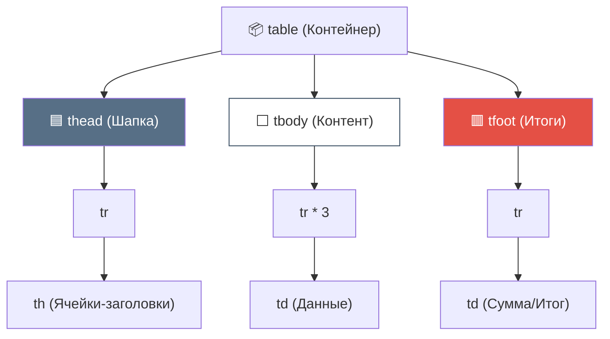

---

### Полосатые столбцы: Точность селектора 🎨

Теперь самое интересное — мы хотим раскрасить не строки, а **столбцы**. CSS позволяет сделать это так же легко:

```css
/* Выбираем нечетные столбцы (1-й и 3-й) во всей таблице */
table td:nth-child(odd) {
  background-color: #f39c12; /* Оранжевый */
}
```

#### Проблема «Перекрытия» и Специфичность

Когда мы начинаем комбинировать общие правила со специфичными, возникает конфликт. Например, мы хотим, чтобы «подвал» таблицы (`tfoot`) всегда был красным, независимо от того, четный это столбец или нет.

Обратите внимание на этот фрагмент:

```css
/* Этот селектор ОЧЕНЬ точный: он ищет td внутри tfoot таблицы с классом full-table */
table.full-table tfoot td {
  background-color: #e45045;
  color: #340505;
}
```

**Почему это важно?**
Если бы мы написали просто `tfoot td`, оранжевый цвет от `td:nth-child(odd)` мог бы оказаться «сильнее» в некоторых браузерах. 

>[!warning]
>#### Битва весов в CSS ⚖️
>В CSS существует понятие **специфичности**. Чем подробнее описан путь к элементу, тем выше его приоритет.
>- `td:nth-child` — 10 баллов за псевдокласс + 1 за тег.
>- `table.full-table tfoot td` — 10 баллов за класс + 3 балла за теги.
>
>Если ваши стили не применяются, у вас два пути:
>1. 🛠️ **Сделать селектор точнее** (добавить класс родителя, как в примере выше).
>2. 🔨 **Использовать `!important`** (крайний метод, который заставляет стиль примениться насильно, но усложняет жизнь в будущем).

>[!tip]
>#### Как выбрать четный/нечетный? 💡
>- `odd` — 1, 3, 5... (нечетные)
>- `even` — 2, 4, 6... (четные)
>
>Вы можете красить строки по горизонтали через `tr:nth-child`, и одновременно красить столбцы через `td:nth-child`. При их пересечении сработает то правило, которое написано в CSS **ниже** (если их вес одинаков).

---

### 5. Битва за приоритет: Специфичность в деталях ⚖️

Почему в нашем примере «подвал» таблицы окрасился в красный, хотя до этого мы приказали всем нечетным ячейкам быть оранжевыми? Ответ кроется в **специфичности** (или «весе») селектора. 

Браузер — это строгий судья. Когда два правила претендуют на один и тот же элемент, он не выбирает тот, что «красивее». Он берет калькулятор и считает баллы.

#### Система подсчета баллов CSS

Представьте специфичность как четырехзначное число `(0, 0, 0, 0)`:

1.  **Inline-стили** (в самом HTML): `+1000`
2.  **ID** (`#footer`): `+100`
3.  **Классы, атрибуты и псевдоклассы** (`.full-table`, `:nth-child`): `+10`
4.  **Теги** (`table`, `td`, `tr`): `+1`

---

### Разбор нашего конфликта 🥊

Давайте сравним два правила из нашего кода и вычислим их вес.

#### Правило №1: Полосатые столбцы
```css
table td:nth-child(odd)
```
*   `table` (тег) = **1**
*   `td` (тег) = **1**
*   `:nth-child` (псевдокласс) = **10**
*   **Итого: 12 баллов**

#### Правило №2: Красный подвал
```css
table.full-table tfoot td
```
*   `table` (тег) = **1**
*   `.full-table` (класс) = **10**
*   `tfoot` (тег) = **1**
*   `td` (тег) = **1**
*   **Итого: 13 баллов**

**Результат:** Правило для подвала выиграло со счетом **13 против 12**! Поэтому ячейки в `tfoot` стали красными, проигнорировав «нечетную» оранжевую заливку.

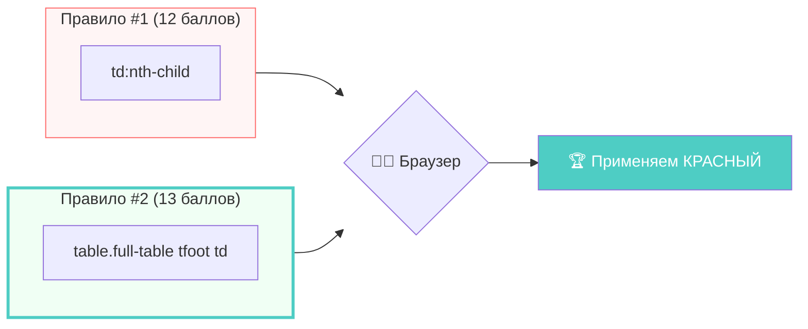

---

### Почему мы просто не использовали `!important`?

Мы могли бы написать `background-color: #e45045 !important;`. Это мгновенно подняло бы вес правила до небес. Однако опытные разработчики называют это **«ядерным ударом»**.

>[!warning]
>#### Ловушка !important ☢️
>Если вы используете `!important`, вы ломаете естественную иерархию CSS. Чтобы перебить такой стиль в будущем (например, при наведении мышкой), вам придется добавлять еще более мощный `!important`. 
>Это приводит к «войне спецификаций», где код становится невозможно поддерживать. **Правильный путь — сделать селектор чуть точнее**, добавив класс или контекст (тег родителя).

#### Как «победить» селектор без криков?

Чтобы перебить правило, достаточно добавить в цепочку одно уточнение:
- Был просто `td`? Напишите `tr td`.
- Был `tr td`? Напишите `.my-table tr td`.

Каждое слово в селекторе — это гиря на весах. Мы добавили класс `.full-table` и тег родителя `tfoot`, что сделало наше намерение максимально ясным для браузера: *«В этой конкретной таблице, именно в этой секции, ячейки должны быть такими»*.

>[!tip]
>#### Золотое правило специфичности 💡
>Пишите максимально простые селекторы. Усложняйте их (добавляйте классы и вложенность) только тогда, когда нужно разрешить конфликт стилей. Чем меньше вес ваших правил, тем легче будет изменять дизайн сайта в будущем.

---

### Итоги: Ваша карта инструментов CSS-селекторов 🗺️

Мы прошли путь от простого окрашивания текста до сложных расчетов специфичности. Теперь ваша «коробочка инструментов» наполнена всеми необходимыми средствами для точечного управления дизайном. 

Давайте структурируем все изученные типы селекторов, чтобы вы знали, когда и какой инструмент доставать.

#### 1. Основной арсенал (Базовые селекторы)
Это фундамент, на котором строится 90% верстки:
- **Селектор тега** (`td`, `table`) — применяет стили ко всем элементам этого типа. Полезен для задания общих правил (например, отступов во всех ячейках).
- **Селектор класса** (`.full-table`) — самый гибкий инструмент. Позволяет объединять разные элементы в группы и стилизовать их одинаково.
- **Селектор ID** (`#main-header`) — «снайперский выстрел». Применяется только к одному уникальному элементу на странице. Используйте редко.

#### 2. Комбинаторы (Связи между элементами)
Позволяют выбирать элементы в зависимости от их окружения:
- **Вложенный селектор** (`table td`) — выбирает все `td` внутри любой таблицы.
- **Дочерний селектор** (`thead > tr`) — выбирает только прямых «детей». Это помогает избежать случайного окрашивания вложенных таблиц.

#### 3. Псевдоклассы (Динамика и Порядок)
Самая интеллектуальная часть CSS, позволяющая выбирать элементы по их состоянию или позиции:
- **Структурные** (`:nth-child(even/odd)`) — идеальны для создания «зебр», полосатых столбцов и выделения каждого n-го элемента в больших списках.
- **Интерактивные** (например, `:hover`, который мы затронем далее) — позволяют сайту «оживать» при действиях пользователя.

---

### Шпаргалка по расчету «веса» ⚖️

Если ваши стили не работают, просто проверьте эту таблицу. Кто набрал больше баллов — тот и прав:

| Тип селектора | Вес (баллы) | Пример |
| :--- | :--- | :--- |
| **Тег** | 1 | `table`, `tr`, `td`, `th` |
| **Класс / Псевдокласс** | 10 | `.my-class`, `:nth-child()`, `:hover` |
| **ID** | 100 | `#unique-id` |
| **Inline-стиль** | 1000 | `style="color: red;"` |
| **!important** | ∞ | `color: red !important;` |

---

>[!tip]
>#### Совет наставника 🎓
>Хороший CSS-код — это не тот, где много `!important`, а тот, где структура таблицы (созданная с помощью крутых инструментов вроде **Emmet**) поддерживается логичными и легкими селекторами. 
>
>Начинайте с общих правил для тегов и постепенно уточняйте их с помощью классов. Теперь, когда вы понимаете, как браузер «считает» ваш код, вы не просто верстальщик, а настоящий архитектор интерфейсов.

В следующем разделе мы узнаем, как сделать наши таблицы не только красивыми, но и интерактивными! 🚀

---

### Итоговая практика: Создаем идеальную таблицу 🏆

Мы разобрали множество инструментов: от сокращений **Emmet** до тонкостей **специфичности CSS**. Теперь давайте соберем всё воедино и закрепим алгоритм создания профессиональной, семантически верной и стильной таблицы.

#### 1. Структура (HTML)
Настоящая таблица — это не просто набор тегов `<tr>` и `<td>`. Чтобы она была доступной и логичной, мы всегда используем три «этажа»: **шапку**, **тело** и **подвал**.

**Секрет быстрой верстки (Emmet):**
Введите эту строку в VS Code и нажмите `Tab`:
`table>thead>tr>th*3^^tbody>tr*4>td*3^^tfoot>tr>td*3`

*   **`thead`**: Для заголовков (используем `th` внутри).
*   **`tbody`**: Для основных данных.
*   **`tfoot`**: Для итогов, сумм или примечаний.

---

#### 2. Базовая стилизация (CSS)
Чтобы таблица не выглядела как привет из 90-х, нам нужно «схлопнуть» двойные границы и добавить пространства.

```css
table {
  /* Убирает двойные рамки между ячейками */
  border-collapse: collapse; 
  border: 2px solid #34495e;
  width: 100%; /* Растягиваем на всю ширину */
}

td, th {
  border: 1px solid #34495e;
  padding: 20px; /* Даем контенту "дышать" */
  text-align: left;
}

th {
  background-color: #576f86;
  color: white;
  text-transform: uppercase; /* Делаем заголовки строже */
}
```

---

#### 3. Продвинутый дизайн: Полосатая «зебра» 🦓
Чередование цветов помогает глазу не терять строку при чтении больших объемов данных. Мы используем `:nth-child(even)` для четных строк.

```css
/* Выбираем каждую четную строку (2, 4, 6...) и красим её ячейки */
table tr:nth-child(even) td {
  background-color: #c3e2e4;
}
```

---

#### 4. Финальный штрих: Акцент на итогах
Наш селектор для `tfoot` должен быть достаточно точным, чтобы выделить область итогов ярким цветом.

```css
tfoot td {
  background-color: #e45045; /* Красный акцент */
  color: rgb(52, 5, 5);
  font-weight: bold;
}
```

---

### Визуальная карта нашей таблицы 💡

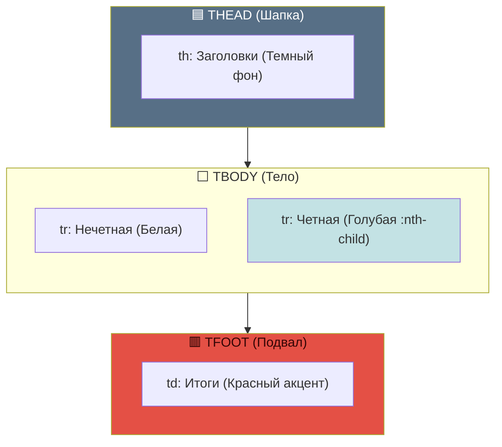

>[!info]
>#### Главный вывод урока 🎓
>Создание качественной таблицы — это баланс между тремя силами:
>1. **Семантика:** Правильное использование `thead`, `tbody`, `tfoot` (удобно для роботов).
>2. **Специфичность:** Понимание того, какое CSS-правило «сильнее» (удобно для контроля кода).
>3. **Визуальный ритм:** Использование полосатых строк и отступов (удобно для людей).

Теперь вы готовы создавать таблицы любой сложности, которые будут отлично выглядеть и корректно работать! 🚀

---