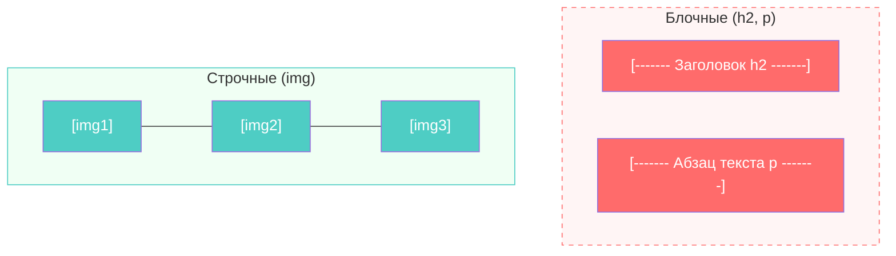
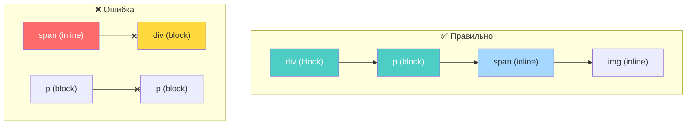
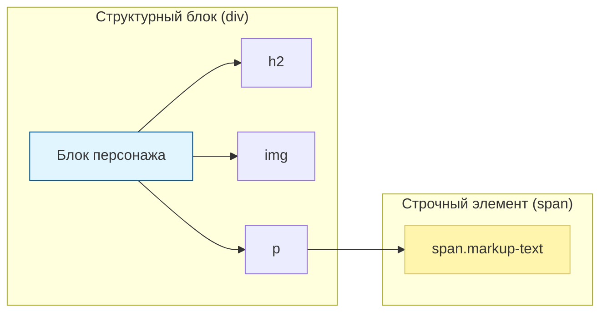
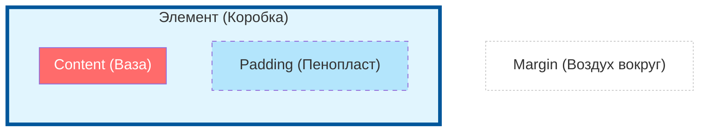
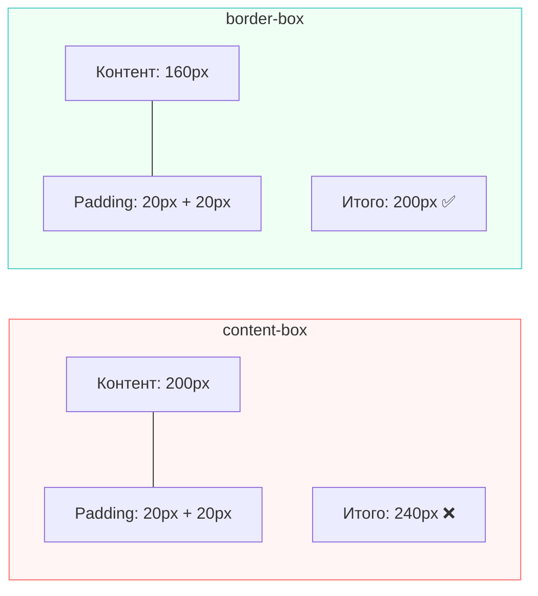
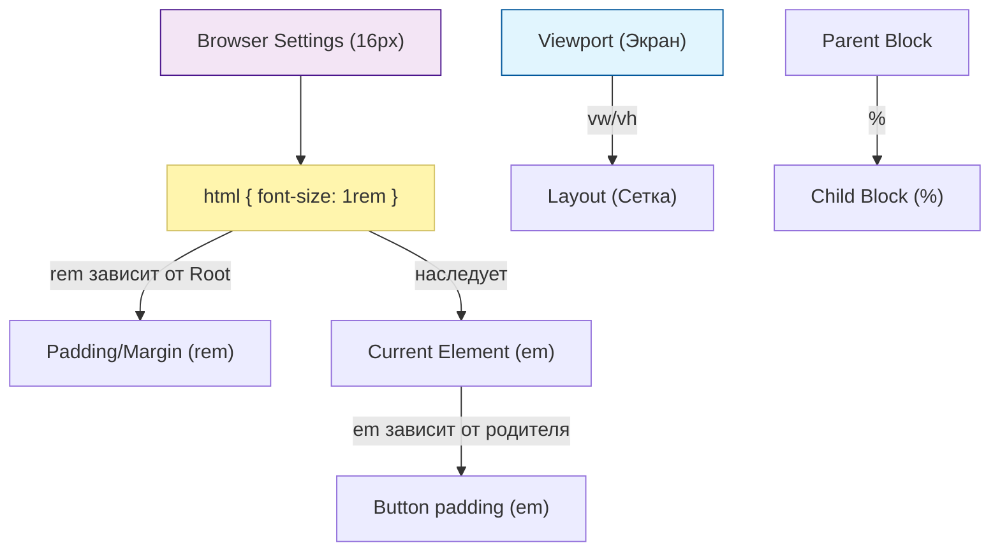
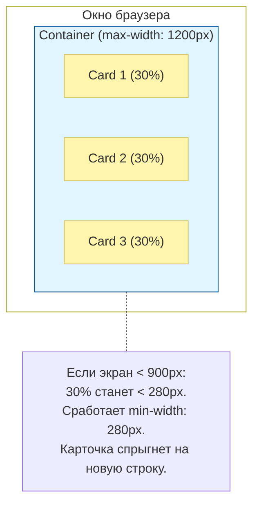

## Эволюция изображений: почему каждый байт на счету 🖼️

В современной веб-разработке борьба за производительность — это прежде всего борьба с «тяжелым» контентом. Изображения составляют до **60-70%** от общего веса средней веб-страницы. Именно поэтому фронтенд-разработчики так сильно сосредоточены на современных форматах сжатия, таких как **WebP** и **AVIF**.

### Зачем «упарываться» по размеру картинок? ⚖️

Для разработчика это не просто перфекционизм. Скорость загрузки напрямую влияет на ключевые показатели проекта:

1. **LCP (Largest Contentful Paint):** Метрика Google, которая замеряет, как быстро отрисовывается самый крупный видимый элемент (часто это баннер или фото товара). Медленная загрузка → плохой рейтинг в поиске (SEO).
2. **Удержание пользователей:** Исследования показывают, что если страница грузится дольше 3 секунд, около 50% пользователей её закрывают.
3. **Экономия трафика:** Для пользователей с мобильным интернетом или лимитированными тарифами тяжелые картинки — это буквально деньги, улетающие в трубу.

---

## WebP: Золотой стандарт от Google 🌐

Формат **WebP** был представлен компанией **Google** в 2010 году. Его цель была амбициозной: заменить собой стареющие форматы JPEG и PNG, предложив лучшее сжатие при сохранении качества.

>[!info]
>
>#### Революция от Google 🚀
>
>Инженеры Google взяли за основу алгоритмы предсказания кадров из видеокодека VP8. Это позволило WebP «угадывать», как будет выглядеть соседний пиксель, и записывать только отличия, что колоссально экономит место.

**Преимущества WebP:**

* **Вес:** В среднем на **25-35%** легче, чем JPEG, при сопоставимом качестве.
* **Универсальность:** Поддерживает прозрачность (как PNG) и анимацию (как GIF).
* **Поддержка:** На сегодняшний день поддерживается **всеми** современными браузерами.

---

### AVIF: Новый претендент на трон 🏆

Если WebP — это стандарт, то **AVIF** — это будущее. Этот формат основан на открытом видеокодеке AV1 и поддерживается такими гигантами, как Netflix и Microsoft.

**Почему AVIF круче всех?**

* **Экстремальное сжатие:** Картинка в AVIF может быть в **2 раза меньше**, чем JPEG, без видимой потери деталей.
* **Цветопередача:** Поддерживает 10-битную и 12-битную глубину цвета (HDR), что важно для качественных мониторов.

---

### Сравнительная таблица форматов 📊

| Формат | Кто создал | Главная фишка | Вес (пример) | Поддержка |
| :--- | :--- | :--- | :--- | :--- |
| **JPEG** | Группа JPEG (1992) | Совместимость со всем | 100 КБ | 100% |
| **WebP** | **Google** | Прозрачность + Сжатие | 65 КБ | 96%+ |
| **AVIF** | AOMedia | Ультимативное сжатие | 40 КБ | ~90% (Safari 16+) |

>[!tip]
>
>#### Как использовать это в проекте? 💡
>
>Необязательно выбирать что-то одно. С помощью HTML-тега `<picture>` вы можете предложить браузеру сначала AVIF, если он не поддерживается — WebP, а на самый крайний случай — обычный JPEG.

```html
<picture>
  <source srcset="assets/img/bender.avif" type="image/avif">
  <source srcset="assets/img/bender.webp" type="image/webp">
  
</picture>
```

Как говорил **Стив Прюитт** (известный эксперт по производительности):
> Изображения — это самый простой способ сделать ваш сайт медленным, или самый эффективный способ сделать его быстрым.

Использование WebP и AVIF — это не просто следование моде, а фундамент **User Experience (UX)**. Чем легче ваш `assets/img/`, тем счастливее ваш пользователь.

---

## Блочные и строчные элементы: почему Фрай встал в ряд? 🧱

Взгляните на свой код: вы добавили несколько изображений подряд, и они выстроились в одну горизонтальную линию. В то же время заголовки `<h2>` ведут себя эгоистично — каждый из них занимает отдельную строку и не пускает никого рядом с собой.

Всё дело в фундаментальном свойстве CSS — **Box Model** (Блочная модель) и значении свойства `display`, которое браузер назначает тегам по умолчанию.

---

### Блочные элементы (display: block) 📦

Теги вроде `<h1>`, `<h2>`, `<p>`, `<div>` — это **блочные элементы**.

**Их особенности:**

* **Занимают всю ширину:** Даже если текста внутри мало, блок растягивается на всю ширину родительского контейнера (от края до края).
* **Всегда с новой строки:** Каждый блочный элемент начинается с новой строки.
* **Управляют геометрией:** Вы можете задавать им четкую ширину (`width`), высоту (`height`), а также любые отступы (`margin` и `padding`).

В вашем HTML заголовок `<h2>Доктор Зойберг...</h2>` создает невидимый прямоугольник через весь экран. Именно поэтому текст описания под ним не может «запрыгнуть» справа от заголовка — там просто нет свободного места.

---

### Строчные элементы (display: inline) ⛓️

Тег `` — это классический пример **строчного** (или строчно-замещаемого) элемента.

**Их особенности:**

* **Ширина по контенту:** Они занимают ровно столько места, сколько нужно их содержимому (тексту или картинке).
* **Идут в ряд:** Они располагаются друг за другом, пока не упрутся в край страницы, после чего переносятся на следующую строку (как слова в предложении).
* **Ограничения:** Строчным элементам нельзя задать вертикальные `margin-top` и `margin-bottom` (они не будут расталкивать соседей сверху и снизу), а их высота определяется размером контента.

>[!info]
>
>#### Почему картинки в ряд? 🖼️
>
>Посмотрите на ваш блок с Фраем: вы написали несколько тегов `` один за другим. Браузер воспринимает их как «слова» в параграфе. Поскольку их ширина позволяет, он ставит их плечом к плечу.

---

## Визуализация поведения



---

### Как изменить это поведение? 🛠️

CSS позволяет нам «обмануть» природу тега. Мы можем превратить строчное изображение в блок или наоборот. Например, в вашем `css/main.css` можно сделать так:

```css
/* Теперь каждое изображение Фрая будет занимать целую строку */
img {
    display: block;
    margin-bottom: 10px; /* Добавим отступ снизу */
}
```

Или мы можем использовать «гибрид» — **`display: inline-block`**.

>[!tip]
>
>#### inline-block: Лучшее из двух миров 🌟
>
>Этот режим позволяет элементам стоять **в ряд** (как строчным), но при этом дает возможность **задавать ширину, высоту и все отступы** (как блочным). Чаще всего карточки персонажей или товаров верстаются именно так.

**Итоговое сравнение:**

| Свойство | `display: block` | `display: inline` | `display: inline-block` |
| :--- | :--- | :--- | :--- |
| **С новой строки?** | Да | Нет | Нет |
| **Ширина** | 100% родителя | По контенту | По контенту (управляемая) |
| **Высота/Marign/Padding**| Работают полностью | Только горизонтальные | Работают полностью |

Именно поэтому ваш Фрай и «подозревает» всех, стоя в ряд — он просто соблюдает правила строчных элементов!

---

## Анатомия ограничений: что можно и нельзя в CSS 🏗️

Понимание того, как элементы взаимодействуют друг с другом, убережет вас от ситуации, когда «я пишу `margin`, а он не работает». Давайте разберем «запретные зоны» для каждого типа отображения.

---

### Ограничения строчных элементов (`inline`) ⛓️

Строчные элементы ведут себя как текст. Вы когда-нибудь пробовали задать отдельному слову в предложении персональную высоту? Это разрушило бы строку. Отсюда вытекают их строгие ограничения:

1. **Геометрия под запретом:** Вы **не можете** задать `width` (ширину) и `height` (высоту). Браузер их просто проигнорирует. Размер строчного элемента всегда равен его содержимому.
2. **Вертикальные отступы `margin`:** Свойства `margin-top` и `margin-bottom` не работают. Вы можете отодвинуть соседей слева или справа, но не сверху или снизу.
3. **Визуальный обман `padding`:** Вы можете задать вертикальные `padding-top/bottom`, и вы даже увидите фон элемента, но он **не будет расталкивать** другие строки. Он просто «наползет» на них сверху как прозрачная пленка.

>[!warning]
>
>#### Исключение: Инструментальные строчные элементы 🖼️
>
>Теги ``, `<video>`, `<input>` называются **замещаемыми** (replaced) строчными элементами. В отличие от обычного текста, им **можно** задавать ширину и высоту, так как они имеют собственный физический размер (размер картинки).

---

### Ограничения блочных элементов (`block`) 🧱

У блоков почти нет ограничений в плане геометрии, но есть «социальные» ограничения:

1. **Нетерпимость к соседям:** Блочный элемент никогда не пустит другого соседа на свою горизонтальную линию, даже если вы зададите ему `width: 10px`. Оставшееся пространство будет заполнено «пустым» margin-полем.
2. **Схлопывание внешних отступов (Margin Collapse):** Если поставить два блока друг под другом, их вертикальные `margin` не суммируются, а «пожирают» друг друга. Если у верхнего блока `margin-bottom: 30px`, а у нижнего `margin-top: 20px`, расстояние между ними будет **30px**, а не 50px.

---

## Правила вложенности (Матрешка тегов) 🎎

Браузеры следуют спецификации HTML, которая определяет, «кто в чьем доме может жить».

### 🟢 Можно

* **Блок в Блок:** `<div>` внутри `<div>`, `<section>` внутри `<body>`.
* **Строка в Блок:** `<span>` внутри `<p>`, `` внутри `<div>`. Это стандарт.
* **Строка в Строку:** `<a>` внутри `<span>`, `<strong>` внутри `<em>`.

### 🔴 Нельзя (Технически можно, но это ошибка)

1. **Блок в Строку:** **Никогда** не кладите `<div>` или `<h2>` внутрь `<span>`. Строчный элемент не может «разогнуться», чтобы удержать внутри себя блок. Это ломает дерево документа.
2. **Параграф в Параграф:** Тег `<p>` не может содержать другие блочные элементы, включая другие `<p>`. Браузер автоматически закроет первый параграф, как только увидит открывающий тег второго.
3. **Заголовок в Заголовок:** `<h1><h2></h2></h1>` — семантический и визуальный хаос.

>[!tip]
>
>#### Исключение для ссылок ⚓
>
>В современном HTML5 тегу `<a>` (ссылка) разрешили быть оберткой для целых блоков. Вы можете обернуть `<div>` с картинкой и заголовком в одну большую ссылку. Это единственное массовое исключение, когда «строка» законно поглощает «блок».

---

### Таблица вложенности и ограничений 📊

| Что во что? | Результат | Почему? |
| :--- | :--- | :--- |
| **Inline в Block** | ✅ Правильно | Блок — это контейнер, он для этого создан. |
| **Block в Block** | ✅ Правильно | Стандартное создание структуры страницы. |
| **Block в Inline** | ❌ Ошибка | Строка — это поток текста, она не может обернуть объемный блок. |
| **Link (`<a>`) в Block** | ✅ Спец-правило | Разрешено для удобства создания кликабельных карточек. |



**Резюме для практики:** Если вам нужно поставить `` и `<span>` в ряд, но при этом задать им высоту — используйте `display: inline-block`. Это снимет почти все ограничения строчных элементов, сохранив их способность стоять в одной линии.

---

## `div` и `span`: Универсальные кубики Lego для верстки 🧱

В мире HTML есть теги со смыслом (семантикой), такие как `<h1>` (заголовок) или `<p>` (параграф). Но иногда нам нужны «пустые» контейнеры, которые сами по себе ничего не значат, но позволяют нам группировать элементы или выделять куски текста для стилизации.

Это наши **универсальные кубики Lego**:

* **`<div>`** — блочный кубик. Используется для создания целых секций, логических блоков и оберток.
* **`<span>`** — строчный кубик. Используется для выделения части текста внутри строки.

Они не несут никакой смысловой нагрузки для браузера, пока мы не наделим их ею с помощью **классов**.

---

## Практический пример: выделение имен персонажей 👤

Посмотрите, как в вашем коде используется тег `<span>` с классом `.markup-text`. Без этого тега имена персонажей были бы обычным белым текстом. Но мы «обернули» их в `<span>`, чтобы точечно применить стили.

```html
<!-- sample_lesson_4.html -->
<p>
  <span class="markup-text">Филип Дж. Фрай</span> - ленивый и беззаботный 
  курьер из 20-го века...
</p>

<p>
  <span class="markup-text">Бендер Б. Родригес</span> - циничный и 
  саркастичный робот...
</p>
```

Здесь `<span>` работает как маркер: он говорит браузеру: «Примени особые правила вот к этому кусочку внутри параграфа».

---

### Анализ стилей и работа над ошибками 🔍

В вашем CSS для класса `.markup-text` прописаны интересные свойства:

```css
/* main.css */
.markup-text {
    background-color: rgb(127, 113, 51);
    padding: 2px;
    border-radius: 3px;
    margin-top: 50px; /* ⚠️ Внимание на эту строку! */
}
```

Разберем, что здесь происходит:

1. **`background-color`**: Мы создали эффект «хайлайтера», закрасив фон под именем персонажа.
2. **`padding: 2px`**: Мы добавили немного «воздуха» внутри цветного фона, чтобы текст не прилипал к краям заливки.
3. **`border-radius`**: Скруглили углы нашей плашки.
4. **`margin-top: 50px`**: А вот этот отступ **работать не будет**.

>[!warning]
>
>#### Ловушка строчного элемента! 🪤
>
>Поскольку `<span>` по умолчанию является **строчным (inline)** элементом, он игнорирует вертикальные `margin`. Вы можете поставить хоть `500px`, Фрай не сдвинется вниз относительно параграфа.

---

## Как сделать так, чтобы отступы заработали? 🛠️

Если вам действительно нужно, чтобы ваши плашки с именами имели вертикальные отступы и вели себя более предсказуемо, вам нужно переключить их режим отображения:

```css
.markup-text {
    display: inline-block; /* 🚀 Превращаем в гибрид! */
    background-color: rgb(127, 113, 51);
    padding: 2px 6px;
    border-radius: 3px;
    margin-top: 10px; /* Теперь этот отступ заработает! */
}
```

---

### Когда использовать `div`, а когда `span`? 📐

Представьте, что вы строите дом для команды «Межпланетного экспресса»:

* **`<div>`** — это целая **комната** или этаж. В него вы положите заголовок персонажа, карту, его изображение и описание. Это большой контейнер.
* **`<span>`** — это **наклейка** на коробке или выделение слова в документе. Он нужен только внутри строки.

>[!tip]
>
>#### Золотое правило Lego 💡
>
>Используйте семантические теги (`header`, `main`, `footer`, `article`), когда это возможно. Но если вам нужно просто «сгруппировать для красоты» или «покрасить кусочек» — `div` и `span` ваши лучшие друзья. У них нет своего «мнения» (стилей) от браузера, поэтому они идеально слушаются ваших CSS-правил.



---

## Магия свободного пространства: Margin и Padding 📏

В веб-разработке расстояние между элементами так же важно, как и сами элементы. Чтобы управлять «воздухом» на странице, в CSS используются два фундаментальных свойства: **Margin** (внешний отступ) и **Padding** (внутренний отступ).

В вашем CSS-файле оставлена отличная шпаргалка, давайте разберем её «на пальцах».

---

### 1. Визуальное различие: Снаружи vs Внутри 📦

Представьте, что ваш элемент — это **подарочная коробка с хрупкой вазой** внутри:

* **Padding (Внутренний отступ)** — это мягкий пенопласт **внутри** коробки. Он защищает вазу, чтобы она не касалась стенок. Если у коробки есть фон, padding будет покрашен в этот цвет.
* **Margin (Внешний отступ)** — это пустое пространство **вокруг** коробки на полке. Оно нужно, чтобы другие коробки не стояли к нашей вплотную. Сквозь margin всегда виден фон родителя (например, пола или полки).



---

### 2. Способы записи: От детального к краткому 📝

В CSS существует четыре способа записи этих свойств. Браузер всегда читает их **по часовой стрелке**, начиная с **12 часов (Top)**.

#### Вариант 1: Четыре позиции (Полная запись)

`margin: [top] [right] [bottom] [left];`

```css
/* Отступ сверху 10, справа 20, снизу 30, слева 40 */
margin: 10px 20px 30px 40px;
```

> [!tip]
> **Как запомнить?** Используйте правило **TRouBLe**: **T**op, **R**ight, **B**ottom, **L**eft.

#### Вариант 2: Три позиции

`margin: [top] [right/left] [bottom];`

```css
/* Сверху 10, по бокам по 20, снизу 30 */
margin: 10px 20px 30px;
```

#### Вариант 3: Две позиции (Самый частый вариант)

`margin: [vertical] [horizontal];`

```css
/* Сверху и снизу по 10, слева и справа по 20 */
margin: 10px 20px;
```

#### Вариант 4: Одна позиция

`margin: [all];`

```css
/* 10px со всех четырех сторон */
margin: 10px;
```

---

### 3. Точечное управление 🎯

Если вам нужно изменить отступ только с одной стороны, не обязательно переписывать всё свойство. Используйте уточняющие суффиксы:

```css
.markup-text {
    margin-top: 50px;    /* Только сверху */
    margin-bottom: 20px; /* Только снизу */
    margin-left: 10px;   /* Только слева */
    margin-right: 5px;   /* Только справа */
}
```

Эти же правила работают и для `padding`: `padding-top`, `padding-left` и так далее.

---

### 4. Особенности поведения (Важно для верстки!) ⚠️

Работа с отступами имеет несколько нюансов, которые часто путают новичков:

1. **Центрирование через `auto`**:
    Если блочному элементу (например, `div`) задать фиксированную ширину и `margin: 0 auto;`, он встанет **ровно по центру** своего родителя. Браузер сам рассчитает одинаковые отступы слева и справа.

2. **Прозрачность Margin**:
    Margin всегда прозрачен. У него нет цвета. Если вы хотите сделать цветную рамку вокруг текста, вам нужен `padding` (внутри цветного элемента) или свойство `border`.

3. **Взаимодействие со строчными элементами**:
    Как мы уже выяснили ранее, для `<span>` (без `inline-block`) вертикальные `margin-top/bottom` не сработают. А вот `padding-top/bottom` визуально сработает, но не будет раздвигать строки текста вокруг.

>[!info]
>
>#### Зачем так много вариантов записи? 💡
>
>Краткие записи (shorthands) помогают уменьшить размер вашего CSS-файла. Вместо четырех строчек `margin-top...` вы пишете одну `margin: 10px 20px 15px 5px;`, что делает код чище и профессиональнее.

В вашем проекте с персонажами Futurama эти отступы — ключ к тому, чтобы превратить обычный список текста в красивые карточки, где у каждого героя есть свое личное пространство!

---

## Свойство `box-sizing`: решаем проблему «выпирающих» элементов 📏

Когда мы только начинаем верстать, нас часто ждет сюрприз: мы задаем блоку ширину `500px`, добавляем `padding: 20px`, и внезапно блок становится `540px`, ломая всю сетку сайта. Это происходит из-за стандартной математики браузера.

Свойство `box-sizing` позволяет нам выбрать, как именно браузер должен рассчитывать итоговый размер «коробки».

---

### 1. `content-box` — Стандартная модель (Матрешка) 🪆

Это значение установлено в браузере по умолчанию. Здесь ширина (`width`) и высота (`height`) относятся **только к самому контенту**.

**Формула расчета:**
`Итоговая ширина = width + padding-left + padding-right + border-left + border-right`

* **Проблема:** Вы никогда не знаете итоговый размер блока, пока не сложите все отступы и рамки в уме. Если вы делаете два блока по `50%`, чтобы они стояли в ряд, и добавите им `10px` паддинга — они перестанут помещаться и один из них «спрыгнет» вниз.

---

### 2. `border-box` — Умная модель (Чемодан) 🧳

Это выбор профессионалов. При этой модели `width` и `height` — это **окончательный размер блока**. Если вы добавите `padding` или `border`, браузер не раздует блок наружу, а «сожмет» контент внутри, чтобы сохранить заданные размеры.

**Формула расчета:**
`Итоговая ширина = width (уже включает в себя контент, padding и border)`

* **Преимущество:** Если вы сказали блоку быть `500px`, он будет `500px` в любых обстоятельствах. Это делает верстку предсказуемой и легкой.

---

### Визуальное сравнение 🎨

Представьте два одинаковых блока с `width: 200px` и `padding: 20px`:



---

### Как это применить в проекте? 🛠️

В современном вебе принято устанавливать `border-box` для всех элементов сразу в самом начале CSS-файла. Это избавляет от головной боли с расчетами.

Добавьте этот код в начало вашего `main.css`:

```css
/* Универсальный селектор * выбирает вообще все теги на странице */
*, *::before, *::after {
    box-sizing: border-box;
}
```

>[!tip]
>
>#### Почему это важно для Futurama? 🚀
>
>Если вы решите сделать карточки персонажей (например, по 3 в ряд), использование `border-box` гарантирует, что ваши карточки не «разлетятся» в разные стороны, когда вы добавите им внутренние отступы для красоты.

>[!info]
>
>#### Внешние отступы (Margin)
>
>Важно помнить: **`margin` никогда не входит в расчет `width`**, даже при `border-box`. Margin — это всегда пространство *вне* коробки, которое отодвигает соседей.

---

### Единицы измерения в CSS: от жестких пикселей до гибких экранов 📏

Чтобы страница выглядела одинаково хорошо и на огромном мониторе, и на маленьком смартфоне, нам нужно уметь правильно выбирать «линейку» для измерения размеров. В CSS все единицы делятся на две группы: **абсолютные** (всегда одинаковые) и **относительные** (подстраиваются под контекст).

---

### 1. Абсолютные единицы

#### `px` (Пиксели)

Это базовая единица, «точка» на экране.

* **Когда применять:** Когда нужен жесткий, неизменный размер. Например, толщина границы (`border: 1px`) или небольшие иконки.
* **Минус:** Пиксели не умеют «расти» или «сжиматься» в зависимости от настроек пользователя.

---

### 2. Относительные единицы (Текст и Контекст)

Эти единицы зависят от размеров шрифта. Это критически важно для **доступности**: если слабовидящий пользователь увеличит шрифт в браузере, ваш дизайн «раздвинется» вместе с текстом и не сломается.

#### `rem` (Root EM) — Главный стандарт

Привязан к размеру шрифта в теге `<html>`. По умолчанию в браузерах **1rem = 16px**.

* **Когда применять:** Для **всего**: отступов (padding, margin), размеров шрифтов, ширины блоков.
* **Пример:** Если вы хотите отступ в `32px`, пишите `2rem`.

#### `em` (Element EM) — Зависимый от соседа

Привязан к размеру шрифта **текущего** элемента.

* **Когда применять:** Для элементов, которые должны масштабироваться пропорционально тексту внутри них. Например, отступы внутри кнопки или расстояние между буквами.
* **Опасность:** `em` обладает эффектом «матрешки». Если вложить три блока друг в друга с `font-size: 2em`, текст в последнем станет гигантским!

---

### 3. Резиновые и экранные единицы

#### `%` (Проценты)

Зависят от размера **родительского** контейнера.

* **Когда применять:** Для создания колонок и сеток. Если родителю задать `width: 1000px`, а дочернему `width: 50%`, он всегда будет `500px`.

#### `vw` и `vh` (Viewport Width/Height) — Размер экрана

`1vw` — это 1% от ширины окна браузера, `1vh` — 1% от высоты.

* **Когда применять:** Когда нужно растянуть блок на весь экран. Например, главный баннер на главной странице сайта: `height: 100vh`.

---

### Шпаргалка: когда и что выбирать? 💡

Чтобы ваш код выглядел профессионально, придерживайтесь этой логики:

| Объект | Единица | Почему? |
| :--- | :--- | :--- |
| **Шрифт** | `rem` | Чтобы текст масштабировался под настройки системы. |
| **Сетка/Колонки** | `%` или `vw` | Чтобы блоки занимали нужную часть экрана. |
| **Отступы (Margin/Padding)** | `rem` | Чтобы расстояние между блоками было гармонично тексту. |
| **Тонкие линии/Тени** | `px` | Глаз не заметит разницы в 0.05rem, а 1px всегда будет четким. |
| **Кнопки/Беджи** | `em` | Чтобы при изменении шрифта кнопки её отступы подстроились сами. |

---

### Визуализация зависимостей



>[!info]
>
>#### Совет для проекта Futurama 🤖
>
>Попробуйте в своем CSS заменить `margin-top: 50px` на `margin-top: 3rem`. На первый взгляд ничего не изменится, но ваш сайт станет гораздо более «умным» и гибким! А для фоновых картинок, которые должны занимать весь экран, используйте `100vw` и `100vh`.

---

### Гибкость под контролем: Проценты и Ограничители 📏

Использование только процентов в верстке похоже на попытку растянуть резиновую ленту: она заполнит все пространство, но на очень широких мониторах ваш текст превратится в одну бесконечную строку, которую неудобно читать. Чтобы этого избежать, мы комбинируем «резиновые» проценты с «жесткими» ограничителями — `min-width` и `max-width`.

---

### 1. Тандем: Проценты + Ограничители

Логика проста: мы позволяем элементу быть гибким, но ставим ему рамки «не меньше» и «не больше».

* **`width: 100%` + `max-width: 1200px`**: Элемент будет растягиваться на весь экран смартфона, но на мониторе он остановится на 1200 пикселях и не будет расти дальше.
* **`width: 25%` + `min-width: 300px`**: На десктопе у вас будет 4 карточки в ряд (по 25% каждая). Но если размер окна уменьшится и 25% станут меньше 300px, карточка зафиксируется на значении 300px, чтобы контент внутри не «схлопнулся».

---

### 2. Создаем карточки персонажей (Чистая Box Model) 🤖

Давайте создадим набор карточек для персонажей «Футурамы», используя только свойства блочной модели (Box Model), без современных Flexbox или Grid. Мы будем использовать `display: inline-block`, чтобы поставить их в ряд.

#### Шаг 1: HTML-структура

```html
<section class="container">
    <div class="character-card">
        
        <div class="card-content">
            <h3>Филип Дж. Фрай</h3>
            <p>Курьер из прошлого, застрявший в будущем.</p>
        </div>
    </div>
    <!-- Другие карточки... -->
</section>
```

#### Шаг 2: CSS-магия

```css
/* Устанавливаем правильную модель расчета размеров */
* {
    box-sizing: border-box;
}

.container {
    width: 100%;
    max-width: 1200px; /* Ограничиваем общую ширину сайта */
    margin: 0 auto;    /* Центрируем контейнер */
    padding: 20px;
}

.character-card {
    display: inline-block; /* Позволяем карточкам встать в ряд */
    vertical-align: top;   /* Выравниваем карточки по верхнему краю */
    
    /* ГИБКОСТЬ + ОГРАНИЧЕНИЕ */
    width: 30%;            /* Занимаем почти треть ширины родителя */
    min-width: 280px;      /* Карточка не станет слишком узкой и не сломает текст */
    
    margin: 1.5%;          /* Создаем внешние отступы между карточками */
    
    border: 2px solid #333;
    border-radius: 8px;
    background-color: #f9f9f9;
    overflow: hidden;      /* Чтобы картинка не вылезала за скругленные углы */
}

.card-img {
    width: 100%;           /* Картинка всегда растягивается на всю ширину карточки */
    height: 200px;
    object-fit: cover;     /* Картинка заполняет область без искажения пропорций */
}

.card-content {
    padding: 1.5rem;       /* Внутренние отступы для текста */
}
```

---

### Как это работает (Визуализация) 📦

Когда вы используете `inline-block` с процентами и ограничителями, процесс выглядит так:



---

### Почему это круто? 🚀

1. **Предсказуемость**: Благодаря `max-width` на контейнере, ваш сайт не будет выглядеть странно на телевизорах 4K.
2. **Читаемость**: Текст внутри карточки всегда будет иметь достаточно места благодаря `min-width`.
3. **Адаптивность**: Хотя мы не писали специальных правил для мобилок, из-за `min-width` карточки сами начнут перестраиваться в одну колонку, когда им станет тесно.

>[!warning]
>
>#### Нюанс `inline-block`
>
>При использовании `display: inline-block` между карточками может появиться крошечный отступ в пару пикселей. Это «фантомный пробел» из вашего HTML-кода. Чтобы его убрать, можно либо удалить пробелы между тегами `</div><div...>` в HTML, либо задать родителю `font-size: 0`.

>[!tip]
>
>#### Практический совет
>
>Если вы хотите, чтобы карточки всегда занимали всю ширину, попробуйте поиграть с `width: calc(33.33% - 30px);`. Функция `calc` отлично дополняет Box Model, позволяя смешивать проценты и пиксели!
