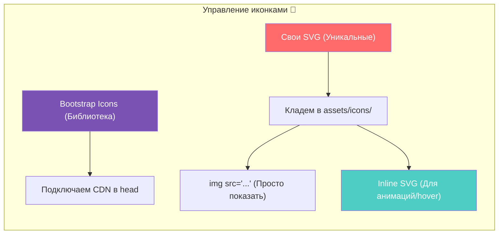

# Урок 4. Шрифты и отступы: оживляем интерфейс 🎨

## Работа с типографикой: Google Fonts 🔡

Текст — это основной способ передачи информации на сайте, и его внешний вид напрямую влияет на то, как пользователь будет воспринимать ваш продукт. Стандартные системные шрифты (вроде Arial или Times New Roman) надежны, но часто выглядят скучно. Чтобы выделить проект и задать ему нужный характер, разработчики используют внешние шрифты, и самым популярным сервисом для этого является **Google Fonts**.

### Как выбрать и подключить шрифт 🛠️

Процесс работы с Google Fonts интуитивно понятен и состоит из нескольких простых шагов. Сначала вы переходите на сайт сервиса и выбираете понравившуюся гарнитуру. Важно обращать внимание на поддержку кириллицы (фильтр *Language: Cyrillic*) и количество доступных начертаний (толщины шрифта от 100 до 900).

После выбора конкретных стилей сервис сформирует для вас специальную корзину, в которой будет находиться готовый HTML-код для подключения. Этот код необходимо скопировать и вставить в секцию `<head>` вашего документа. Обратите внимание, что подключение обычно состоит из трех тегов: два из них (`preconnect`) подготавливают браузер к быстрой загрузке, а третий (`link href=...`) содержит саму ссылку на файл шрифта.

Ниже представлен пример того, как выглядит готовый блок подключения для шрифтов **Kelly Slab** и **Roboto Flex**:

```html
<!-- Подключение шрифтов в секции <head> -->
<link rel="preconnect" href="https://fonts.googleapis.com" />
<link rel="preconnect" href="https://fonts.gstatic.com" crossorigin />
<link
  href="https://fonts.googleapis.com/css2?family=Kelly+Slab&family=Roboto+Flex:opsz,wght,XOPQ,XTRA,YOPQ,YTDE,YTFI,YTLC,YTUC@8..144,100..1000,96,468,79,-203,738,514,712&display=swap"
  rel="stylesheet"
/>
```

### Использование шрифта в CSS 🎨

Подключить шрифт в HTML — это только половина дела. Чтобы браузер понял, к каким именно элементам его применить, нужно прописать соответствующее правило в вашем CSS-файле. Для этого используется свойство `font-family`.

>[!tip]
>
>#### Резервные шрифты 🛡️
>
>Всегда указывайте запасной вариант через запятую (например, `sans-serif`). Если сервис Google Fonts будет временно недоступен или у пользователя возникнут проблемы с интернетом, браузер подставит стандартный шрифт вместо того, чтобы оставить страницу без текста.

Если мы хотим применить наш новый шрифт ко всей странице сразу, мы задаем свойство `font-family` для тега `body`. Это сработает благодаря механизму **наследования**: все вложенные элементы (заголовки, абзацы, списки) автоматически "подхватят" этот шрифт от родителя.

```css
/* Применение подключенного шрифта ко всей странице */
body {
  font-family: 'Roboto Flex', sans-serif;
  font-weight: 400; /* Используем обычное начертание */
}

h1, h2 {
  font-family: 'Kelly Slab', cursive; /* Для заголовков используем декоративный шрифт */
}
```

Жонглируя разными семействами шрифтов, вы можете расставлять акценты. Например, строгий и вариативный **Roboto Flex** отлично подойдет для больших блоков текста, так как он легко читается, а необычный **Kelly Slab** станет отличным решением для крупных заголовков, притягивающих взгляд.

---

## Форматы шрифтов: от зоопарка расширений к единым стандартам 📜

История экранных шрифтов — это борьба за четкость букв при минимальном размере файла. Когда-то давно на компьютерах правили бал форматы **TTF** (TrueType) и **OTF** (OpenType). Они были созданы компаниями Apple и Microsoft еще в конце 80-х и 90-х. Эти форматы прекрасно работают и сегодня: они содержат всю информацию о контурах букв, кернинге (расстоянии между ними) и лигатурах. Однако у них был один существенный минус для веба — они не были сжаты. Подключение десятка таких файлов могло заставить сайт "грузиться" вечность.

### Эволюция веба: WOFF и WOFF2 🚀

С развитием интернета стало ясно, что нам нужен специальный "упакованный" формат. Так появился **WOFF** (Web Open Font Format) — по сути, это тот же OTF или TTF, но обернутый в сжатый контейнер. Позже вышел **WOFF2**, который использует еще более продвинутые алгоритмы сжатия (Brotli), позволяя уменьшить размер файла еще на 30% по сравнению с первой версией.

>[!info]
>
>#### Актуальный стандарт 2024+ 📅
>
>На сегодняшний день **WOFF2** является основным стандартом для веба. Его поддерживают все современные браузеры. Его предшественник WOFF еще встречается для поддержки совсем древних систем, но в 99% случаев вам достаточно только второй версии.

### Сравнение форматов

| Формат | Что это? | Вес | Когда использовать? |
| :--- | :--- | :--- | :--- |
| **TTF / OTF** | Универсальный формат для ОС | 📦 Большой | Для дизайна в Figma или установки в систему. |
| **WOFF** | Первое поколение веб-контейнеров | 📥 Средний | Для поддержки старых браузеров (IE 11). |
| **WOFF2** | Золотой стандарт современного веба | ⚡ Маленький | **Всегда**, когда верстаете современный сайт. |

---

### Как скачать шрифты для локальной работы? 📥

Если вы решили не полагаться на CDN (серверы Google) и хотите хранить шрифты "у себя", процесс выглядит так:

1. **Поиск:** На том же Google Fonts вместо копирования ссылки вы нажимаете кнопку **Download all**. Вам скачается `.zip` архив.
2. **Распаковка:** Внутри вы чаще всего найдете файлы `.ttf`. Это отличные исходники, но, как мы выяснили выше, они тяжеловаты.
3. **Конвертация:** Чтобы проект летал, профессиональные разработчики прогоняют эти `.ttf` через конвертеры (например, *Font Squirrel* или *Webfont Generator*), на выходе получая заветные `.woff2`.

> [!warning]
>
> #### Лицензионный капкан 🪤
>
> Не все шрифты в интернете бесплатны. Google Fonts предоставляет шрифты с открытой лицензией (OFL), но если вы скачиваете шрифт с пиратского ресурса, вы нарушаете закон. Всегда проверяйте файл `LICENSE.txt` в архиве со шрифтом.

Использование локальных шрифтов делает ваш сайт независимым от сторонних сервисов: даже если Google Fonts упадет или будет заблокирован, ваш сайт сохранит свой уникальный облик, так как все ресурсы находятся прямо в вашей папке с проектом. В следующей части мы разберем, как правильно организовать "жилище" для этих файлов внутри вашей рабочей директории.

---

## Архитектура проекта: наводим порядок в файлах 📂

Когда вы начинаете работать над реальным проектом, важно сразу договориться о «гигиене» папок. Если бросать картинки, шрифты и стили в одну кучу с `index.html`, через неделю вы сами не сможете найти нужный файл. Для простых страниц на HTML/CSS в индустрии сложился стандарт организации структуры.

### Иерархия папок 🏗️

Ваш проект должен быть похож на хорошо организованный склад. Мы разделяем исходный код (HTML) и **ассеты** (ресурсы) — изображения, шрифты, медиафайлы.

Обычно в корне проекта создается папка `assets` (или `static`), внутри которой ресурсы разносятся по категориям:

```text
my-project/
├── index.html             # Главная страница
├── css/                   # Папка для стилей
│   └── style.css
├── js/                    # Папка для скриптов (будет позже)
└── assets/                # Все внешние ресурсы
    ├── fonts/             # Шрифты (.woff2)
    ├── img/               # Картинки и фото (.jpg, .png, .webp)
    ├── icons/             # Иконки (обычно .svg)
    ├── video/             # Видеофайлы
    └── audio/             # Звуковые эффекты или подкасты
```

### Почему такая структура — это правильно? ✅

1. **Масштабируемость:** Если завтра вам понадобится добавить 50 новых иконок, вы просто положите их в `icons`, и основной корень проекта останется чистым.
2. **Пути в CSS:** При такой структуре вы всегда знаете, где искать файл. В CSS-коде путь к шрифту будет выглядеть логично: `../assets/fonts/my-font.woff2`.
3. **Безопасность и Deploy:** Современные инструменты сборки сайтов ожидают именно такого разделения, чтобы правильно оптимизировать картинки и сжать шрифты перед публикацией.

---

### Визуализация структуры в проекте 🗺️

```mermaid
mindmap
  root(("Папка проекта"))
    "Корень"
      "index.html"
      "css/"
        "style.css"
    "assets/ (Ресурсы)"
      "fonts/ 🔡"
        "roboto-bold.woff2"
        "roboto-regular.woff2"
      "img/ 🖼️"
        "hero-bg.jpg"
        "product-photo.webp"
      "icons/ ✨"
        "logo.svg"
        "social-icons.svg"
      "video/ 🎬"
        "bg-video.mp4"
```

---

### Подключение локального шрифта: Директива `@font-face` 🔡

Когда файлы лежат в папке `assets/fonts/`, их нужно «зарегистрировать» в вашем CSS. Для этого используется специальное правило `@font-face`.

```css
/* css/style.css */

@font-face {
  font-family: 'MyCustomFont'; /* Имя, которое мы придумали */
  src: url('../assets/fonts/my-font.woff2') format('woff2'); 
  font-weight: normal;
  font-style: normal;
  font-display: swap; /* Важно: текст отобразится сразу системным шрифтом, пока грузится основной */
}

body {
  font-family: 'MyCustomFont', sans-serif;
}
```

>[!warning]
>
>#### Ловушка относительных путей ⚓
>
>Заметьте две точки в пути: `../assets/...`. Это означает: «Выйти из папки `css` на уровень выше, а затем зайти в папку `assets`». Если вы укажете путь без `../`, браузер будет искать папку `assets` внутри папки `css`, не найдет её и шрифт не загрузится.

>[!tip]
>
>#### Организация медиа-контента 🎥
>
>Если ваш сайт содержит много видео или аудио, никогда не храните их «сырыми». Используйте форматы `.mp4` для видео и `.mp3` для аудио, а также следите, чтобы названия файлов были на латинице, без пробелов и спецсимволов (используйте дефисы: `intro-video.mp4`).

Такой порядок в проекте — это не просто прихоть перфекциониста, а залог того, что при переносе сайта на сервер или передаче его другому разработчику ничего не «отвалится», а шрифты и картинки загрузятся ровно там, где они и должны быть.

---

Работая с иконками, разработчик всегда стоит перед выбором: подключить готовую библиотеку (как **Bootstrap Icons**) или использовать собственные уникальные **SVG**. Оба подхода имеют право на жизнь, но технически реализуются по-разному.

## Использование Bootstrap Icons (BS5) 🥾

Bootstrap Icons — это огромный сет из более чем 2000 иконок, которые идеально сочетаются друг с другом. Самый быстрый способ начать работу — подключить их через **CDN** (аналогично Google Fonts).

Вы вставляете ссылку в `<head>`, а затем используете иконку в HTML с помощью тега `<i>` со специальными классами:

```html
<!-- 1. Подключение стилей иконок -->
<link rel="stylesheet" href="https://cdn.jsdelivr.net/npm/bootstrap-icons@1.11.0/font/bootstrap-icons.css">

<!-- 2. Использование на странице -->
<i class="bi bi-alarm" style="font-size: 2rem; color: cornflowerblue;"></i>
```

**Плюс:** Это фактически «иконочный шрифт». Вы можете менять размер иконки через `font-size` и цвет через `color`, как если бы это был обычный текст.

---

## Работа со своими SVG-иконками 🎨

Если дизайнер нарисовал уникальную иконку, которой нет в готовых сетах, мы используем формат **SVG** (Scalable Vector Graphics). В отличие от картинок (JPG/PNG), SVG — это код. У нас есть два основных способа его размещения.

### Способ 1: Тег `` (Для простых декораций)

Вы просто указываете путь к файлу в папке `assets/icons/`.

```html

```

*Минус: вы не сможете легко изменить цвет иконки через CSS.*

### Способ 2: Inline SVG (Для управления стилем)

Вы открываете `.svg` файл в текстовом редакторе, копируете код `<svg>...</svg>` и вставляете его прямо в HTML-разметку.

```html
<a href="#" class="social-link">
  <svg xmlns="http://www.w3.org/2000/svg" width="16" height="16" fill="currentColor" viewBox="0 0 16 16">
    <path d="M8 0L0 8l8 8 8-8-8-8z"/> <!-- Это и есть описание контуров иконки -->
  </svg>
  Подпишись
</a>
```

>[!tip]
>
>#### Почему Inline SVG — это круто? 💡
>
>Когда код иконки находится прямо в HTML, вы можете обращаться к нему через CSS. Например: `.social-link:hover svg { fill: red; }`. Иконка плавно поменяет цвет при наведении, чего невозможно добиться обычным тегом ``.

---

### Сводная таблица выбора 📊

| Метод | Когда использовать | Плюсы | Минусы |
| :--- | :--- | :--- | :--- |
| **Bootstrap Icons** | Обычные интерфейсы (корзины, стрелки) | Очень быстро, легко стилизовать как текст | Типовые иконки, «как у всех» |
| **SVG как файл (``)** | Большие иллюстрации, логотипы | Чистый HTML-код, кэшируется браузером | Сложно перекрасить динамически |
| **Inline SVG** | Интерактивные элементы, кнопки, меню | Полный контроль через CSS, нет лишних запросов | Раздувает размер HTML-файла |

---

### Организация в папе `assets` 📂

Если вы выбрали путь хранения файлов, не забывайте про структуру, которую мы обсуждали ранее. Иконки должны жить отдельно от фотографий:



>[!warning]
>
>#### Проблема черных иконок 🏴‍☠️
>
>Часто при сохранении из графических редакторов SVG имеет жестко прописанный атрибут `fill="#000000"`. Чтобы иметь возможность менять цвет через CSS, замените в коде SVG значение цвета на `fill="currentColor"`. Тогда иконка будет всегда принимать цвет текста родительского элемента.
