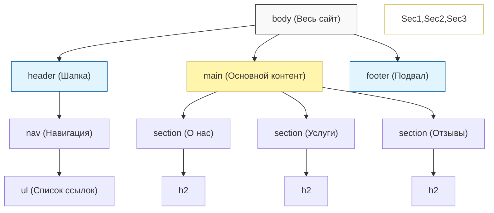
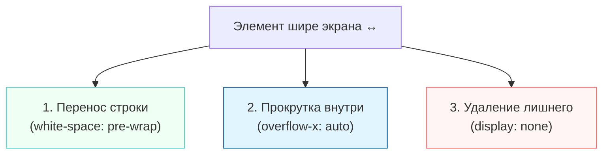
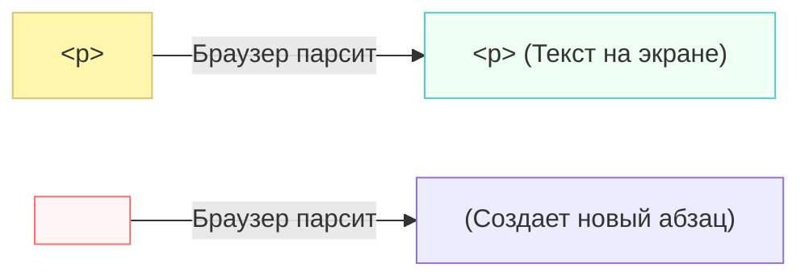
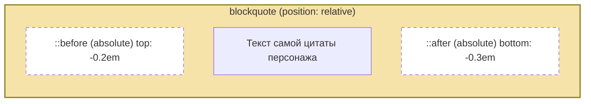
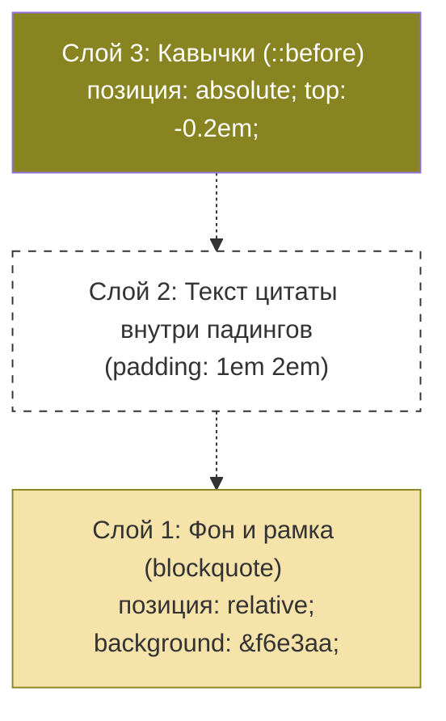
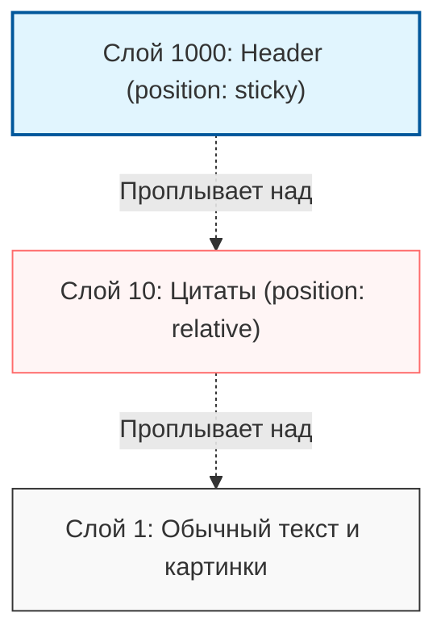

# Урок 5.1 Семантические теги 🏷️

В предыдущих уроках мы часто использовали тег `<div>`. Это универсальная «коробка», но у неё есть проблема: она ничего не говорит браузеру о том, что внутри. В этом уроке мы разберем семантику — способ сделать ваш код понятным не только визуально, но и логически.

## Что такое семантика и зачем она нужна? 🧠

**Семантические теги** — это теги, которые описывают своё предназначение (свой смысл) человеческим языком. Например, глядя на тег `<footer>`, и вы, и браузер сразу понимаете, что это «подвал» сайта с контактами.

Если строить дом, то семантика — это подписи на чертеже: «Кухня», «Спальня», «Входная дверь». Без них это были бы просто «прямоугольные комнаты».

**Зачем это нужно:**

1. **Для поисковиков (SEO):** Google и Яндекс быстрее понимают, где на странице важный контент, а где — просто меню. Это помогает сайту подняться выше в поиске.
2. **Для доступности:** Программы, которые читают текст с экрана для слабовидящих людей, используют семантику, чтобы озвучивать: «Начало навигации», «Статья».
3. **Для разработчиков:** Читать код, состоящий из осмысленных тегов, гораздо проще, чем бесконечную «войну дивов» (`<div><div><div>...</div></div></div>`).

---

## Почему браузер-переводчик не переводит код? 🌐

Вы могли заметить, что если открыть страницу с кодом и включить автоперевод (например, в Google Chrome), обычный текст переводится, а код внутри тегов `<code>` или `<pre>` — нет.

Это происходит благодаря семантике тега `<code>`. Браузеры настроены так, чтобы игнорировать содержимое этих тегов при переводе. Код — это строгий набор инструкций (ключевые слова вроде `while`, `print`, `if`). Если переводчик превратит Python-цикл `while True` в «пока истина», программа просто перестанет работать.

>[!info]
>
>#### Семантический иммунитет 🛡️
>
>Тег `<code>` сообщает браузеру: «Внутри меня находится техническая информация, её нельзя изменять или переводить».

---

## Простой пример однострочного кода 💻

Для коротких вставок кода прямо внутри предложения используется тег `<code>`. Он делает шрифт моноширинным (как в печатной машинке) и выделяет его на фоне обычного текста.

**Пример использования:**

```html
<p>Чтобы вывести текст в консоль, используйте команду <code>print()</code>.</p>
```

В вашем проекте это выглядит так:
> Мы можем вышить на вашем плюшевом Бендере команду: `kill all humans!`

---

## Популярные семантические теги 📊

Вот «золотой состав» тегов, которые вы будете использовать в 90% случаев при создании структуры сайта:

| Тег | Смысл (Назначение) | Аналогия |
| :--- | :--- | :--- |
| **`<header>`** | Шапка сайта: логотип, главная навигация. | Название газеты сверху. |
| **`<nav>`** | Контейнер для навигационных ссылок. | Оглавление в книге. |
| **`<main>`** | Уникальный, основной контент страницы. | Главная статья выпуска. |
| **`<section>`** | Крупный смысловой блок (раздел) сайта. | Глава в книге. |
| **`<article>`** | Независимый, законченный фрагмент (пост, новость). | Заметка в газете. |
| **`<aside>`** | Боковая панель или косвенный контент. | Срезка «кстати...» на полях. |
| **`<footer>`** | Подвал сайта: копирайт, ссылки на соцсети. | Самый низ страницы с выходными данными. |

>[!tip]
>
>#### Золотое правило семантики 🏆
>
>Всегда ищите специализированный тег для вашей задачи. Используйте `<div>` только в том случае, если ни один из семантических тегов не подходит для описания логики вашего блока.

Именно такую структуру мы видим в вашем шаблоне `lesson_5.html`: сначала идет `<header>` с навигацией `<nav>`, затем основной блок `<main>`, разделенный на секции `<section>`. Это — эталон правильной разметки!

---

## Работа с кодом в HTML 💻

Демонстрация программного кода на сайте требует особого подхода. Обычный текст в HTML игнорирует лишние пробелы и переносы строк, но в коде каждый символ и каждый отступ имеют значение.

### 1. Тег `<code>`: Однострочные вставки

Тег `<code>` — это **строчный** семантический элемент. Он используется, когда вам нужно упомянуть название функции, переменной или короткую команду прямо внутри абзаца.

* **Особенность:** Шрифт автоматически становится моноширинным (все буквы одинаковой ширины), что характерно для редакторов кода.
* **Пример из вашего кода:**

    ```html
    <p>Мы можем вышить команду: <code>kill all humans!</code></p>
    ```

---

### 2. Связка `<pre>` + `<code>`: Многострочные блоки

Для отображения целого фрагмента программы (например, цикла `while`) одного тега `<code>` недостаточно, так как он схлопнет все ваши красивые отступы в одну линию. Здесь на помощь приходит тег `<pre>` (**pre**formatted text).

* **`<pre>`** сохраняет все пробелы, табуляции и переносы строк именно в том виде, в каком вы написали их в HTML-файле.
* **Связка:** Мы вкладываем `<code>` внутрь `<pre>`, чтобы объединить сохранение структуры и семантическое обозначение кода.

**Пример из вашего задания:**

```html
<pre><code>
print("Бендер спит и приговаривает:")
while True:
    print("Ммм... Вот бы убить всех человеков... Да...!")
</code></pre>
```

>[!warning]
>
>#### Осторожнее с отступами! ⚠️
>
>Будьте внимательны: если вы сделаете лишний отступ перед кодом внутри тега `<pre>` в своем редакторе (VS Code), этот отступ **появится и на сайте**. Пишите код внутри `<pre>` сразу от края или с тем отступом, который должен видеть пользователь.

---

### 3. Подсветка синтаксиса через Highlight.js (hljs) ✨

Сам по себе HTML не умеет раскрашивать код (делать ключевые слова синими, а строки зелеными). Чтобы код выглядел как в крутой IDE, мы используем библиотеку **Highlight.js**.

В вашем файле `lesson_5.html` подключение реализовано в три этапа:

1. **Стили (CSS):** Подключается темная тема (например, `atom-one-dark`).

    ```html
    <link rel="stylesheet" href="https://.../atom-one-dark.min.css" />
    ```

2. **Скрипт (JS):** Сама логика анализа текста.

    ```html
    <script src="https://.../highlight.min.js"></script>
    ```

3. **Активация:** Команда «найти весь код и раскрасить его», которая запускается в самом низу страницы.

    ```html
    <script>hljs.highlightAll();</script>
    ```

#### Указание языка

Библиотека обычно сама угадывает язык, но вы можете помочь ей, добавив класс к тегу `<code>`:

```html
<pre><code class="language-html">
&lt;p&gt;Это параграф!!!!&lt;/p&gt;
</code></pre>
```

>[!info]
>
>#### Экранирование символов 🧩
>
>Заметили странные `&lt;` и `&gt;` в примере выше? Если внутри блока кода вам нужно показать сами теги (например, `<p>`), их нельзя писать просто так, иначе браузер подумает, что это настоящий параграф.
>
>* `&lt;` — это знак `<` (Less Than)
>* `&gt;` — это знак `>` (Greater Than)

---

### 4. Оформление через CSS 🎨

В файле `lesson_5.css` заданы важные правила для того, чтобы длинный код не «разрывал» дизайн вашего сайта:

```css
pre code {
  white-space: pre-wrap;         /* Перенос длинных строк кода на новую строку */
  overflow-x: scroll !important; /* Если строка очень длинная — появится прокрутка */
}
```

Это гарантирует, что даже на маленьком экране смартфона ваш код останется читаемым, а не уйдет за край экрана.

---

## Структура современной страницы 🏗️

Правильная разметка сайта похожа на скелет: она держит на себе весь контент и определяет, где у «тела» страницы голова, а где — ноги. В вашем файле `lesson_5.html` реализована классическая семантическая структура, которая является стандартом в индустрии.

Рассмотрим основные элементы этого «скелета»:

---

### 1. `<header>` — Шапка сайта 🎩

Это вводная часть страницы. В ней обычно располагаются логотип, название проекта и главное навигационное меню.

* **В вашем коде:** Внутри шапки находится тег `<nav>`, который помогает пользователю перемещаться по разделам («О нас», «Услуги», «Отзывы»).
* **Особенность:** С помощью CSS вы сделали её «липкой» (`position: sticky`), чтобы навигация всегда была перед глазами при прокрутке.

### 2. `<main>` — Главная сцена 🎬

Это самый важный тег на странице. Он сообщает браузеру и поисковикам: «Все, что находится здесь — это уникальное содержимое, ради которого пользователь пришел на сайт».

* **Важное правило:** На странице должен быть только **один** тег `<main>`. В него не включают то, что повторяется на всех страницах (меню или футер).

### 3. `<section>` — Смысловые разделы 🧩

Разделяет контент внутри `<main>` на логические блоки.

* **Связь с заголовками:** Каждая «правильная» секция должна начинаться с заголовка (`<h2>`, `<h3>` и т.д.). Это делает структуру страницы иерархичной.
* **В вашем коде:** Выделили три секции:
    1. Информационная («О нас»).
    2. Прайс-лист/Услуги (где живет Бендер и таблицы).
    3. Обратная связь («Отзывы» с Flex-боксами).

### 4. `<footer>` — Подвал страницы 🐾

Завершающий блок. Здесь принято размещать контактную информацию, ссылки на социальные сети, данные о лицензиях и копирайт.

---

### Визуализация иерархии



---

### Почему это лучше, чем просто `<div>`? 💡

Представьте, что вы — робот-поисковик. Если на сайте одни `<div>`, вам придется «прочитать» все тексты, чтобы понять, где тут меню, а где — статья.

>[!tip]
>
>#### Семантический бонус 🏆
>
>Используя `<header>`, `<main>` и `<section>`, вы даете браузеру готовую карту. Это повышает **SEO (Search Engine Optimization)**: поисковики быстрее индексируют ваш сайт, а пользователи с ограниченными возможностями легче ориентируются на нем с помощью программ-чтецов.

В вашем проекте такая разметка позволила применить стили точечно: например, «приколотить» именно `header` к верху страницы, не затрагивая остальные блоки.

---

### Быстрая разработка с Emmet и структура кода 🚀

Чтобы не писать вручную каждую скобку, разработчики используют **Emmet** — систему сокращений, которая превращает короткие фразы в целые блоки кода. В вашем задании указано мощное сокращение, которое разворачивает «скелет» всей страницы одним нажатием клавиши `Tab`.

---

### 1. Магия Emmet: Разбор формулы

Давайте разберем сокращение из вашего HTML-файла:
`header>nav^main>(section>h2)*3^footer`

**Как это работает шаг за шагом:**

1. **`header>nav`**: Создать «шапку», а **внутри** неё (`>`) — навигацию.
2. **`^`**: Подняться на уровень выше. Мы закончили с `header` и теперь хотим поставить следующий тег **рядом** с ним, а не внутри.
3. **`main`**: Создать основной блок после шапки.
4. **`>(section>h2)*3`**: Внутри `main` создать 3 секции, в каждой из которых будет заголовок `h2`.
5. **`^footer`**: Снова подняться вверх (из `main`) и добавить подвал сайта.

**Результат (то, что вы получили в коде):**

```html
<header>
    <nav></nav>
</header>
<main>
    <section><h2></h2></section>
    <section><h2></h2></section>
    <section><h2></h2></section>
</main>
<footer></footer>
```

---

### 2. Примеры полезных сокращений для урока

Помимо структуры страницы, в вашем коде использовались и другие удобные команды:

* **Для навигации:** `nav>ul>li*3>a`
  * *Смысл:* Навигация → Список → 3 пункта → Ссылки внутри.
* **Для таблиц:** `table>tr*3>td*9`
  * *Смысл:* Таблица с 3 строками, в каждой по 9 ячеек.
* **Для Flex-контейнера:** `div.container>div.box*4{Бокс №$}`
  * *Смысл:* Создать `div` с классом `container`, внутри 4 «бокса» с текстом, где вместо `$` подставится номер (1, 2, 3, 4).

---

### 3. Чистота и комментарии в коде 📝

Обратите внимание на то, как оформлен ваш HTML-код. Хороший тон — подписывать логические блоки, чтобы не запутаться в закрывающих тегах.

```html
<!-- lesson_5.html -->

<!-- "Верх" сайта. Лого, навигация и т.п. -->
<header>
  <nav>
     <!-- Список ссылок -->
  </nav>
</header>

<!-- Основное содержимое сайта -->
<main>
  <section>
    <!-- Контент секции -->
  </section>
</main>
```

>[!info]
>
>#### Почему это важно? 💡
>
>Когда ваш сайт вырастет до 500+ строк, комментарии станут вашими «маяками». А Emmet сэкономит вам часы времени на рутинном наборе тегов, позволяя сфокусироваться на логике и дизайне.

---

### 4. Шпаргалка по символам Emmet 📊

| Символ | Действие | Пример |
| :--- | :--- | :--- |
| **`>`** | Вложенность (внутри) | `div>p` |
| **`+`** | Соседство (рядом) | `h1+p` |
| **`^`** | Подняться на уровень вверх | `div>p^span` |
| **`*`** | Умножение (количество) | `li*5` |
| **`.`** | Добавить класс | `div.my-class` |
| **`#`** | Добавить ID | `h2#title` |
| **`{}`** | Текст внутри тега | `p{Привет}` |

>[!tip]
>
>#### Попробуйте сами! 🧱
>
>Введите в VS Code `section#reviews>h2{Отзывы}+div.container>div.box*3` и нажмите `Tab`. Вы увидите, как мгновенно создастся готовая секция с заголовком и тремя блоками для отзывов!

## Адаптивность и управление контентом 📱

На современных сайтах контент должен быть «умным»: подстраиваться под размер экрана и не мешать пользователю. Особенно это касается «капризных» элементов — длинного кода и широких таблиц, которые на смартфонах часто пытаются вылезти за край экрана.

В вашем CSS-файле `lesson_5.css` реализованы три стратегии борьбы с этой проблемой.

---

### 1. Перенос текста в блоках кода

По умолчанию длинные строки кода не переносятся, создавая проблему «горизонтального вылета». Свойство `white-space` позволяет изменить это поведение.

```css
/* lesson_5.css */
pre code {
  white-space: pre-wrap; /* ✨ Магия переноса */
}
```

*   **`pre-wrap`**: Браузер сохраняет все ваши пробелы и отступы, но если строка доходит до края блока, он аккуратно переносит её остаток на новую строку. Это критично для мобильных устройств, где ширина экрана ограничена.

---

### 2. Горизонтальная прокрутка: Overflow

Иногда перенос строк может испортить читаемость (например, в таблицах или очень сложном коде). В таких случаях лучше оставить строку длинной, но спрятать её в специальный «контейнер» с прокруткой.

```css
/* Для кода */
pre code {
  overflow-x: scroll !important; /* Всегда или принудительно добавляет полосу прокрутки */
}

/* Для таблиц */
div.table-container {
  overflow-x: auto; /* Появится прокрутка, ТОЛЬКО если таблица шире экрана */
}
```

*   **`overflow-x: auto`**: Самое элегантное решение. Если экран большой — прокрутки нет. Если экран маленький и таблица не влезает — под ней появляется аккуратная полоса прокрутки, и пользователь может «свайпнуть» таблицу влево.

---

### 3. Сокрытие ненужной информации через @media

Это самый мощный инструмент адаптивности. Мы можем сказать браузеру: «Если экран очень узкий, просто удали часть данных, чтобы освободить место».

#### Пример из вашего задания:
В таблице есть ячейки с классом `.no-important-info`. Мы считаем, что эта информация второстепенна.

```css
/* lesson_5.css */
@media (max-width: 600px) {
  td.no-important-info {
    display: none; /* 🚫 Исчезает на экранах меньше 600px */
  }
}
```

*   **Что происходит:** На десктопе пользователь видит полную таблицу из 9 колонок. На смартфоне колонки с классом `no-important-info` полностью удаляются из верстки, и таблица становится компактнее.

---

### 4. Комплексная адаптация таблиц

В том же медиа-запросе вы добавили еще пару правил для улучшения читаемости на мобильных устройствах:

```css
@media (max-width: 600px) {
  td {
    white-space: normal; /* Разрешаем перенос слов внутри ячеек */
    min-width: 100px;    /* Каждая ячейка не может быть меньше 100px */
  }
}
```

>[!info]
>#### Почему это важно? 💡
>Без этих правил ваша таблица на iPhone превратилась бы в нечитаемую «гармошку». Комбинация `display: none` для лишнего и `min-width` для важного делает данные доступными на любом устройстве.

---

### Визуализация стратегий адаптации



>[!tip]
>#### Совет по тестированию 🛠️
>В браузере (Chrome или Edge) нажмите `F12` и выберите иконку мобильного телефона. Потяните за край экрана, уменьшая ширину — вы увидите в реальном времени, как скрываются ячейки таблицы и появляется прокрутка в блоках кода!

---

В дополнение к адаптивности, иногда возникает задача скрыть не только отдельные ячейки, но и целые **строки** таблицы. Это полезно, когда данных слишком много, и на мобильных устройствах мы хотим оставить только «выжимку» — самое важное.

Давайте разберем, как это реализовать, основываясь на приемах из вашего файла `lesson_5.css`.

---

### 1. Метод «Селективного исчезновения» 🪄

Самый простой способ — присвоить строке (`<tr>`) специальный класс и скрыть её через медиа-запрос.

**HTML:**
```html
<table>
  <tr>
    <td>Важный заголовок</td>
    <td>Данные</td>
  </tr>
  <tr class="mobile-hide">
    <td>Вспомогательная инфа</td>
    <td>Можно скрыть на телефоне</td>
  </tr>
</table>
```

**CSS:**
```css
@media (max-width: 600px) {
  .mobile-hide {
    display: none; /* Строка полностью изымается из разметки */
  }
}
```

---

### 2. Продвинутый метод: Псевдоклассы 🎯

Если вы не хотите вручную расставлять классы каждой строке, можно использовать псевдоклассы. Например, скрыть все строки, кроме первых пяти.

```css
@media (max-width: 600px) {
  /* Скрыть все строки начиная с шестой */
  table tr:nth-child(n+6) {
    display: none;
  }
}
```

>[!warning]
>#### Будьте осторожны с семантикой! ⚠️
>Никогда не скрывайте строку с заголовками (`<th>`), иначе пользователь на мобильном устройстве не поймет, что означают данные в оставшихся ячейках. Используйте `nth-child`, только если уверены в структуре таблицы.

---

### 3. Почему `display: none` — это эффективно?

Когда мы используем `display: none` для строки или ячейки:
1.  **Браузер не выделяет под них место:** Таблица пересчитывает свою ширину и высоту так, будто этих данных никогда не было.
2.  **Ускорение отрисовки:** На слабых смартфонах это экономит ресурсы процессора.
3.  **Фокус внимания:** Пользователь не тонет в деталях, которые на ходу (с телефона) ему явно не нужны.

---

### Сравнение подходов к сокрытию данных

| Подход | Как работает | Когда использовать |
| :--- | :--- | :--- |
| **Скрытие ячеек (`td`)** | Столбец исчезает, таблица становится уже. | Когда данных в строке много, но сама строка важна. |
| **Скрытие строк (`tr`)** | Список становится короче, экономится высота. | Когда записей слишком много (например, длинный лог). |
| **Контейнер (`overflow`)** | Ничего не скрывается, появляется скролл. | Когда ВСЕ данные критически важны и их нельзя удалять. |

>[!tip]
>#### Пример из «Футурамы» 🤖
>Если у вас есть таблица всех роботов планеты, на iPhone лучше показать первые 5 самых популярных (Бендер, Флексо и др.), скрыв остальные строки, чтобы пользователю не пришлось пролистывать бесконечный список.

В вашем проекте вы уже успешно применили этот принцип для ячеек `.no-important-info`. Этот же класс можно смело вешать на тег `<tr>`, чтобы скрыть всю строку целиком!

---

### Спецсимволы HTML: борьба за угловые скобки 🧩

В HTML символы `<` и `>` являются зарезервированными — браузер воспринимает их как начало и конец тега. Но что делать, если вам нужно не создать тег (например, параграф), а просто **напечатать** его название на экране, как в учебнике?

Для этого используются специальные последовательности символов, которые называются **HTML-сущностями** (entities).

---

### 1. Почему нельзя просто написать `<p>`?

Если вы напишете в коде:
`Здесь мы используем тег <p>`

Браузер решит, что вы действительно открываете новый абзац. Он скроет текст `<p>` (так как теги не отображаются в окне) и начнет новую строку. В результате пользователь увидит:
`Здесь мы используем тег`

---

### 2. Главные спецсимволы-заменители

Чтобы отобразить технические символы как обычный текст, используйте эти коды:

| Символ | Код (Сущность) | Название (для запоминания) |
| :---: | :--- | :--- |
| **`<`** | `&lt;` | **L**ess **T**han (Меньше чем) |
| **`>`** | `&gt;` | **G**reater **T**han (Больше чем) |
| **`&`** | `&amp;` | **Amp**ersand |
| **`"`** | `&quot;` | **Quot**ation mark |

---

### 3. Пример из вашего кода

В файле `lesson_5.html` вы использовали это правило, чтобы показать пример HTML-кода пользователю:

```html
<!-- lesson_5.html -->
<pre><code class="language-html">
&lt;p&gt;Это параграф!!!!&lt;/p&gt;
</code></pre>
```

**Что увидит пользователь на сайте:**
`<p>Это параграф!!!!</p>`

Благодаря тому, что вы заменили скобки на `&lt;` и `&gt;`, браузер не пытается превратить это в настоящий параграф, а библиотека `hljs` красиво подсвечивает эти символы как часть кода.

---

### 4. Другие полезные символы

Помимо технических скобок, HTML-сущности позволяют вставлять символы, которых нет на клавиатуре.

#### Кавычки для цитат
В вашем уроке про цитаты упомянуты красивые «лапки»:
*   `&#10077;` — Левая двойная кавычка-запятая (`❝`)
*   `&#10078;` — Правая двойная кавычка-запятая (`❞`)

#### Неразрывный пробел
*   `&nbsp;` (**N**on-**B**reaking **Sp**ace)
Используется, когда вы хотите, чтобы два слова всегда стояли рядом и не разрывались при переносе строки (например, «100&nbsp;руб.»).

---

### Визуальная шпаргалка



>[!tip]
>#### Как не запутаться? 💡
>Все сущности всегда начинаются с амперсанда `&` и заканчиваются точкой с запятой `;`. Если вы забыли точку с запятой, браузер может вас не понять и выдать «кракозябры».

>[!info]
>#### Задание для Бендера 🤖
>Если вы захотите вывести на экран строку кода Python, где используются знаки «меньше» или «больше» (например, `if x < 10:`), их тоже желательно заменять на `&lt;`, особенно если вы используете валидаторы кода. Это — признак высокого качества верстки.

---

## Оформление цитат: Псевдоэлементы и Позиционирование ❝❞

В вебе детали решают всё. Красиво оформленная цитата привлекает внимание и делает текст живым. В вашем проекте для этого используется мощная связка: **семантический тег `<blockquote>`**, **псевдоэлементы** для декоративных кавычек и **абсолютное позиционирование**.

---

### 1. Теория: Типы позиционирования в CSS

Свойство `position` определяет, как элемент располагается на странице. Это фундамент для создания сложных интерфейсов.

| Тип | Как работает | Когда применяем |
| :--- | :--- | :--- |
| **`static`** | По умолчанию. Элемент идет в общем потоке. | Для обычного текста и блоков. |
| **`relative`** | Сдвиг относительно «родного» места. **Не вылетает из потока.** | Как **"якорь"** для вложенных `absolute` элементов. |
| **`absolute`** | Вырывается из потока и выравнивается по **ближайшему** родителю с `position: relative` (или выше). | Для иконок, декора, всплывающих подсказок. |
| **`fixed`** | Намертво приклеен к окну браузера. Не двигается при скролле. | Кнопки «Наверх», онлайн-чаты. |
| **`sticky`** | Гибрид: ведет себя как `static`, пока не дойдет до края, а потом «прилипает». | **Header** сайта или боковое меню. |

---

### 2. Практика: Анатомия вашей цитаты

Рассмотрим, как эти свойства работают в связке в файле `lesson_5.css`:

```css
blockquote {
  position: relative; /* ⚓ Якорь для кавычек */
  padding: 1em 2em;   /* Место для текста, чтобы он не налез на кавычки */
  border-left: 5px solid #898422;
  background: #f6e3aa;
}

/* Левая кавычка */
blockquote::before {
  content: "❝";       /* Спецзнак кавычки */
  position: absolute; /* 🏠 Свободное позиционирование внутри blockquote */
  top: -0.2em;        /* Выносим чуть выше края */
  left: 0.2em;
  font-size: 3em;     /* Делаем кавычку большой и декоративной */
  color: #898422;
}
```

#### Почему это сделано именно так:
1.  **`blockquote { position: relative; }`**: Если этого не сделать, кавычки с `position: absolute` улетят в самый верх страницы (к `body`). Мы создаем систему координат внутри цитаты.
2.  **Псевдоэлементы `::before` и `::after`**: Позволяют добавить декоративные элементы (кавычки) в HTML, не создавая лишних тегов вроде `<span>`. Это делает HTML-код чистым.
3.  **Спецзнаки**: Вместо картинок используются символы юникода (`❝` и `❞`), которые легко красить через `color` и масштабировать.

---

### 3. Схема взаимодействия



---

### 4. Шпаргалка: что и когда применять? 💡

*   Нужно наложить иконку на угол карточки? Используйте **`absolute`** внутри **`relative`**.
*   Хотите, чтобы меню всегда было сверху (как в вашем `header`)? Используйте **`sticky`**.
*   Нужно просто немного сдвинуть заголовок, не затронув другие блоки? Используйте **`relative`**.
*   Хотите сделать «водяной знак», который не двигается? Используйте **`fixed`**.

>[!info]
>#### Цитата Бендера 🤖
>В вашем коде Бендер говорит о будущем машин. Благодаря `position: absolute`, кавычки выглядят как профессиональная верстка, «обнимая» блок текста сверху и снизу, что было бы невозможно сделать обычным текстом.

>[!tip]
>#### Порядок слоев (z-index)
>В вашем коде для `header` указан `z-index: 1000`. Это свойство работает **только** для позиционированных элементов (`relative`, `absolute`, `sticky` и т.д.). Оно определяет, кто будет «сверху», если элементы наложатся друг на друга. Чем больше число, тем выше слой!

---

На практике оформление цитат — это классический пример того, как **Box Model (блочная модель)** встречается с **Positioning (позиционированием)**. Давайте разберем ваш CSS с урока «по косточкам» и поймем, какая логика стоит за каждым свойством.

---

### 1. Разбор кода: Взаимосвязь стилей

В файле `lesson_5.css` оформление цитаты работает как единый механизм:

```css
blockquote {
  position: relative;        /* 1. Создаем систему координат */
  padding: 1em 2em;          /* 2. Резервируем место под кавычки */
  margin: 1em 0;
  border-left: 5px solid #898422;
  background: #f6e3aa;
}

blockquote::before {
  content: "❝";              /* 3. Добавляем символ без правки HTML */
  position: absolute;        /* 4. Вырываем из потока */
  top: -0.2em;               /* 5. Точное позиционирование */
  left: 0.2em;
  font-size: 3em;
  color: #898422;
}
```

---

### 2. Почему мы делаем именно так? (QA-разбор)

#### 🤔 Почему `blockquote` получил `position: relative`?
**Без этого всё сломается.** Если родитель (`blockquote`) имеет значение по умолчанию (`static`), то дочерний элемент с `position: absolute` будет искать ближайшего «не-статичного» предка. В итоге ваши кавычки улетят в левый верхний угол всей страницы (`body`).
*   **Логика:** Мы говорим браузеру: «Считай координаты `top` и `left` для кавычек от границ этого блока цитаты».

#### 🤔 Почему кавычки сделаны через `::before` и `::after`, а не просто текстом?
1.  **Чистота контента:** Цитата в HTML должна оставаться цитатой (просто текстом). Декоративные кавычки — это оформление, им не место в тексте, их не должен зачитывать поисковый робот как часть фразы.
2.  **Удобство:** Вам не нужно в каждой цитате вручную ставить эти знаки. Вы один раз описали стиль в CSS, и все `<blockquote>` на сайте автоматически стали красивыми.

#### 🤔 Почему `position: absolute` для кавычек?
Если оставить кавычки обычным текстом, они будут расталкивать слова. `absolute` позволяет нам «наложить» кавычки поверх фона или вынести их за край, не двигая при этом основной текст цитаты.

---

### 3. Типы позиционирования: Когда и что применять?

На уроке вы познакомились со списком свойств. Вот шпаргалка для практики:

| Свойство | Когда применять | Живой пример из вашего кода |
| :--- | :--- | :--- |
| **`relative`** | Когда нужно стать «базой» для вложенных элементов. | `blockquote` (держит в себе кавычки). |
| **`absolute`** | Когда элемент должен «плавать» внутри родителя. | Псевдоэлементы `::before` и `::after`. |
| **`sticky`** | Когда блок должен следовать за скроллом, но в рамках страницы. | `header` (всегда виден вверху). |
| **`static`** | Никогда (оно и так стоит по умолчанию). | Обычные параграфы `<p>`. |

---

### 4. Визуализация слоев

Представьте, что цитата — это многослойный пирог:



### 5. Практический совет 💡

Заметили в CSS свойство `z-index: 1000` у хедера?
```css
header {
  position: sticky;
  top: 0;
  z-index: 1000; 
}
```
Это сделано для того, чтобы при прокрутке страницы ваши цитаты (которые тоже имеют позиционирование) не проплывали **над** меню, а аккуратно уходили **под** него. 

>[!tip]
>**Запомните:** Свойство `z-index` работает только у тех элементов, у которых `position` **НЕ** `static`. Именно поэтому позиционирование — это ключ к управлению глубиной (слоями) вашего сайта.

---

## Якорные ссылки и навигация по лендингу ⚓

Когда страница становится длинной (как ваш лендинг с Бендером), пользователю неудобно прокручивать её вручную. Для решения этой проблемы используются **якорные ссылки** — они позволяют мгновенно «перепрыгнуть» к нужному разделу страницы.

---

### 1. ID — как уникальный якорь

Чтобы ссылка знала, куда именно нужно прокрутить страницу, у целевого элемента должен быть идентификатор — атрибут `id`. 

**Правила ID:**
*   **Уникальность:** Один и тот же `id` не может встречаться на странице дважды.
*   **Имя:** Должно быть коротким, понятным и написанным латиницей (например, `reviews`, `services`).
*   **В вашем коде:** Вы присвоили ID заголовкам внутри секций:
    ```html
    <h2 id="h2-1">О нас</h2>
    <h2 id="h2-2">Услуги</h2>
    <h2 id="h2-3">Отзывы</h2>
    ```

---

### 2. Как правильно сделать якорную ссылку

Для создания ссылки на якорь используется стандартный тег `<a>`, но в атрибуте `href` указывается символ «решетка» (`#`) и имя целевого `id`.

**Синтаксис:**
```html
<nav>
  <ul>
    <li><a href="#h2-1">О нас</a></li>
    <li><a href="#h2-2">Услуги</a></li>
    <li><a href="#h2-3">Отзывы</a></li>
  </ul>
</nav>
```

**Как это работает:**
1. Пользователь нажимает на ссылку.
2. Браузер ищет на текущей странице элемент, у которого `id` совпадает с текстом после решетки.
3. Окно браузера мгновенно перемещается так, чтобы этот элемент оказался сверху.

---

### 3. Плавная прокрутка (Smooth Scroll) 🌊

По умолчанию переход по якорной ссылке происходит мгновенно — это может дезориентировать пользователя (кажется, что страница просто перезагрузилась). Чтобы движение было красивым и плавным, в CSS добавлено специальное свойство:

```css
/* lesson_5.css */
html {
  scroll-behavior: smooth; /* Плавное скольжение вместо телепортации */
}
```

*   **Как это работает:** Теперь при нажатии на «Отзывы» страница не «прыгнет», а плавно прокрутится до нужного раздела. Это создает ощущение качественного, дорогого интерфейса.

---

### 4. Проблема «перекрытия» заголовка

В вашем проекте используется «липкая» шапка (`position: sticky`). Когда вы переходите по ссылке, заголовок секции может оказаться **под** шапкой и стать невидимым.

>[!tip]
>#### Полезный хак 🛠️
>Чтобы заголовок не заезжал под меню, можно добавить отступ сверху (например, `scroll-margin-top`) или использовать пустой элемент-якорь чуть выше заголовка. В простом варианте достаточно сделать отступы (`padding-top`) у самих секций.

---

### Схема работы якоря

```mermaid
sequenceDiagram
    participant User as "Пользователь 👨‍💻"
    participant Link as "Ссылка <a href='#h2-3'>"
    participant Browser as "Браузер 🌐"
    participant Target as "Элемент <h2 id='h2-3'>"

    User->>Link: Нажимает
    Link->>Browser: "Ищи ID 'h2-3'"
    Browser->>Target: Вычисляет координаты
    Note over Browser: scroll-behavior: smooth
    Browser-->>User: Плавно прокручивает страницу вниз
```

>[!info]
>#### Ссылки на другие страницы
>Якоря работают и между страницами. Ссылка `href="index.html#contact"` откроет страницу `index.html` и сразу прокрутит её к разделу контактов. Это очень удобно для больших порталов!


В вашем проекте реализовано «умное» поведение верхней панели: при прокрутке страницы она не исчезает, а остается приклеенной к верхнему краю экрана. Это стандарт современного UX (пользовательского опыта), позволяющий навигации всегда быть под рукой.

### 1. Почему мы делаем липким `header`, а не `nav`?

В теории вы можете сделать липким любой элемент. Однако на практике выгоднее фиксировать именно **`<header>`**.

*   **Целостность дизайна:** В «шапке» (`header`) обычно находится не только меню (`nav`), но и логотип, кнопка входа или телефон. Если сделать липким только `nav`, то при прокрутке логотип уедет вверх, а меню останется — это выглядит обрезанно и странно.
*   **Группировка:** `header` — это логический контейнер для всей верхней части. Делая его липким, вы гарантируете, что вся «голова» сайта перемещается как единое целое.

---

### 2. Как это работает: CSS-магия

В файле `lesson_5.css` за это отвечают всего три строчки кода:

```css
header {
  position: sticky; /* 1. Включаем режим "липкости" */
  top: 0;           /* 2. Точка прилипания — самый верх окна */
  z-index: 1000;    /* 3. Гарантируем, что меню будет ПОВЕРХ остального контента */
}
```

**Разбор свойств:**
1.  **`position: sticky`**: Это гибридное состояние. Элемент ведет себя как обычный блок (`static`), пока находится в поле зрения. Но как только его верхний край касается границы, указанной в `top`, он «замирает» и следует за скроллом.
2.  **`top: 0`**: Если не указать это свойство, браузер не поймет, в какой момент нужно «приклеивать» блок. Можно указать, например, `top: 10px`, и тогда между меню и краем окна останется небольшой зазор.
3.  **`z-index: 1000`**: Страница — это слои. Позиционированные элементы (как ваши цитаты или карточки с Flexbox) могут перекрывать друг друга. Мы даем хедеру очень большое число, чтобы он всегда плыл «над» всеми фотографиями и текстами.

---

### 3. Особенности работы Sticky

Важно помнить, что `sticky` работает только **внутри своего родителя**. 
В вашем случае родителем `header` является `body`, поэтому шапка видна на протяжении всей страницы. Если бы вы положили `header` внутрь какой-то маленькой секции, он бы перестал быть липким, как только эта секция закончилась бы.

---

### 4. Почему `sticky`, а не `fixed`?

До появления `sticky` разработчики использовали `position: fixed`. Но у него был огромный минус:

| Свойство | Поведение | Проблема |
| :--- | :--- | :--- |
| **`fixed`** | Элемент полностью вырывается из потока. | Следующий за ним блок (например, `main`) заезжает под меню. Приходится вручную добавлять `margin-top`, чтобы контент не перекрывался. |
| **`sticky`** | Элемент сохраняет свое место в потоке. | Следующие блоки «знают», где кончается меню, и верстка не ломается. Всё выглядит естественно. |

---

### Схема визуального наслоения



>[!tip]
>#### Совет для мобильных 📱
>На маленьких экранах «липкие» шапки могут занимать слишком много места. В таком случае в медиа-запросе можно изменить `position: sticky` на `position: static`, чтобы освободить пространство для контента и вернуть меню обычное поведение.

---

