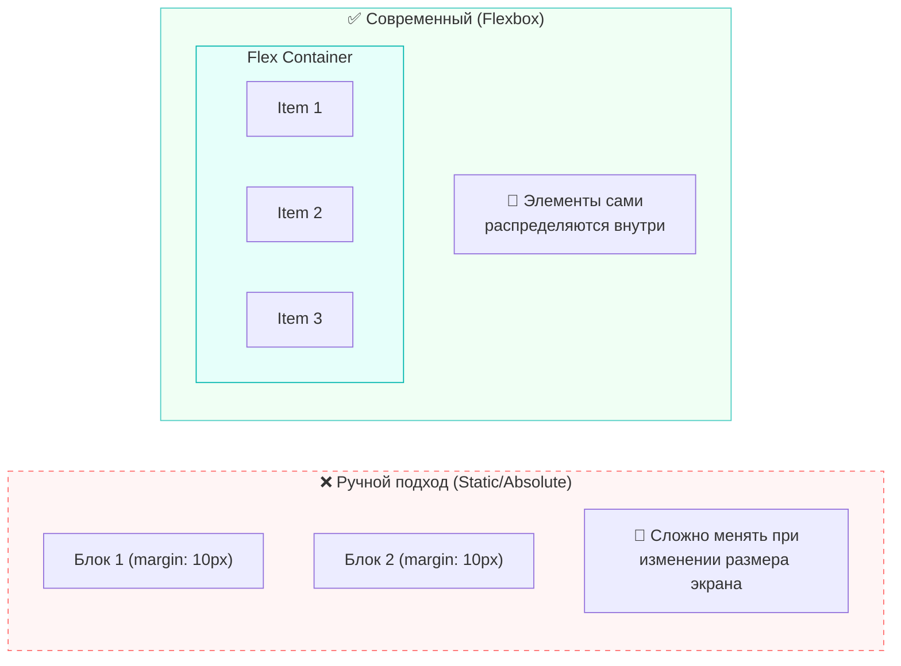
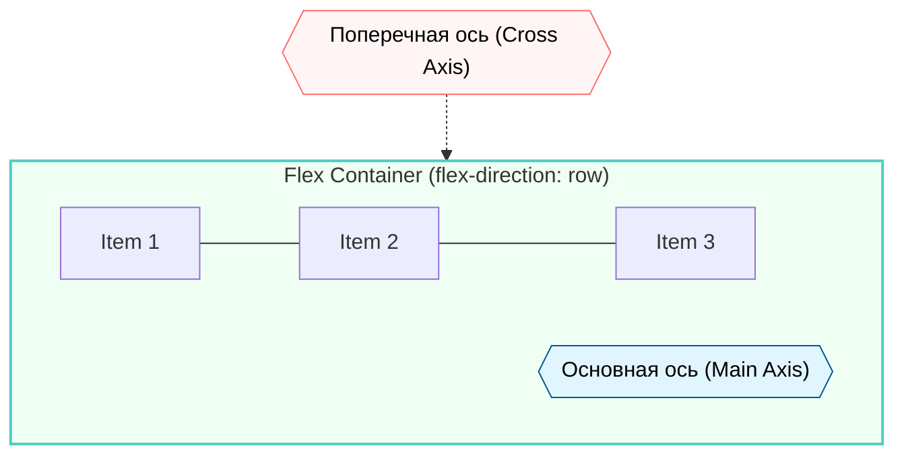
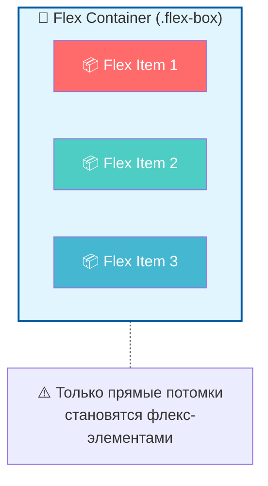
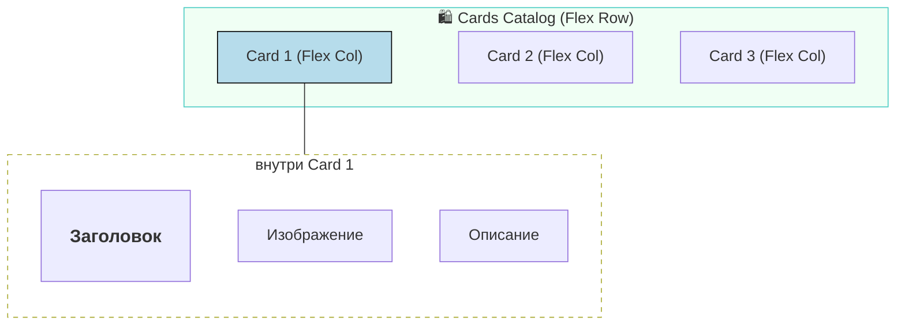

# Урок 5.2. Знакомство с Flexbox 🧱

Добро пожаловать в мир современной верстки! До этого мы с вами сражались с отступами, высчитывали пиксели и пытались укротить позиционирование, чтобы просто поставить два блока рядом. Пришло время познакомиться с инструментом, который сделал фронтенд-разработку человечной.

---

## Что такое Flexbox? 📦

**Flexbox** (от англ. *Flexible Box Layout* — модель гибкого контейнера) — это одномерный метод компоновки элементов в CSS. Представьте, что у вас есть коробка (контейнер), внутри которой лежат предметы. С помощью Flexbox вы можете приказать этим предметам выстроиться в ряд, в колонку, прижаться к краям или равномерно распределиться по всей доступной площади.

Главная суперсила Flexbox заключается в слове **«гибкость»**. Элементы могут изменять свою ширину и высоту, чтобы наилучшим образом заполнить доступное пространство на экранах любого размера.

---

## Почему он так называется? 🧬

Название происходит от английского слова **flexible** (гибкий). Традиционная верстка была «жесткой»: если вы задали блоку ширину 300px, он оставался таким и на мониторе, и на телефоне, ломая верстку.

Flexbox же работает на основе **главной** и **поперечной осей**. Контент внутри контейнера ведет себя как «живой»: он сжимается, если места мало, и расширяется, если его много. Это избавляет нас от необходимости прописывать жесткие размеры для каждого элемента.

---

## Когда Flexbox появился в CSS? ⏳

История внедрения Flexbox была непростой:

* **Первые черновики:** Появились еще в 2009 году.
* **Становление:** К 2012–2014 годам спецификация начала приобретать современный вид.
* **Эпоха стандарта:** Примерно с **2015-2016 годов** Flexbox стал поддерживаться всеми современными браузерами и превратился в стандарт индустрии.

Сегодня вам больше не нужно беспокоиться о поддержке: Flexbox работает везде — от старых Android-смартфонов до новейших iPhone.

---

## Flexbox против «Ручной верстки» 🥊

До появления этой модели разработчики использовали хаки с `float`, `inline-block` или высчитывали `margin` и `position: absolute`.

| Параметр | Ручная верстка (Old School) | Flexbox (Modern) |
| :--- | :--- | :--- |
| **Центрирование** | Настоящая боль. Нужно высчитывать `top: 50%` и менять `transform`. | Одна строчка: `align-items: center`. |
| **Выравнивание в ряд** | Использование `float` требует «сброса» (clearfix), иначе блоки ломают фон. | Просто `display: flex`. |
| **Равномерные отступы** | Приходится вручную считать `margin-right` и убирать его у последнего элемента. | Свойство `justify-content: space-around` сделает всё само. |
| **Порядок элементов** | Только через изменение HTML-кода. | Свойство `order` позволяет поменять визуальный порядок блоков в CSS. |

---

### Визуальное сравнение подходов



>[!tip]
>
>#### В чем главная суть? 💡
>
>Раньше мы говорили каждому элементу: «Встань в 20 пикселях от края». Теперь мы говорим контейнеру: «Распредели своих детей равномерно». Мы управляем **логикой поведения**, а не координатами.

В вашем коде `lesson_5_1.css` мы уже начали применять эту магию:

```css
div.card {
  display: flex;             /* Активируем Flexbox */
  flex-direction: column;    /* Выстраиваем элементы внутри в колонку */
  justify-content: space-around; /* Равномерно распределяем воздух между ними */
  align-items: center;       /* Центрируем всё содержимое */
}
```

Без Flexbox для создания такой карточки товара нам пришлось бы написать в три раза больше кода!

---

Чтобы мастерски управлять элементами на странице, нужно понять, что Flexbox — это не просто «сетка», а система управления **осями**. Как только вы активируете `display: flex`, внутри контейнера рождаются две невидимые линии, вдоль которых выстраивается всё содержимое.

---

## 1. Основная и Поперечная оси 🧭

Во Flexbox всё вращается вокруг двух направлений:

* **Основная ось (Main Axis):** Это направление, вдоль которого выстраиваются элементы. По умолчанию она идет **горизонтально** (слева направо). Именно вдоль неё работают свойства распределения пространства.
* **Поперечная ось (Cross Axis):** Она всегда перпендикулярна основной. Если основная ось горизонтальна, то поперечная идет **вертикально** (сверху вниз).

---

## 2. Направление оси: `flex-direction` 🔄

Вы можете в любой момент развернуть основную ось. От этого зависит, как будут вести себя ваши блоки.

| Значение | Направление оси | Как выстроятся элементы |
| :--- | :--- | :--- |
| **`row`** | Слева направо | В одну строку (значение по умолчанию). |
| **`column`** | Сверху вниз | В один столбик (как в вашей карточке товара). |
| **`row-reverse`** | Справа налево | В строку, но первый элемент окажется в конце. |
| **`column-reverse`** | Снизу вверх | В столбик, перевернутый «вверх ногами». |

В вашем примере для `div.card` используется `flex-direction: column`. Это значит, что для карточки **основная ось стала вертикальной**, и свойства выравнивания поменялись ролями.

---

## 3. Свойства и их значения ⚙️

### Распределение по основной оси: `justify-content`

Это свойство отвечает за то, как элементы «дышат» вдоль основной линии.

* **`flex-start`**: Все элементы прижаты к началу (по умолчанию).
* **`flex-end`**: Все элементы прижаты к концу.
* **`center`**: Все элементы в центре.
* **`space-between`**: Первый — в начале, последний — в конце, весь «воздух» поровну между ними.
* **`space-around`**: (Как в вашей карточке) Элементы имеют равное пространство вокруг себя.
* **`space-evenly`**: Все зазоры (между краями и элементами) абсолютно одинаковые.

### Выравнивание по поперечной оси: `align-items`

Отвечает за «высоту» (если ось горизонтальна) или за «ширину» (если вертикальна).

* **`stretch`**: Элементы растягиваются на всю высоту контейнера (по умолчанию).
* **`center`**: (Как в вашей карточке) Элементы выравниваются по центру поперечной оси.
* **`flex-start` / `flex-end`**: Прижать к одному из краев.

---

## Визуализация осей в Flexbox



---

## Чеклист: свойства контейнера 📊

| Свойство | Что делает | Возможные значения |
| :--- | :--- | :--- |
| `display` | Создает флекс-контейнер | `flex`, `inline-flex` |
| `flex-direction` | Задает направление осей | `row`, `column`, `reverse` варианты |
| `justify-content` | Выравнивает по главной оси | `center`, `space-between`, `space-around` |
| `align-items` | Выравнивает по поперечной оси | `center`, `stretch`, `flex-start` |

>[!tip]
>
>#### Золотое правило отладки 💡
>
>Если ваш `justify-content` перестал работать так, как вы ожидали — проверьте `flex-direction`. Когда вы меняете направление на `column`, «право-лево» и «верх-низ» меняются местами!

>[!info]
>
>#### Разбор вашего кода
>
>В `div.card` вы указали `align-items: center`. Поскольку это колонка (`flex-direction: column`), «поперечная ось» теперь горизонтальна. Именно поэтому заголовок, картинка и текст встали ровно по центру ширины карточки.

---

Для того чтобы закрепить теорию, разберем классический пример: контейнер, в котором живут несколько разноцветных квадратов. Это поможет увидеть, как `display: flex` мгновенно берет под контроль хаос.

---

## 1. Пример кода: «Три квадрата» 🔳

Представим простую структуру в HTML и соответствующие стили.

**HTML:**

```html
<div class="flex-box">
  <div class="square red">1</div>
  <div class="square green">2</div>
  <div class="square blue">3</div>
</div>
```

**CSS:**

```css
/* Контейнер */
.flex-box {
  display: flex;            /* Активируем Flexbox */
  justify-content: center;  /* Собираем квадраты в центре по горизонтали */
  align-items: center;      /* Центрируем их по вертикали */
  height: 200px;
  background-color: #f0f0f0;
  border: 2px dashed #ccc;
}

/* Общие стили для квадратов */
.square {
  width: 50px;
  height: 50px;
  color: white;
  display: flex;            /* Да, квадрат сам может быть флекс-контейнером */
  justify-content: center;  /* Чтобы цифра была по центру */
  align-items: center;
  font-weight: bold;
}

.red   { background-color: #ff6b6b; }
.green { background-color: #4ecdc4; }
.blue  { background-color: #45b7d1; }
```

---

## 2. Основные сущности Flexbox 🧬

В этом примере мы сталкиваемся с двумя фундаментальными ролями, которые нельзя путать.

### 🏢 Flex Container (Флекс-контейнер)

Это родительский элемент (в нашем случае `.flex-box`), к которому применено свойство `display: flex`.

* **Его задача:** Определять правила игры для всех своих «детей».
* **На что влияет:** Он задает направление осей, логику распределения отступов и выравнивание.
* **Аналогия:** Это начальник отдела, который говорит сотрудникам: «Встаньте в ряд!» или «Разойдитесь по углам!».

### 📦 Flex Item (Флекс-элемент)

Это **прямые** потомки контейнера (наши `.square`).

* **Их задача:** Послушно следовать правилам контейнера.
* **Возможности:** Каждый элемент может иметь свои уникальные свойства (например, один квадрат может захотеть быть больше других или прижаться к другому краю).
* **Важно:** Флекс-элементами становятся *только* теги первого уровня вложенности. Если внутри квадрата будет еще один `div`, он не будет «флекс-элементом» для большой коробки автоматически.

---

## 3. Взаимодействие сущностей



>[!info]
>
>#### Особенность «Текстовых узлов»
>
>Интересный факт: если вы просто напишете текст внутри флекс-контейнера без тегов, браузер обернет его в «анонимный флекс-элемент» и тоже будет выравнивать по общим правилам.

---

## 4. Разбор вашего кода через эти сущности 🔍

В вашем файле `lesson_5_1.html` вы создали вложенную структуру:

1. **`div.cards-catalog`** — это контейнер для всех карточек. Если вы добавите ему `display: flex`, карточки выстроятся в один ряд.
2. **`div.card`** — это **одновременно** и флекс-элемент (внутри каталога), и флекс-контейнер (для своего заголовка, картинки и описания).

>[!tip]
>
>#### Матрешка Flexbox 🪆
>
>Это лучшая стратегия современной верстки: мы создаем большие флекс-блоки, внутри которых находятся маленькие флекс-блоки. Это позволяет добиться идеального контроля над каждым пикселем интерфейса.

---

Давайте детально разберем, как ваш код превращает набор HTML-тегов в современный каталог товаров. В финальной версии мы видим использование «вложенного Flexbox» — это когда один флекс-элемент сам становится контейнером для других.

---

### 1. Глобальная структура: Контейнер-центровщик

В файле `lesson_5_1.css` вы определили класс `.container`:

```css
div.container {
  display: flex;
  flex-direction: column; /* Элементы (заголовок и каталог) идут один под другим */
}
```

Хотя здесь Flexbox используется минимально, он подготавливает почву для того, чтобы весь контент страницы (секции) вел себя предсказуемо.

---

### 2. Карточка товара: Микро-космос Flexbox 🪐

Самая интересная часть — это класс `div.card`. Здесь Flexbox решает сразу три задачи:

```css
div.card {
  display: flex;
  flex-direction: column;         /* 1. Вертикальный стек элементов */
  justify-content: space-around;  /* 2. "Воздух" между заголовком, фото и текстом */
  align-items: center;            /* 3. Горизонтальное центрирование содержимого */
  /* ... стили оформления ... */
}
```

* **`flex-direction: column`**: Мы заставляем заголовок `<h3>`, обертку `.image` и описание `<p>` встать в строгий столбик.
* **`justify-content: space-around`**: Это свойство магии. Оно само вычисляет свободное место внутри карточки (высота которой 400px) и равномерно распределяет его. Вам не нужно задавать `margin-bottom` каждому элементу!
* **`align-items: center`**: Поскольку главная ось теперь вертикальная, поперечная стала горизонтальной. Это свойство выравнивает все элементы по центру ширины карточки.

---

### 3. Интерактивность и спецэффекты ✨

Вы добавили псевдокласс `:hover`, который заставляет карточку «оживать» при наведении:

```css
div.card:hover {
  box-shadow: 0 4px 8px rgba(0, 0, 0, 0.3); /* Тень для эффекта объема */
  transform: scale(1.03);                  /* Легкое увеличение */
  transition: all 0.2s ease;               /* Плавность анимации */
}
```

* **`transform: scale(1.03)`** — это современный способ акцентировать внимание. Карточка плавно «выплывает» на пользователя.
* **`transition`** — критически важен. Без него изменения будут мгновенными и дергаными.

---

### 4. Работа с изображениями: `object-fit` 🖼️

Одной из самых частых проблем верстки являются разные пропорции картинок. Вы решили её профессионально:

```css
div.image img {
  width: 100%;
  height: 200px;
  object-fit: cover;     /* Умная подрезка */
  object-position: center; 
}
```

>[!info]
>
>#### В чем сила object-fit: cover? ✂️
>
>Это свойство работает как `background-size: cover`. Изображение заполняет всю область 200px высоты, не растягиваясь и не деформируясь. Лишние края просто обрезаются. Это гарантирует, что все ваши карточки в каталоге будут иметь **одинаковый размер**, даже если исходные фото Плюмбусов были разными.

---

### 5. Иерархия Flexbox (Визуализация)



### Итоговый результат

Благодаря Flexbox и фиксированным размерам (`width: 250px`, `height: 400px`), ваш каталог выглядит как профессиональный интернет-магазин. Все элементы внутри карточек выровнены идеально ровно, а плавные тени при наведении добавляют интерфейсу «лоска».

>[!tip]
>
>#### Маленькая деталь 🧩
>
>В вашем HTML-файле есть комментарий `<!--header>nav>ul>li*4>a...-->`. Это **Emmet-аббревиатура**. Если вы введете эту строку в VS Code и нажмете Tab, редактор автоматически построит всю структуру меню. Пользуйтесь этим для ускорения работы!
