# Урок 8. Знакомство с JavaScript 🚀

## Разрыв шаблона: JavaScript — это не Java 🧩

Начнем с самого важного факта, который ежегодно вводит в заблуждение тысячи новичков: **JavaScript категорически никак не связан с Java**. Несмотря на схожесть в названии, это два абсолютно разных языка программирования с разной философией, синтаксисом и областями применения.

Как говорит известная в IT-кругах поговорка:
> Связь между Java и JavaScript такая же, как между словами «Кар» и «Картошка» (или «Ham» и «Hamster»).

Более двух десятилетий эта путаница порождает забавные (и не очень) ситуации на собеседованиях и в рабочих чатах. Чтобы понять, как мы к этому пришли, нужно заглянуть в закулисье кремниевой долины середины 90-х.

## Историческая справка: Хайп как стратегия выживания 📜

JavaScript появился на свет в **1995 году**. Его «отцом-создателем» стал **Брендан Эйк** (Brendan Eich), работавший в компании **Netscape**. В те времена интернет был статичным и скучным: страницы представляли собой просто наборы текста и картинок. Netscape нужен был инструмент, который «оживит» браузер, сделает его интерактивным.

>[!info]
>
>#### Кто такой Брендан Эйк? 👨‍🔬
>
>Американский программист, создатель JavaScript и сооснователь проекта Mozilla. Легендарна история о том, что первую версию JS он написал всего за **10 дней**. Именно эта спешка обусловила многие странные особенности языка, с которыми разработчики сражаются до сих пор.

### Почему же тогда «Java»-script? 🧐

В 1995 году язык **Java** (созданный в Sun Microsystems) был на пике невероятной популярности. Он считался «будущим интернета». Маркетологи Netscape решили «подсесть» на хвост уходящему поезду популярности и провести один из самых успешных (и спорных) маркетинговых ходов в истории IT.

Они переименовали свой новый язык из **LiveScript** в **JavaScript**, чтобы он звучал как «младший брат» популярной Java. Цель была проста: **хайпануть** на узнаваемом бренде и привлечь внимание разработчиков.

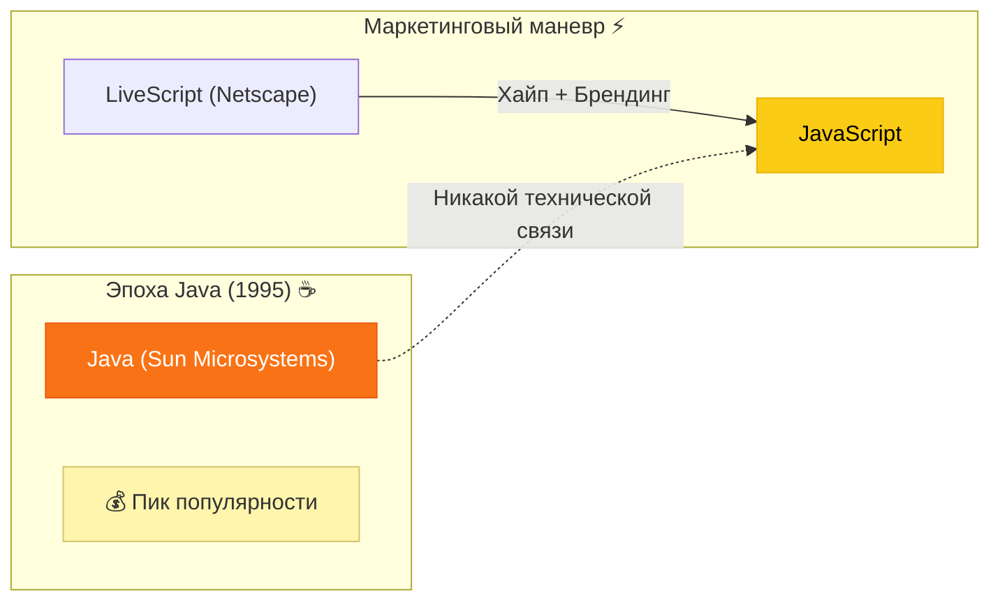

## Цели создания: Оживить «Мертвый» интернет ⚡

Брендан Эйк не планировал создавать язык для серьезных серверных вычислений. JavaScript задумывался как **легкий скриптовый язык**, ориентированный на дизайнеров и верстальщиков, а не на инженеров-программистов.

**Основные задачи языка в 1995 году были простыми:**

- Проверить, правильно ли заполнена форма (например, введен ли `@` в поле Email).
- Добавить простую анимацию на страницу.
- Реагировать на клики пользователя без перезагрузки всей страницы.

>[!tip]
>
>#### Главная концепция 🎭
>
>JavaScript создавался как «клей» между HTML-разметкой и действиями пользователя. Это был максимально простой вход в программирование для тех, кто раньше просто верстал страницы.

Разработчики преследовали цель сделать веб-браузер полноценной платформой для приложений. Они и представить не могли, что через 20 лет на этом «десятидневном наброске» будут работать сложнейшие системы: от социальных сетей до движков искусственного интеллекта.

Сегодня **JavaScript** — это самый популярный язык программирования в мире, который давно перерос свои маркетинговые корни и стал фундаментом всего современного интернета. Но шлейф «того самого переименования» все еще тянется за ним, напоминая о временах, когда название значило больше, чем архитектура.

## Эволюция JavaScript: от застоя к бесконечной гонке 🧬

Путь JavaScript не был линейным. Язык пережил периоды бурного роста, долгого забвения и, наконец, тотального доминирования. Чтобы мы с вами могли писать на современном и удобном языке, JS пришлось пройти через стандартизацию **ECMAScript (ES)** — это, по сути, официальный «свод правил» или спецификация языка.

### Ключевые вехи развития

Долгое время JavaScript развивался медленно. Между выходом третьей версии (1999 г.) и пятой (2009 г.) прошло целых десять лет — целая вечность по меркам IT. Но настоящий «взрыв» произошел в **2015 году**.

>[!info]
>
>#### Легендарный ES6 (ES2015) 🏆
>
>Выход версии **ES6** (официально ES2015) стал самым масштабным обновлением за всю историю. Язык изменился до неузнаваемости: появились классы, стрелочные функции, переменные `let` и `const`, промисы и модули. Именно ES6 превратил JavaScript из «языка для простых скриптов» в мощный инструмент для создания серьезных приложений.

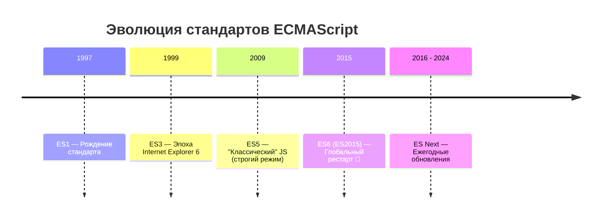

После 2015 года комитет TC39 (люди, отвечающие за стандарт) решил изменить стратегию: теперь новые фишки добавляются в язык **каждый год**. Поэтому сегодня мы не ждем десятилетиями — новые возможности появляются регулярно, как обновления в вашем смартфоне.

## Проблема «бабушек» и старых браузеров 👵💻

Казалось бы, если обновления выходят каждый год, почему бы всегда не использовать самые свежие функции? Здесь разработчики сталкиваются с суровой реальностью: **вы не контролируете софт своего пользователя**.

Ваш сайт может открыть разработчик на последнем Chrome, а может — условная «бабушка» (или сотрудник консервативного банка) на браузере пятилетней давности, который просто не знает, что такое современные функции JavaScript.

>[!warning]
>
>#### Ловушка обратной совместимости 🪤
>
>Если вы используете в коде новейшую фишку стандарта 2024 года, а пользователь зайдет с браузера 2020 года — **скрипт просто упадет с ошибкой**, и ваш сайт превратится в «тыкву».

**Почему это происходит:**

- **Медленное обновление:** Далеко не все пользователи настраивают автообновление ПО.
- **Старое железо:** Старые компьютеры и планшеты физически не могут запустить современные версии браузеров.
- **Корпоративная среда:** В больших компаниях версии софта могут быть «заморожены» на годы из соображений безопасности.

### Как с этим живут разработчики?

В индустрии принято ориентироваться на концепцию **«транспиляции»**. Мы пишем код на самом современном и красивом JavaScript (ES6+), а затем с помощью специальных инструментов (например, **Babel**) автоматически «переводим» его в старый добрый ES5, который поймет даже «бабушкин» браузер.

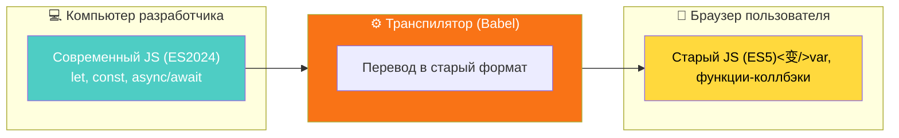

**Главный вывод:** Обновления — это здорово для удобства работы, но опытный разработчик всегда помнит о своей аудитории. Не стоит гнаться за самым свежим стандартом «в голом виде», пока вы не убедились, что ваш код дойдет до каждого пользователя в рабочем состоянии.

## Золотой стандарт: Разбираемся в версиях 💎

Вы абсолютно правы в своих догадках, но давайте внесем идеальную техническую точность. То, что мы сегодня называем «современным JavaScript», — это не какой-то один стандарт, а результат двух мощнейших обновлений, которые изменили всё.

### ES6 (2015): Большая революция 🏹

Это был фундамент. Именно здесь появились те самые «новомодные» штуки:

- **Стрелочные функции** (`() => {}`) — лаконичный синтаксис, который избавил нас от лишних слов `function` и решил вечную проблему с контекстом `this`.
- **Нормальное ООП** — в язык наконец-то завезли ключевое слово `class`. До этого программистам приходилось имитировать классы через хитрые манипуляции с прототипами.
- **Шаблонные строки** — возможность вставлять переменные прямо в текст через обратные кавычки и знак доллара: `` `Привет, ${name}!` ``.

### ES8 (2017): Асинхронный прорыв ⏳

А вот те самые **`async` / `await`**, которые вы упомянули, действительно официально закрепились в стандарте **ES8 (ES2017)**.

- **Почему это важно:** До их появления работа с сетью (запросы к серверу) была похожа на ад из вложенных функций (так называемый *Callback Hell*).
- **Результат:** `async` / `await` позволили писать сложный асинхронный код так, будто он обычный, линейный и выполняется по порядку. Это сделало код в разы чище и понятнее.

---

## Что изучать сегодня? (Взгляд из 2026 года) 🧭

Вы спросили про стандарт на момент **2006 года** — и это интересная ловушка времени! В 2006 году миром правил глубоко устаревший **ES3**, а до выхода легендарного ES6 оставалось еще целых 9 лет. Если вы вдруг окажетесь в 2006-м, вам придется писать очень громоздкий и неудобный код.

Но если мы говорим о **сегодняшнем дне**, мой совет как наставника будет следующим:

>[!tip]
>
>#### Твоя цель — ES6+ 🎯
>
>Не забивайте голову номерами стандартов (ES9, ES10, ES2024). Для уверенного старта вам нужно освоить **базу ES6** (классы, стрелочные функции) и **асинхронность из ES8**. Всё, что выходило позже — это лишь приятные косметические дополнения.

### Почему именно такой подход?

1. **Читаемость:** Код на ES6+ в два раза короче и понятнее «старого» стиля.
2. **Рынок труда:** На собеседованиях никто не спросит вас про стандарт 2006 года. Все ожидают, что вы владеете классами и асинхронностью.
3. **Инструменты:** Как мы уже обсуждали, современные инструменты (Babel) сами переведут ваш красивый код в старый формат. Ваша задача — писать современно и чисто.

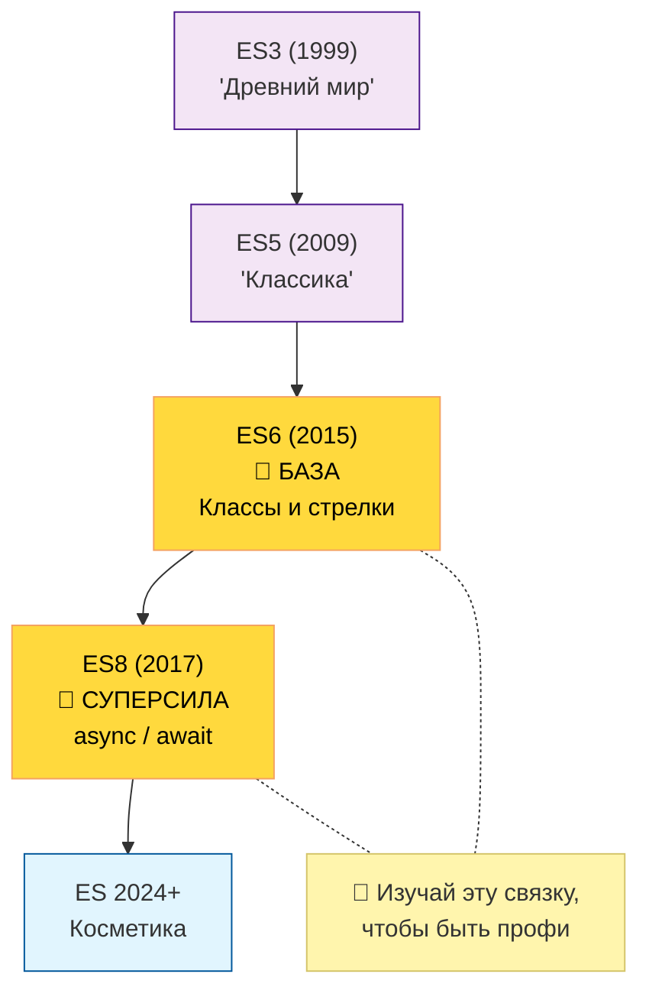

**Подведем итог:** Не бойтесь цифр. Сосредоточьтесь на синтаксисе, который появился в **ES6** и **ES8**. Это «золотая середина», которая сделает вас современным разработчиком, чьи программы будут летать и в современных браузерах, и (после небольшой обработки) в браузерах тех самых «бабушек».

Чтобы вам было удобно ориентироваться в этом «алфавитном супе» из аббревиатур, я собрал хронологическую таблицу. В ней отражены самые важные этапы взросления JavaScript.

Как ваш наставник, я выделил жирным те версии, которые являются **фундаментом** современного программирования. Если вы их знаете — вы востребованный специалист.

### Хронология ECMAScript: От истоков до наших дней 📅

| Версия | Год | Сленговое название | Главные «ништяки» и нововведения |
| :--- | :--- | :--- | :--- |
| ES1 | 1997 | Первая версия | Рождение стандарта. Регулярные выражения. |
| ES3 | 1999 | Эпоха IE6 | Обработка ошибок (`try/catch`), классические циклы `for..in`. |
| ES5 | 2009 | Классический JS | Строгий режим (`'use strict'`), методы массивов (`forEach`, `map`). |
| **ES6** | **2015** | **ES2015** | **Классы, стрелочные функции, `let`/`const`, модули, промисы.** |
| ES7 | 2016 | ES2017 | Оператор возведения в степень (`**`), `Array.includes()`. |
| **ES8** | **2017** | **ES2018** | **Асинхронные функции (`async` / `await`), `Object.values()`.** |
| ES9 | 2018 | ES2019 | Операторы развертывания для объектов (`...`), циклы `for await`. |
| ES10 | 2019 | ES2020 | `Array.flat()` (выпрямление массивов), `Object.fromEntries()`. |
| ES11 | 2020 | ES2021 | Оператор нулевого слияния (`??`), `BigInt` (огромные числа). |
| ES12 | 2021 | ES2022 | Метод `String.replaceAll()`, приватные методы классов. |
| ES13 | 2022 | ES2023 | Метод `.at()` для массивов, `Top-level await`. |
| ES14 | 2023 | ES2024 | Новые методы неизменяемых массивов (`toSorted`, `toReversed`). |
| ES15 | 2024 | ES2025 | Улучшенная работа со строками и регулярными выражениями. |

---

### Анализ эволюции: Что это значит для нас? 🧠

Если посмотреть на таблицу, можно заметить три четких этапа жизни языка:

1. **Древность (ES1 — ES3):** Язык был диким и необузданным. Его использовали только для самых примитивных вещей, вроде «сделать так, чтобы кнопка мигала при наведении».
2. **Эпоха застоя (2000 — 2014):** После 2000 года наступила долгая пауза. Разработчики мучались с браузерными войнами и пытались привести всё к единому знаменателю в ES5.
3. **Современность (2015 — н.в.):** После выхода **ES6** язык стал обновляться ежегодно (отсюда и названия с годом, вроде ES2020). Теперь это полноценный «взрослый» инструмент.

>[!tip]
>
>#### На что сделать упор? 🎯
>
>Если вы новичок, ваша «святая троица» — это инструменты из **ES5** (база), **ES6** (структура и модули) и **ES8** (работа с сервером). Всё, что выше — это скорее полезные лайфхаки, которые делают жизнь приятнее, но не меняют правила игры кардинально.

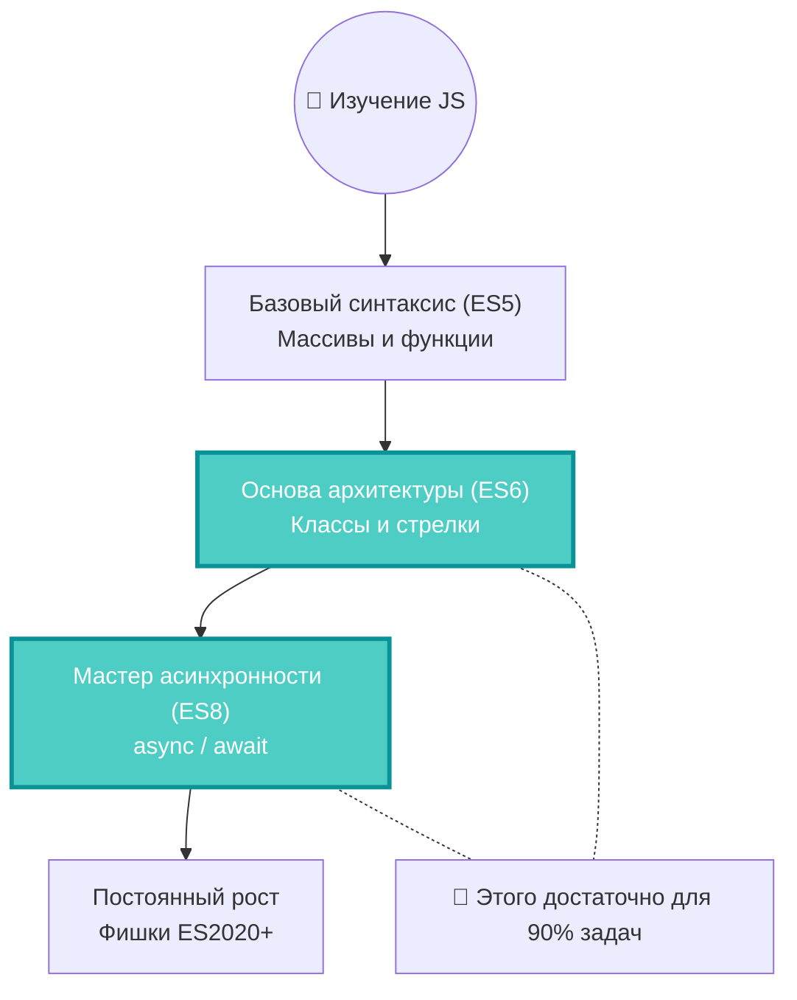

Как ваш наставник, я гарантирую: зная механику этих версий, вы сможете читать и понимать практически любой современный проект в интернете. JavaScript перестал быть «странным языком» и превратился в стройную, логичную систему.

Чтобы понять, как работает JavaScript, нам нужно разобраться, как компьютер вообще «понимает» программный код. Представьте, что вы написали инструкцию по сборке шкафа. У компьютера есть два способа её прочитать.

## Компиляция vs Интерпретация ⚙️

### 1. Компилируемые языки (C++, Rust, Go) 🏗️

Здесь всё серьезно. Ваш код перед запуском должен пройти через **компилятор** — программу-переводчик, которая превращает весь ваш текст сразу в бинарный файл (единицы и нули), понятный процессору.

- **Аналогия:** Это как перевести целую книгу с английского на русский, напечатать тираж и раздать читателям. Читать удобно и быстро, но если вы нашли ошибку на странице 5, придется переделывать перевод и перепечатывать всю книгу заново.

### 2. Интерпретируемые языки (Python, PHP, JavaScript) 🎭

Тут всё иначе. Программа **интерпретатор** читает ваш код прямо в момент выполнения — строчка за строчкой — и тут же дает команды процессору.

- **Аналогия:** Это как синхронный переводчик. Спикер говорит фразу — переводчик тут же её озвучивает. Это медленнее, чем чтение готового перевода, зато вы можете вносить правки «на лету», и программа сразу подхватит изменения.

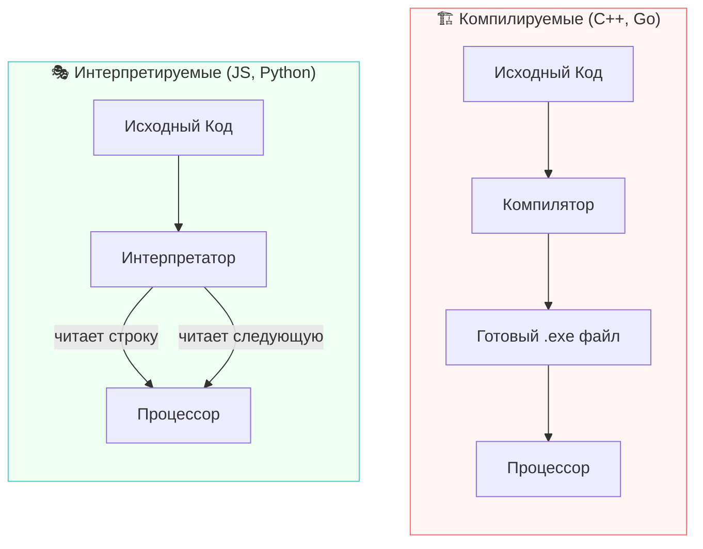

---

## JavaScript: Ваш интерпретатор уже установлен 🌐

JavaScript — это **интерпретируемый язык**. Но здесь кроется главная прелесть для новичка.

Если для работы с Python или C++ вам нужно сначала скачать и настроить специальную среду разработки, установить компиляторы или движки, то для JavaScript **вам не нужно скачивать вообще ничего**.

### Почему так?

Потому что основной «дом» для JavaScript — это браузер (Chrome, Firefox, Safari, Edge). Внутри каждого современного браузера уже живет невероятно мощный и быстрый «движок» (например, **V8** в Google Chrome), который и является тем самым интерпретатором.

>[!info]
>
>#### Движок V8 🚀
>
>Это сердце Chrome и Node.js. Он берет ваш JavaScript-код и прямо «на лету» превращает его в быстрые машинные команды. Это делает JS одним из самых быстрых интерпретируемых языков в мире.

**Это значит, что:**

- Любой текстовый редактор (даже «Блокнот») — это ваша среда разработки.
- Любой браузер — это ваша среда запуска.

>[!tip]
>
>#### Кнопка «Пуск» всегда под рукой ⌨️
>
>Вы можете прямо сейчас нажать `F12` в браузере, перейти во вкладку **Console** и написать `console.log("Привет!")`. Код сработает мгновенно, потому что интерпретатор уже «заведен» и ждет ваших команд.

Таким образом, JavaScript — это самый доступный язык для старта: порог вхождения практически нулевой, а инструменты для работы у вас уже установлены с того момента, как вы открыли это окно.

После всей теории пришло время практики. Самое приятное в JavaScript — то, что ваша первая программа запустится прямо в том окне, где вы сейчас читаете этот текст.

## Ваш первый шаг в мир кода 🚀

Давайте оживим ваш браузер. Мы воспользуемся инструментами разработчика, которыми пользуются профессионалы в Google, Meta и Microsoft каждый день.

### Шаг 1: Открываем пульт управления

Возьмите вашу клавиатуру и выполните одно из действий:

1. Нажмите клавишу **`F12`**.
2. Или используйте комбинацию:
   - **Windows/Linux:** `Ctrl + Shift + I`
   - **macOS:** `Cmd + Option + I`
3. В открывшемся окне найдите и выберите вкладку **Console** (Консоль).

### Шаг 2: Пишем код

Кликните мышкой в поле ввода консоли (там обычно мигает курсор рядом с символом `>`). Введите следующую команду:

```javascript
console.log("Привет, мир!");
```

Нажмите **`Enter`**.

### Шаг 3: Магия свершилась

Если всё сделано верно, вы увидите два сообщения:

1. Белым шрифтом (или черным, зависит от темы): `Привет, мир!`
2. Серым шрифтом чуть ниже: `undefined`

---

## Что это было? Разбираем «под капотом» 🔍

Поздравляю, вы только что вызвали метод объекта и увидели работу интерпретатора в реальном времени! Давайте разложим этот процесс на составляющие.

### Кто такой `console`?

В JavaScript **`console`** — это специальный встроенный **объект**, который дает нам «трубу» для общения с внутренней кухней браузера. Представьте, что это бортовой компьютер корабля, через который инженер может следить за состоянием двигателей.

### Что делает `.log()`?

Это **метод** (проще говоря — команда), который приказывает объекту `console` выведи («залогируй») информацию на экран разработчика. Это наш главный инструмент отладки: когда в программе что-то идет не так, мы просим консоль вывести значения переменных, чтобы понять, где ошибка.

### Откуда взялось `undefined`? 👻

Многих новичков пугает эта надпись, но на самом деле всё в порядке.

>[!info]
>
>#### Почему мы видим undefined? 🧐
>
>Консоль браузера работает по принципу «вопрос — ответ». Она не просто выводит текст, она показывает **результат** (возвращаемое значение) проделанной работы.

В JavaScript любая функция или метод должна что-то вернуть «в руки» программе после завершения.

- Задача `console.log` — **напечатать** текст на экране. Она это делает успешно.
- Но внутри самого языка эта команда **ничего не возвращает** для дальнейших вычислений.

Поскольку она возвращает «ничего», JavaScript честно пишет вам: `undefined` (что буквально означает «не определено»).

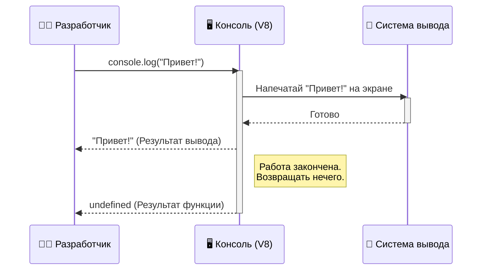

**Итог:** Вывод «Привет, мир!» — это **полезное действие**, а `undefined` — это **технический отчет** о том, что команда не передала никаких данных дальше по цепочке. Теперь вы официально начали свой путь в JavaScript!

Мы научились запускать код в консоли, но настоящие веб-приложения работают иначе: код встраивается прямо в структуру страницы. Давайте разберем, как «подружить» HTML и JavaScript.

## JavaScript внутри HTML-страницы 📄

Чтобы браузер понял, что перед ним не просто текст, а программный код, который нужно выполнить, используется специальный тег — `<script>`. Это своего рода контейнер, который говорит интерпретатору: «Внимание, сейчас начнется магия на языке JavaScript!».

Как и в случае с CSS (который живет в тегах `<style>`), вы можете писать скрипты прямо внутри HTML-файла:

```html
<!-- sample_008_html_js.html -->
<!doctype html>
<html lang="ru">
  <head>
    <meta charset="UTF-8" />
    <title>Мой первый скрипт</title>
  </head>
  <body>
    <h1>Заголовок страницы</h1>

    <script>
      // Это стандартный JS-комментарий. Он работает внутри тега <script>.
      
      <!-- Как ни странно, HTML-комментарии внутри <script> тоже часто поддерживаются -->
      <!-- браузерами для обратной совместимости, но лучше использовать // -->
      
      console.log("Привет из HTML-файла!");
    </script>
  </body>
</html>
```

## Где лучше размещать тег `<script>`? 📍

Вы могли заметить, что в примере выше скрипт расположен в самом низу, перед закрывающим тегом `</body>`. Это не случайность, а «золотой стандарт» веб-разработки. Чтобы понять почему, нужно заглянуть в голову браузера.

### Как браузер читает ваш файл

Браузер — очень прилежный читатель. Он читает HTML-файл **сверху вниз**, строчка за строчкой:

1. Видит `<head>` — загружает настройки.
2. Видит `<h1>` — тут же рисует заголовок на экране.
3. Доходит до тега `<script>` — и тут он **останавливается**.

Когда браузер встречает скрипт, он бросает все силы на его выполнение. Если ваш скрипт очень тяжелый или сложный, пользователь будет смотреть на белый пустой экран, пока код не отработает.

>[!warning]
>
>#### Проблема блокировки 🚧
>
>Если вы поставите скрипт в начало файла (в раздел `<head>`), браузер не покажет пользователю содержимое страницы (текст, картинки, кнопки), пока не загрузит и не выполнит весь код. Это плохой пользовательский опыт.

### Почему мы ставим скрипт в конец `<body>`

1. **Скорость загрузки:** Пользователь сначала видит контент (текст, дизайн), а уже потом, через доли секунды, «подгружаются» мозги сайта (скрипты).
2. **Доступ к элементам:** Если ваш скрипт должен изменить заголовок или покрасить кнопку, эта кнопка **уже должна существовать** в памяти браузера. Если скрипт сработает раньше, чем браузер дочитает до кнопки, он её просто «не найдет».

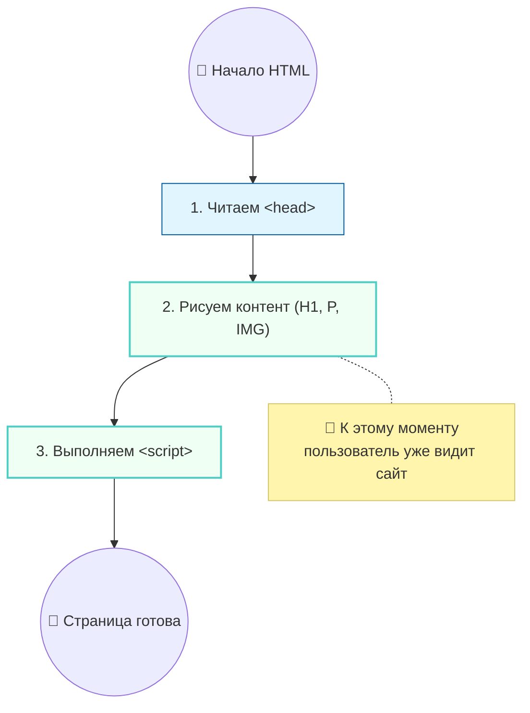

>[!tip]
>
>#### Итог
>
>Размещайте основной JavaScript-код перед закрывающим тегом `</body>`. Это гарантирует, что ваша страница загрузится визуально быстро, а скрипты будут иметь доступ ко всем элементам DOM (структуры страницы), которые вы описали выше.

Писать весь код внутри HTML-файла удобно только для крошечных учебных примеров. В реальных проектах JavaScript-код хранят в отдельных файлах с расширением `.js`. Это позволяет поддерживать чистоту в структуре проекта: HTML отвечает за **скелет**, CSS — за **красоту**, а JS — за **поведение**.

## Подключение внешнего файла 🔗

Для подключения внешнего скрипта используется всё тот же тег `<script>`, но теперь мы добавляем ему специальный атрибут — **`src`** (от англ. *source* — источник).

### Как это выглядит на практике

1. Создайте в папке с проектом файл с названием `lesson_8.js`.
2. Внутри этого файла напишите:

```javascript
// lesson_8.js
console.log("Файл JavaScript подключен и работает! 🎉");
```

1. В вашем основном HTML-файле подключите его следующей строкой (лучше всего — перед закрывающим тегом `</body>`):

```html
<script src="./lesson_8.js"></script>
```

>[!important]
>
>#### Важное замечание ⚠️
>
>Если вы используете атрибут `src`, то код **внутри** тега `<script>` писать нельзя — он будет проигнорирован. Браузер выполнит только тот код, который находится во внешнем файле.

---

## Магия Emmet: создание структуры за долю секунды ⚡

Профессиональные разработчики никогда не пишут структуру HTML вручную. Для этого в современных редакторах (VS Code, PyCharm) есть встроенный инструмент — **Emmet**.

**Emmet** — это плагин, который позволяет превращать короткие аббревиатуры в полноценные блоки кода.

### Самый полезный шорткат

Просто введите один символ — восклицательный знак — и нажмите кнопку **Tab**:
`!` + **`Tab`**

**Мгновенно развернется стандартный шаблон:**

```html
<!DOCTYPE html>
<html lang="en">
<head>
    <meta charset="UTF-8">
    <meta name="viewport" content="width=device-width, initial-scale=1.0">
    <title>Document</title>
</head>
<body>
    <!-- Ваш контент здесь -->
    
    <!-- Вы пишите script:src и нажимаете Tab -->
    <script src="./lesson_8.js"></script>
</body>
</html>
```

>[!tip]
>
>#### Полезные сокращения Emmet
>
>- `script:src` + `Tab` → Автоматически создаст `<script src=""></script>` и поставит курсор в кавычки.
>- `h1{Текст}` + `Tab` → Создаст `<h1>Текст</h1>`.
>- `p*3` + `Tab` → Создаст сразу три пустых параграфа `<p></p>`.

### Итоговая схема подключения

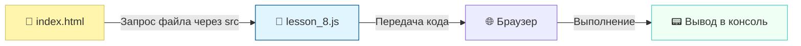

Использование внешних файлов — это признак хорошего тона. Это упрощает отладку, позволяет нескольким разработчикам работать над разными частями сайта одновременно и помогает «бабушкиным» браузерам эффективнее кэшировать ваш код (запоминать его, чтобы не скачивать заново при каждом переходе по страницам).

Когда мы говорим «я учу JavaScript», важно понимать: сам по себе язык — это лишь набор грамматических правил. Чтобы JS мог делать что-то полезное (рисовать окна или работать с файлами), ему нужна **среда выполнения**.

## Два лица одного языка: Браузер vs Node.js 🎭

Существует две основные среды, где живет JavaScript: **Браузер** (Client-side) и **Node.js** (Server-side).

- **Браузерный JS:** Его главная суперсила — взаимодействие с пользователем. Он умеет менять цвета кнопок, реагировать на клики и плавно прокручивать страницу. Но из соображений безопасности он «заперт» внутри вкладки: он не может просто так удалить файл с вашего диска или прочитать ваши пароли.
- **Node.js:** Это интерпретатор, который устанавливается прямо в операционную систему. У него нет окон и кнопок, зато он имеет полный доступ к файловой системе, сетевым портам и базам данных.

Браузер предоставляет нам набор инструментов (API), которых нет в Node.js, и один из самых важных для нас сегодня — это объект `console`.

---

## Объект `console`: Больше, чем просто текст 📊

Как мы уже выяснили, **`console`** — это мост между вашим кодом и панелью инструментов разработчика. Но профессионалы используют его не только для вывода «Привет». В консоли есть уровни важности, которые помогают фильтровать сообщения в больших проектах.

### Основные методы логирования

| Метод | Уровень | Визуальный стиль | Когда использовать |
| :--- | :--- | :--- | :--- |
| `console.log()` | Инфо / Обычный | Обычный текст | Для общей информации и проверки значений переменных. |
| `console.info()` | Инфо | Обычно как `log`, иногда с иконкой `i` | Для важных меток в ходе выполнения программы. |
| `console.warn()` | Предупреждение | **Желтый фон** + значок `⚠️` | Если что-то идет не идеально, но программа еще работает. |
| `console.error()` | Ошибка | **Красный фон** + значок `❌` | Когда всё сломалось (например, данные не загрузились). |
| `console.table()`| Таблица | Удобная сетка/таблица | Когда нужно красиво вывести список объектов или массив. |
| `console.clear()`| Команда | Очистка | Чтобы «прибраться» в консоли и удалить старые сообщения. |

### Попробуем в деле

Добавьте эти строки в ваш файл `lesson_8.js`, чтобы увидеть разницу:

```javascript
// sample_008_console_levels.js

console.log("Это обычное сообщение");
console.warn("Внимание! Почти закончилась память (шутка)");
console.error("Критическая ошибка! Роботы захватили мир");

// Попробуем вывести данные красиво
const user = { id: 1, name: "Иван", role: "Admin" };
console.table(user);
```

>[!tip]
>
>#### Лайфхак для отладки 💡
>
>В браузере над списком сообщений консоли есть фильтр (**All levels**). Если ваш проект выдает сотни строк текста, вы можете выключить «Logs» и оставить только «Errors», чтобы сфокусироваться на исправлении багов.

---

## Почему это важно? 🧠

Использование правильных методов логирования — это часть культуры кода.

- Если вы будете писать всё через `console.log`, вы утонете в тексте.
- Если вы помечаете ошибки через `console.error`, браузер сам подсветит их красным, а в некоторых случаях даже отправит уведомление в системы мониторинга.

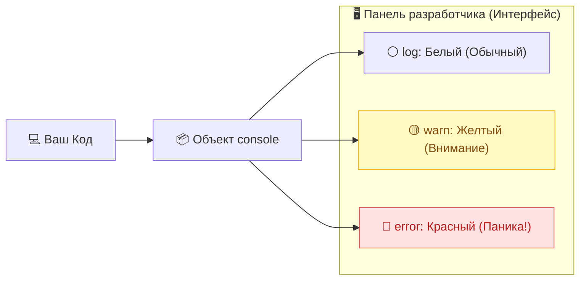

**Помните:** Консоль — это ваш бортовой самописец. Учитесь общаться с ней грамотно с первого дня, и она сэкономит вам сотни часов при поиске ошибок!

Когда мы пишем `console.log("Привет, мир!")`, мы используем один из самых фундаментальных типов данных в программировании — **строку** (String). Давайте разберемся, почему кавычки здесь — это не просто украшение, а жизненная необходимость для интерпретатора.

## Что такое строка? 🧵

В программировании **строка** — это любая последовательность символов: буквы, цифры, пробелы и даже эмодзи. Чтобы компьютер понял, где начинается и где заканчивается этот «кусок текста», мы оборачиваем его в кавычки.

Представьте, что кавычки — это упаковочная коробка. Всё, что внутри коробки, воспринимается JavaScript как **данные** (текст), а не как **команда** (код).

---

## Зачем нужны кавычки? 🤔

Интерпретатор JavaScript очень буквоед. Когда он видит слово в коде, он пытается его классифицировать:

1. **Это команда?** (например, `console`, `log`)
2. **Это переменная?** (сосуд, где хранится какое-то значение)
3. **Это данные?** (просто текст)

**Если вы поставите кавычки:**
`"Привет"` — Интерпретатор говорит: «О, это просто текст. Я не буду пытаться понять, что это слово значит, я просто передам его дальше».

**Если вы ЗАБУДЕТЕ кавычки:**
`Привет` — Интерпретатор говорит: «Так, кавычек нет. Значит, это не текст. Наверное, это название какой-то переменной или функции, которую разработчик создал ранее. Пойду-ка поищу в своей памяти слово "Привет"».

>[!warning]
>
>#### Что произойдет при ошибке? 💥
>
>Если вы напишете `console.log(Привет, мир!)` без кавычек, JavaScript обыщет всю свою память, не найдет там переменной с именем `Привет` и выдаст ошибку:
>**`Uncaught ReferenceError: Привет is not defined`**
>(Ошибка: Ссылка не найдена: «Привет» не определено).

В этот момент программа просто **остановится** и откажется работать дальше.

---

## Три вида кавычек в JavaScript 🎨

В современном JS есть три способа создать строку, и все они правильные, но имеют свои особенности:

1. **Двойные кавычки:** `"Привет"`
2. **Одинарные кавычки:** `'Привет'`
   *(Между ними нет технической разницы, это вопрос стиля. Главное — не начинать одинарной, а заканчивать двойной).*
3. **Обратные кавычки (Тильда):** `` `Привет` ``
   *(Появились в ES6. Самые мощные: позволяют вставлять переменные прямо внутрь строки).*

### Пример из жизни (Метафора)

Представьте, что вы диктуете секретарю письмо.

- Если вы говорите: **«Напиши: "Уважаемый клиент"»** — секретарь пишет текст.
- Если вы просто скажете: **«Уважаемый клиент»** — секретарь впадет в ступор, потому что это не команда («напиши», «позвони»), а просто бессвязное обращение. Кавычки в коде выполняют ту же роль команды «воспринимай это как текст».

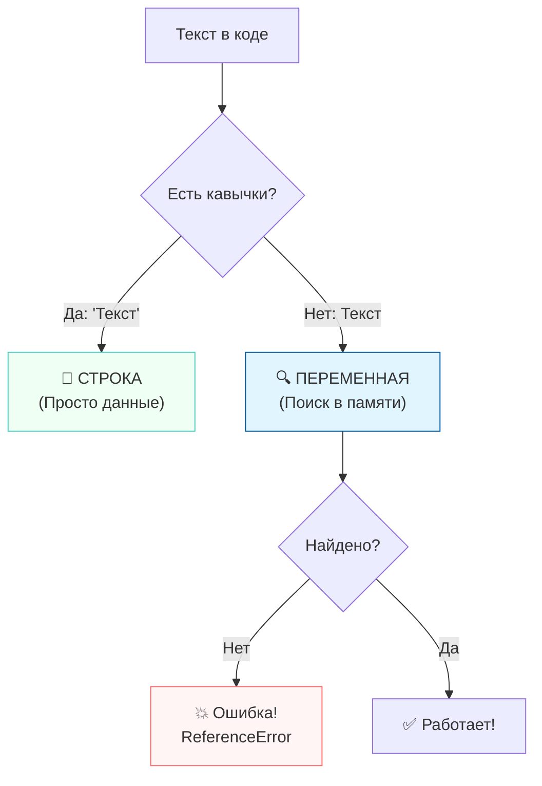

>[!tip]
>
>#### Золотое правило
>
>Всё, что является «человеческим» текстом (имена, названия, сообщения, адреса), **всегда** оборачивайте в кавычки. Если это не команда языка и не созданная вами переменная — значит, это строка.

Когда мы начинаем складывать данные в JavaScript, мы сталкиваемся с одной из самых обсуждаемых особенностей языка. JavaScript — это язык с **динамической и слабой типизацией**, что заставляет его проявлять «излишнюю самостоятельность» при вычислениях.

## Числа против Строк: Кто кого? 🧮

Давайте запустим простой эксперимент в консоли и разберем результаты.

```javascript
// sample_008_math_vs_strings.js

// Число vs Строка визуально
console.log(100500);   // В консоли будет синим (число)
console.log("100500"); // В консоли будет белым/черным (строка)

// 1. Сложение чисел (Математика)
console.log(100 + 100);     // Результат: 200
// Тут всё логично. Математика в чистом виде.

// 2. Сложение строк (Конкатенация)
console.log("100" + "100"); // Результат: "100100"
// Здесь кавычки говорят JS: «Это не числа, это вагоны поезда!». 
// Оператор + превращается в "сцепку" и просто склеивает их.
```

## Конкатенация: Клей для данных 🧴

Процесс склеивания строк называется **конкатенацией**. Представьте, что строки — это блоки LEGO. Когда вы их «складываете», вы не получаете новый блок, вы просто соединяете их в одну длинную конструкцию.

### Самый странный случай: Число + Строка

Что произойдет, если мы попытаемся сложить теплое с мягким?

```javascript
console.log("100" + 100); // Результат: "100100"
```

Здесь срабатывает **неявное приведение типов**. JavaScript видит, что один из участников «сложения» — важная и гордая Строка. Чтобы не вызывать ошибку, он берет число `100`, «оборачивает» его в невидимые кавычки и превращает в строку `"100"`. После этого он просто склеивает две строки.

---

## Зачем это придумали? 🧠

Такое поведение может показаться странным, но у создателей JavaScript (вспомним Брендана Эйка и его 10 дней на разработку) были конкретные цели:

1. **Гибкость и живучесть:** JavaScript создавался для веба. Ошибка в одной строчке не должна «вешать» весь браузер пользователя. JS пытается выполнить код любой ценой, даже если программист творит странные вещи.
2. **Удобство для веб-страниц:** Почти всё, что мы получаем от пользователя на сайте (текст из полей ввода, данные из форм), приходит в виде **строк**. Если бы JS был строгим, нам пришлось бы переводить каждую цифру из строки в число вручную перед любым действием. JS делает это «за кадром», стараясь предугадать ваши намерения.

>[!warning]
>
>#### Ловушка для невнимательных 🪤
>
>Эта «доброта» языка часто выходит боком. Если вы случайно сложите зарплату `1000` (число) и бонус `"500"` (строка из формы), вы получите не радостные `1500`, а строку `"1000500"`. Это классический баг новичка!

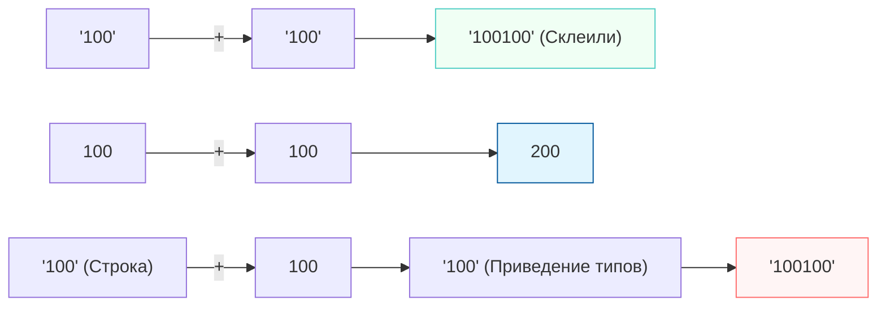

>[!tip]
>
>#### Совет наставника
>
>Всегда контролируйте типы данных. Если вы планируете заниматься математикой — убедитесь, что кавычек нет. Если вы строите предложения — смело используйте строки и их «липкость».

Чтобы программа не просто выполняла команды, а умела запоминать информацию, нам нужны **переменные**. На скриншоте мы видим классический пример создания переменной в современном JavaScript.

```javascript
let variable = "Я переменная";
console.log(variable);
```

Давайте разберем это действие двумя способами: через простую аналогию и через суровую техническую реальность.

---

## 1. Простая аналогия: Коробочка с ярлыком 📦

Представьте, что ваша оперативная память — это огромный склад с миллионами пустых полок.

1. Когда вы пишете `let variable`, вы просите работника склада принести **пустую коробку**.
2. Вы берете липкий ярлык, пишете на нем имя **`variable`** и приклеиваете на коробку. Теперь вы всегда сможете найти именно её среди тысяч других.
3. Оператор `=` (присваивание) — это команда «положи внутрь». Вы берете строку `"Я переменная"` и кладете её в эту коробку.

Теперь, когда вы говорите `console.log(variable)`, JavaScript не печатает слово «variable». Он идет на склад, находит коробку с этим ярлыком, достает из нее содержимое и выводит его на экран.

---

## 2. Техническая реальность: Адресация и RAM 🧠

С точки зрения компьютера и движка JavaScript (например, V8), процесс выглядит гораздо сложнее и интереснее.

### Выделение памяти

Когда интерпретатор видит ключевое слово `let`, он обращается к менеджеру памяти браузера. Тот выделяет небольшой кусочек в **оперативной памяти (RAM)**. У этого кусочка памяти нет человеческого имени, у него есть только **физический адрес** — сложное шестнадцатеричное число (например, `0x016XH23B`).

### Связывание (Binding)

JavaScript создает запись в специальной таблице (её называют *Environment Record*). В этой таблице он связывает понятное нам имя `variable` с конкретным адресом в памяти `0x016XH23B`.

### Хранение данных

Когда мы пишем `variable = "Я переменная"`, браузер берет наше строковое значение, преобразует его в набор байтов и записывает их по адресу `0x016XH23B`.

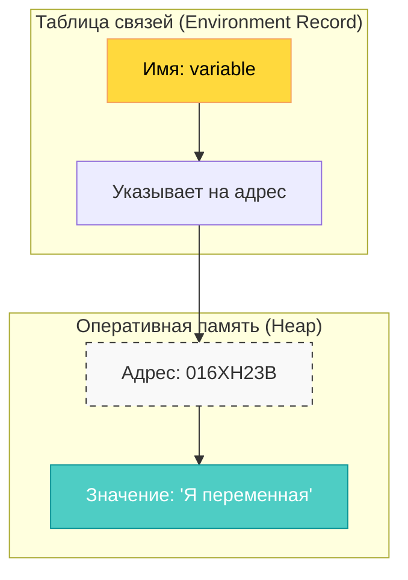

### Что происходит при `console.log(variable)`?

1. JavaScript видит слово `variable` **без кавычек**.
2. Он понимает: «Это не строка, это ссылка».
3. Он ныряет в таблицу связей, находит имя `variable`.
4. Получает адрес памяти `016XH23B`.
5. Идет по этому адресу, считывает оттуда данные и отдает их в метод `log()`.

>[!info]
>
>#### Почему это важно? 💡
>
>Именно поэтому без кавычек JavaScript ищет «коробку», а с кавычками — просто видит текст. Если вы попытаетесь вызвать `console.log(my_box)`, а коробку с таким ярлыком еще не создали через `let`, вы получите ошибку **ReferenceError**, так как в таблице связей нет такого адреса.

---

### Итог

Объявление переменной — это **бронирование места** в памяти компьютера и присвоение этому месту «человеческого» имени для удобного доступа. Это фундамент, на котором строится любая логика: от простейшего калькулятора до нейросетей.

Вы правы, ключевое слово `var` — это «ветеран» JavaScript. Оно существовало в языке с самого первого дня. Однако с выходом стандарта **ES6 (2015 год)** появились `let` и `const`, которые практически полностью вытеснили `var` из современной разработки.

Давайте разберем, почему `var` сегодня считается «плохим тоном», не затрагивая сложные дебри областей видимости.

## Var — это «старый стиль», Let — это «новый стандарт» 🕰️

Главная проблема `var` заключается в том, что он очень **непредсказуемо** ведет себя в коде. Создатели JavaScript в 1995 году хотели сделать язык «мягким», но в итоге это привело к куче трудноловимых ошибок.

### 1. Переобъявление: Ошибка, которую невозможно заметить

Представьте, что вы работаете над большим проектом. Вы создали переменную `user`. Спустя 100 строк кода вы забыли об этом и случайно создали её еще раз.

**С использованием `var`:**

```javascript
var balance = 100;
// ... много строк кода ...
var balance = 0; // JS даже не пикнет! Он просто молча перезапишет данные.

console.log(balance); // Выведет 0. Вы случайно стерли данные и не узнали об этом.
```

**С использованием `let`:**

```javascript
let balance = 100;
// ...
let balance = 0; // ❌ ОШИБКА! Браузер закричит: "Идентификатор 'balance' уже объявлен"
```

`let` стоит на страже вашего кода. Он не позволит вам случайно создать вторую «коробку» с тем же самым именем, защищая данные от случайной перезаписи.

---

### 2. Поднятие (Hoisting): Магия вне Хогвартса 🪄

В JavaScript есть странная особенность — переменные на `var` «всплывают» (поднимаются) в начало кода.

**Странность `var`:**

```javascript
console.log(nickname); // Выведет undefined, но программа НЕ упадет
var nickname = "JS_Wizard";
```

JavaScript видит `var` и заранее резервирует под него место, даже если команда создания идет *после* команды использования. Это создает путаницу: вы используете то, чего еще нет.

**Логичность `let`:**

```javascript
console.log(nickname); // ❌ ОШИБКА! Программа упадет, как и положено.
let nickname = "JS_Wizard";
```

`let` заставляет вас быть дисциплинированным: сначала создай — потом используй. Это делает чтение кода логичным (сверху вниз).

---

## Итог: Почему `var` в учебниках? 📚

Вы видите `var` в старых пособиях по двум причинам:

1. **Инерция:** Авторы не обновляли учебники с 2014 года.
2. **Максимальная поддержка:** Как мы говорили ранее про «бабулины браузеры», `var` понимают абсолютно все версии всех браузеров за последние 25 лет.

>[!warning]
>
>#### Главный совет 🎓
>
>Забудьте про `var`, как про страшный сон. В 2026 году использование `var` на собеседовании — это почти гарантированный отказ. Используйте **`let`** (если значение будет меняться) или **`const`** (если значение меняться не будет).

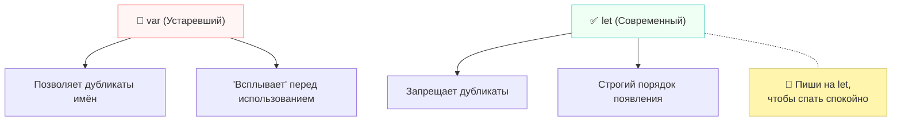

**Подводя итог:** `let` — это современная, безопасная и предсказуемая замена старому `var`. Он делает ваш код чище и защищает вас от ошибок, которые в среде профи называют «выстрелом в ногу».

Выбор имени для переменной — это не просто творческий процесс, а важный этап проектирования кода. Как говорил один из гуру программирования Мартин Фаулер: «Любой дурак может написать код, который поймет компьютер. Хорошие программисты пишут код, который понимают люди».

## Искусство именования: Почему «как-нибудь» не работает 🏷️

В программировании мы работаем с именами гораздо чаще, чем с самими данными. Если вы назовете переменную просто `a` или `data`, через неделю вы сами не вспомните, что там лежит.

**Золотое правило:** Имя должно быть самодокументированным. Глядя на него, коллега (или вы сами через месяц) должен сразу понять, за что отвечает эта «коробка».

| Подход | Пример | Вердикт |
| :--- | :--- | :--- |
| **Плохо** | `let d = 31;` | Что такое 31? Дни? Дистанция? Количество дырок в сыре? |
| **Хорошо** | `let daysInMonth = 31;` | Сразу всё понятно. Код читается как рассказ. |

---

## Стандарт JavaScript: lowerCamelCase 🐫

В JavaScript общепринятым стандартом для переменных является **lowerCamelCase** (нижний верблюжий регистр).

Представьте горбы верблюда: первое слово пишется с маленькой буквы, а каждое следующее слово «приклеивается» к нему и начинается с заглавной. Пробелы в именах переменных запрещены, и именно заглавные буквы служат нам визуальными разделителями.

```javascript
// Правильно (lowerCamelCase)
let userAge = 25;
let mainProjectTitle = "AI Content Pipeline";
let isUserLoggedIn = true;
```

---

## Стили и их применение в мире JS 🌍

Важно знать, что существуют и другие стили, но у каждого в JavaScript есть своя строго отведенная роль.

### 1. lowerCamelCase (наш основной выбор)

Используется для **переменных**, **объектов** и **функций**. Имя переменной обычно состоит из **существительных и прилагательных**.

- `let redButton = ...`

### 2. Глагол + CamelCase (для функций)

Если переменная хранит в себе какое-то действие (**функцию**), её имя обязательно должно содержать **глагол**.

- `function calculateTotalSum() { ... }` — Глагол (что сделать?) + Существительное (что?).
- `function fetchUserData() { ... }`

### 3. UpperCamelCase (или PascalCase)

В этом стиле абсолютно все слова начинаются с заглавной буквы. В JavaScript этот стиль зарезервирован строго для **Классов** (шаблонов для создания объектов). Если вы видите имя `UserManager`, вы сразу понимаете — это класс.

- `class ImageProcessor { ... }`

### 4. snake_case (Разделитель — подчеркивание)

Это стандарт для Python или PHP, но в JavaScript он **категорически не используется**.

- ❌ `let user_age = 25;` — Верный признак того, что код писал разработчик, пришедший из другого языка. В мире JS это считается «дурным тоном».

---

## Почему длинное имя лучше короткого? 📜

Многие новички боятся длинных имен, думая, что это замедлит работу или сделает код «тяжелым». На самом деле, современные редакторы (IDE) дописывают имена за вас по первым двум буквам.

**Сравните два примера:**

```javascript
// Неудачно (слишком коротко)
let m = 60; 
let s = 1000;

// Удачно (описательно)
let secondsInMinute = 60;
let millisecondsInSecond = 1000;
```

Длинное, но точное имя избавляет вас от необходимости писать комментарии. Код становится прозрачным. Лучше один раз написать `currentUserLastLoginDate`, чем мучиться с `cur_dat` и гадать, что это за дата.

```mermaid
mindmap
  root(("Нейминг в JS"))
    "Стиль: lowerCamelCase"
      "Переменные (let/const)"
      "Функции (get.../set...)"
    "Стиль: UpperCamelCase"
      "Классы"
    "Стиль: snake_case"
      "ЗАПРЕЩЕНО (не для JS)"
    "Состав имени"
      "Существительные (что?)"
      "Прилагательные (какой?)"
      "Глагол (для функций)"
```

>[!tip]
>
>#### Совет наставника
>
>Пишите код так, будто человек, который будет его поддерживать после вас — агрессивный психопат, который знает, где вы живете. Читаемые имена переменных — ваша лучшая страховка!

Подводя итог нашей темы про нейминг, давайте закрепим технические правила игры. В JavaScript мало просто выбрать красивое слово — нужно, чтобы оно не «сломало» интерпретатор.

## Технический кодекс оформления переменных 🛠️

Чтобы ваш код успешно прошел проверку движком браузера, запомните несколько железных правил:

1. **Никаких цифр в начале:** Переменная может содержать цифры (например, `user2`), но она **категорически не может** начинаться с них.
   - ✅ `let player1 = "Ivan";`
   - ❌ `let 1player = "Ivan";` — Это вызовет ошибку синтаксиса.
2. **Запрет на пробелы:** В названии не может быть пробелов. Вместо них мы используем `lowerCamelCase`.
   - ✅ `let userAccountBalance = 100;`
   - ❌ `let user account balance = 100;`
3. **Спецсимволы под замком:** Вы не можете использовать в именах знаки вроде `@`, `#`, `!`, `%`. Разрешены только два исключения:
   - `_` (Нижнее подчеркивание) — обычно используется в специфических технических случаях.
   - `$` (Знак доллара) — часто используется библиотеками (например, jQuery) или для обозначения системных переменных.
4. **Регистр имеет значение:** Переменная `user` и переменная `User` — это **две разные** переменные для JavaScript. Будьте внимательны!

---

## Чек-лист идеального названия 📝

При создании новой переменной пропустите её имя через это «сито»:

- [ ] **Язык — только английский.** Даже если вы работаете в русской компании, писать `let mamaMylaRamu` — табу. Пишите `let motherWashedFrame`.
- [ ] **Существительное для данных.** Используйте вопрос «Что это?». (Например: `userName`, `totalPrice`).
- [ ] **Прилагательное для уточнения.** (Например: `activeUser`, `filteredList`).
- [ ] **Глагол для действия.** Если это функция, в начале должен быть глагол-действие. (Например: `calculateResult()`, `printInvoice()`).

>[!info]
>
>#### Почему английский? 🇺🇸
>
>Программирование — это международная среда. Английский язык более лаконичен и позволяет использовать `lowerCamelCase` максимально эффективно. Кроме того, большинство встроенных библиотек и документаций написаны на английском, и ваш код будет выглядеть с ними органично.

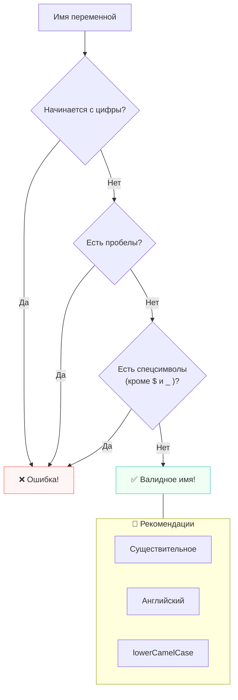

>[!tip]
>
>#### Правило «Трёх слов»
>
>Старайтесь не делать имена длиннее трех слов. Если вам нужно четыре или пять слов, чтобы описать переменную (например, `currentUserLastLoginAttemptStatus`), возможно, стоит пересмотреть логику или упростить структуру данных.

Теперь вы знаете о переменных почти всё: от выделения памяти до выбора идеального имени. В следующем уроке мы перейдем к тому, как управлять этими данными с помощью логики!

Вопрос точки с запятой (`;`) в JavaScript — это одна из тех тем, которая может вызвать жаркие споры в офисе любой IT-компании. Для одних это признак дисциплины, для других — лишний визуальный шум.

Давайте разберемся, зачем этот символ вообще был придуман и почему современные разработчики всё чаще от него отказываются.

## Зачем точка с запятой была нужна? 🏛️

Исторически точка с запятой в языках программирования (таких как C++ или Java, на которые JavaScript хотел быть похожим) служила **терминатором выражения**. Она четко говорила интерпретатору: «Всё, эта инструкция закончена, забудь про неё и переходи к следующей».

В JavaScript точка с запятой выполняет ту же роль — она разделяет инструкции. Без неё браузеру было бы сложно понять, где заканчивается одна команда и начинается другая, особенно если они написаны в одну строку.

```javascript
// Без точек с запятой пришлось бы писать строго по одной строке
let a = 5
let b = 10

// С ними можно свалить всё в кучу (хотя так никто не делает)
let x = 5; let y = 10; console.log(x + y);
```

---

## Что изменилось в 2026 году? 🚀

Почему же сегодня многие считают это «пережитком прошлого»? Дело в механизме, который называется **ASI (Automatic Semicolon Insertion)** — это встроенная в JavaScript система автоматической расстановки точек с запятой.

### Как работает ASI

Когда вы пишете код и нажимаете `Enter`, интерпретатор на лету анализирует вашу строку. Если он видит, что инструкция выглядит законченной, он **сам мысленно ставит там точку с запятой** за вас.

Современные движки JavaScript стали настолько умными, что в 99.9% случаев они безошибочно понимают, где заканчивается мысль разработчика.

### Почему разработчики перестают их писать

1. **Чистота кода:** Без лишних «хвостов» в конце каждой строки код выглядит чище и легче читается.
2. **Меньше работы:** Зачем нажимать лишнюю клавишу тысячи раз в день, если компьютер может сделать это сам?
3. **Автоматизация:** Сейчас почти во всех проектах используются инструменты вроде **Prettier** (автоматический форматировщик кода). Вы можете вообще не писать точки с запятой, а Prettier сам расставит их перед публикацией кода, если они требуются по правилам проекта.

---

## Есть ли ловушки? 🪤

Несмотря на «умный» ASI, существуют редкие случаи (их называют *edge cases*), когда отсутствие точки с запятой может сломать программу. Обычно это случается, если следующая строка начинается с квадратной скобки `[` или круглой `(`.

**Пример ошибки:**

```javascript
let user = "Ivan"
["A", "B", "C"].forEach(console.log)
```

Без точки с запятой в первой строке браузер может подумать, что вы пытаетесь обратиться к символу строки по индексу: `user["A", "B", "C"]...`, и всё сломается. Именно поэтому фанаты точек с запятой продолжают их ставить — «на всякий случай».

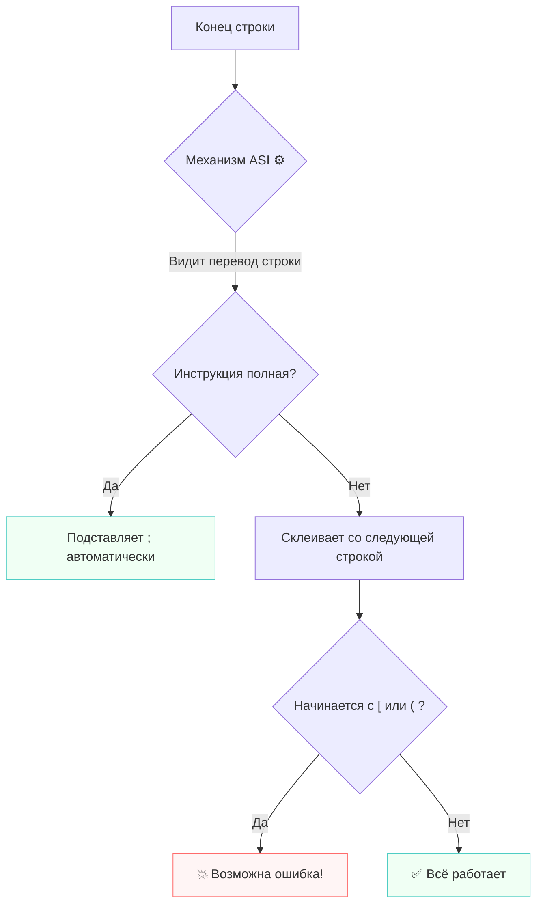

---

## Итог: Писать или не писать? 🧭

В 2026 году ответ прост: **следуйте правилам вашего проекта**.

- Если вы пишете свой проект — выберите один стиль и придерживайтесь его. Большинство современных гайдов рекомендуют **отказаться** от точек с запятой для экономии времени и чистоты.
- Если вы пришли в компанию, где точки с запятой обязательны — ставьте их без лишних споров.

>[!tip]
>
>#### Мой совет
>
>Не тратьте время на споры о точках с запятой. Установите форматировщик **Prettier**, настройте его один раз (например, `semi: false`), и забудьте об этом символе навсегда. Пусть за чистоту кода отвечает автоматика, а вы сосредоточьтесь на логике!

В JavaScript всё, с чем мы работаем — это данные. Чтобы эффективно ими управлять, язык разделяет их на несколько «коробок» разного типа. Понимание этих типов — это база, без которой невозможно построить даже простейший калькулятор.

## Типология данных: С чем мы работаем? 🧰

Все типы данных в JS делятся на **примитивы** (простые значения) и **объекты** (сложные структуры).

### 1. Числа (Number) 🔢

В отличие от многих других языков, в JS нет разделения на целые числа и дробные. Всё это — тип `Number`.

- `let age = 25;`
- `let price = 99.99;`
*Для чего:* Математические вычисления, координаты, счетчики.

### 2. Строки (String) 🧵

Любой текст, обернутый в кавычки.

- `let name = "Alice";`
*Для чего:* Хранение имен, сообщений, адресов и любой текстовой информации.

### 3. Булевы значения (Boolean) ⚖️

Самый лаконичный тип. Имеет всего два состояния: **`true`** (истина) и **`false`** (ложь).

- `let isLogged = true;`
*Для чего:* Условия и логика. Выполнять действие или нет? Переключатели «вкл/выкл».

### 4. Объекты (Object) 📦

Сложная структура данных, которая позволяет объединить много разных свойств в одном месте. Представляет собой пары «ключ: значение».

- `let user = { name: "Ivan", age: 30 };`
*Для чего:* Описание сложных сущностей (пользователь, товар в корзине, пост в соцсети).

### 5. Массивы (Array) 📚

Упорядоченные списки данных. Массив — это частный случай объекта, где у каждого элемента есть свой порядковый номер (индекс), начиная с нуля.

- `let colors = ["red", "green", "blue"];`
*Для чего:* Хранение списков однотипных (и не очень) элементов.

---

## Вечная путаница: `null` против `undefined` ❓

Эти два типа часто путают, потому что оба они говорят о том, что значения «как бы нет». Но смысл у них принципиально разный.

### undefined (Не определено)

Это автоматическое значение. Если вы создали переменную (`let x`), но ничего в неё не положили, JavaScript сам присвоит ей `undefined`.

- **Метафора:** Вы купили коробку, подписали её, но она **пуста** внутри. Вы еще не решили, что в неё положить.

### null (Ничего / Пусто)

Это значение, которое вы присваиваете **вручную**. Это явное указание на то, что здесь пусто.

- **Метафора:** Вы специально положили в коробку чек с надписью «Здесь ничего нет».
- **Когда использовать:** Например, вы ищете пользователя в базе. Если пользователь не найден, программа вернет `null` — «мы искали, но там пусто».

>[!tip]
>
>#### Как запомнить?
>
>- `undefined` — «Я еще не знаю, что тут будет».
>- `null` — «Я точно знаю, что тут ПУСТО».

| Тип | Значение | Инициатива |
| :--- | :--- | :--- |
| **undefined** | Отсутствие значения | Зависит от системы (автоматически) |
| **null** | Намеренная пустота | Зависит от разработчика (вручную) |

---

## Карта типов данных 🗺️

```mermaid
mindmap
  root(("Типы данных в JS"))
    "Примитивы"
      "Number (числа)"
      "String (текст)"
      "Boolean (да/нет)"
      "null (пусто)"
      "undefined (неизвестно)"
    "Сложные (Ссылочные)"
      "Object (пары ключ-значение)"
      "Array (списки/массивы)"
```

### Резюме

В 2026 году JavaScript остается гибким языком, но правильный выбор типа данных — это половина успеха. Используйте **числа** для счета, **строки** для слов, **булевы значения** для логики, а **объекты** и **массивы**, когда данных становится много. И будьте осторожны с `undefined` — лучше всегда явно обозначать пустоту через `null`.

Для того чтобы разложить знания по полочкам, давайте сведем всё воедино. В JavaScript типы данных — это фундамент, на котором держится всё: от простых анимаций до сложных нейросетей.

### Сводная таблица типов данных 📊

| Тип данных | Категория | Что внутри? | Пример кода |
| :--- | :--- | :--- | :--- |
| **Number** | Примитив | Целые и дробные числа | `let price = 150.50;` |
| **String** | Примитив | Текст в любых кавычках | `let name = "Alice";` |
| **Boolean** | Примитив | Логическое "Да" или "Нет" | `let isAdmin = true;` |
| **undefined** | Примитив | Значение не присвоено | `let x; // undefined` |
| **null** | Примитив | Намеренная пустота | `let user = null;` |
| **Object** | Ссылочный | Набор «ключ: значение» | `{ id: 1, name: "Ivan" }` |
| **Array** | Ссылочный | Список элементов | `[10, 20, 30]` |

---

## Важные нюансы, о которых часто забывают 💡

### 1. Ссылочные типы (Object, Array)

В отличие от примитивов, объекты и массивы ведут себя иначе. Когда вы создаете примитив (`Number`, `String`), JavaScript кладет само значение в «коробку». Но для объектов он кладет в коробку только **адрес** (ссылку) на то место в памяти, где лежит этот сложный объект.

- **Следствие:** Если вы скопируете переменную с объектом в другую переменную, они обе будут указывать на один и тот же объект. Измените один — изменится и второй.

### 2. Динамическая типизация

В JavaScript вы можете сначала положить в переменную число, а на следующей строке — текст.

```javascript
let data = 100; // Сейчас это Number
data = "Теперь я текст"; // Теперь это String
```

Это удобно, но опасно. Именно поэтому важно следить за тем, что именно лежит в ваших переменных в каждый конкретный момент времени.

### 3. Особенности `typeof`

В JavaScript есть встроенный инструмент для проверки типа — оператор `typeof`. Но у него есть историческая странность:

>[!warning]
>
>#### Знаменитый баг JavaScript 🧨
>
>Если вы напишете `typeof null`, JavaScript ответит вам `"object"`. Это старая ошибка в самом языке, которую до сих пор не исправили, чтобы не сломать миллионы старых сайтов. Просто запомните: **null — это не объект**, это специальный примитив, несмотря на то, что говорит `typeof`.

---

## Визуализация структуры данных 🧠

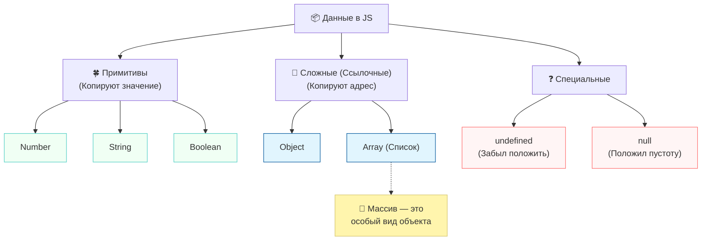

### Итоговый совет

Начинайте всегда с простых типов. Если вам нужно просто хранить имя — берите `String`. Если состояние кнопки — `Boolean`. К **объектам** переходите только тогда, когда вам нужно описать предмет, у которого есть много характеристик. Правильный выбор типа данных делает ваш код предсказуемым и легким в отладке.

Чтобы сделать наш сайт по-настоящему интерактивным, нам нужно научиться общаться с пользователем. Браузер предоставляет для этого три классических инструмента: `alert()`, `prompt()` и `confirm()`.

## Инструменты прямого общения 💬

Эти методы создают модальные окна. «Модальные» означает, что пока пользователь не нажмет кнопку в этом окне, он не сможет продолжить работу со страницей. Это отличный способ привлечь внимание или получить важные данные.

### 1. Alert: Простое уведомление

Этот метод выводит в браузер окно с сообщением и кнопкой «ОК».

```javascript
alert("Привет, я всплывающее окно!");
```

*Когда использовать:* Чтобы сообщить об успешном сохранении данных или предупредить о чем-то важном.

### 2. Prompt: Запрос данных

Этот метод не только показывает текст, но и предоставляет поле для ввода. Самое важное: **всегда возвращает строку**, даже если пользователь ввел число.

```javascript
// Запрашиваем ввод и сохраняем его в переменную
let userName = prompt("Как тебя зовут?");

// Выводим результат в консоль
console.log("Привет, " + userName + "!");
```

### 3. Confirm: Вопрос «Да/Нет»

Иногда нам нужно получить от пользователя согласие. Этот метод выводит две кнопки: «ОК» (вернет `true`) и «Отмена» (вернет `false`).

```javascript
let isHappy = confirm("Вы сегодня счастливы?");
console.log(isHappy); // Выведет true или false
```

---

## Нюанс с типами данных: Работа с числами 🧮

Посмотрите на этот пример. Если мы просто сложим результат из `prompt`, мы получим неприятный сюрприз:

```javascript
let userAge = prompt("Сколько тебе лет?"); 
// Если ввести 25, в переменной будет СТРОКА "25"

console.log("В следующем году тебе будет " + (userAge + 1)); 
// ОШИБКА: Результат будет "251", так как произойдет склеивание строк!
```

Чтобы математика работала правильно, нам нужно принудительно превратить строку в число с помощью функции `Number()`:

```javascript
let userAge = prompt("Сколько тебе лет?");
let nextYearAge = Number(userAge) + 1;

console.log("В следующем году тебе будет " + nextYearAge);
// Теперь результат будет корректным: 26
```

---

## Проблема «склеивания» (Конкатенации) 🧱

Вы заметили, как мы выводим сообщения?
`console.log("Привет, " + userName + "! Тебе " + userAge + " лет.");`

Этот метод называется **конкатенацией**. Он был единственным способом вывода данных долгие десятилетия, но у него есть огромные минусы:

1. Легко запутаться в открывающих и закрывающих кавычках.
2. Легко забыть пробелы между словами и переменными.
3. Код выглядит «рваным» и его сложно читать.

В современном JavaScript (начиная с ES6) появился гораздо более элегантный способ — **шаблонные строки**, о которых мы подробно поговорим в следующем разделе.

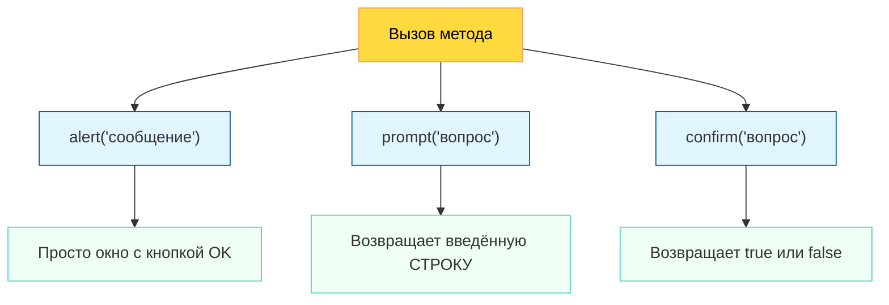

>[!warning]
>
>#### Совет от профи
>
>Хотя `alert` и `prompt` очень просты в изучении, в современном дизайне они используются редко (так как выглядят некрасиво и блокируют работу браузера). Однако для быстрой проверки кода и обучения — это незаменимые помощники!

Когда данных становится много, старый способ склеивания строк через плюс (`+`) превращается в настоящий кошмар для разработчика. На каждое новое вставленное слово вам приходится следить за кавычками и не забывать про пробелы.

На помощь приходят **шаблонные строки** (Template Strings) — стандарт современного JavaScript, который делает код чистым и предсказуемым.

## Революция шаблонов: Обратные кавычки 🚀

Вместо обычных кавычек мы используем **обратные кавычки** (тики), которые находятся на клавише с тильдой (**`~`**) под клавишей `Esc`.

Этот синтаксис позволяет вставлять переменные прямо внутрь текста с помощью конструкции **`${переменная}`**.

### Сравните сами

```javascript
// Переменные для примера
let userName = prompt("Как тебя зовут?");
let userAge = prompt("Сколько тебе лет?");

// ❌ СТАРЫЙ СПОСОБ (Конкатенация)
// Легко ошибиться, куча плюсов и кавычек. Пробелы нужно ставить вручную.
console.log("Привет, " + userName + "! Тебе " + userAge + " лет.");

// ✅ НОВЫЙ СПОСОБ (Шаблонная строка)
// Текст пишется целиком. Переменные вставляются изящно.
console.log(`Привет, ${userName}! Тебе ${userAge} лет.`);
```

### Преимущества шаблонов

1. **Читаемость:** Вы сразу видите итоговое предложение.
2. **Многострочность:** Если вы нажмете `Enter` внутри обратных кавычек, JavaScript сохранит этот перенос строки в тексте. Обычные кавычки выдали бы ошибку.
3. **Любые кавычки внутри:** Внутри обратных кавычек можно спокойно использовать и двойные, и одинарные (`It's "cool"`), не боясь сломать код.

---

## Ловушка возраста: Математика в строках 🪤

Давайте разберем более сложный пример, который мы упоминали ранее, и посмотрим, как шаблонные строки помогают нам выполнять вычисления «на лету».

**Проблема:** Значение из `prompt` — это всегда строка.
Если мы напишем `${userAge + 1}`, JavaScript увидит, например, `"25" + 1` и выдаст `251`.

**Решение:** Нам нужно обернуть данные в функцию `Number()`, чтобы превратить текст в число перед сложением.

```javascript
// sample_008_template_math.js

let studentName = prompt("Введите имя студента:");
let currentAge = prompt("Сколько студенту лет?");

// Мы можем выполнять сложные вычисления прямо внутри ${}
console.log(`
  Студент: ${studentName}
  Текущий возраст: ${currentAge}
  Через 5 лет будет: ${Number(currentAge) + 5}
`);
```

>[!warning]
>
>#### Опасный Number() 🧨
>
>Если пользователь введет вместо возраста слово "десять", функция `Number()` вернет специальное значение **`NaN`** (Not a Number — "Не число"). Любая математика с `NaN` в итоге даст `NaN`. Всегда проверяйте, что именно ввел ваш пользователь!

```mermaid
graph TD
    classDef inputNode fill:#fff5ad,stroke:#d4c46a,color:#333
    classDef process fill:#e1f5fe,stroke:#01579b,color:#fff
    classDef result fill:#f0fff4,stroke:#4ecdc4,color:#333

    Input["Ввод через prompt:<br/>'25'"]:::inputNode --> Convert["Number('25')"]:::process
    Convert --> Math["25 + 1"]:::process
    Math --> Template["`${...}`"]:::result
    Template --> Final["Итоговая строка:<br/>'Вам будет 26'"]:::result

    note["📝 Без Number() мы бы<br/>получили '251'"]
    Convert -.- note
```

### Итоговый совет

Всегда используйте **обратные кавычки** (Шаблонные строки), когда вам нужно объединить текст и программу. Это снижает количество опечаток и делает ваш код профессиональным. А если работаете с числами из `prompt` — всегда «прогоняйте» их через `Number()` сразу после получения.
